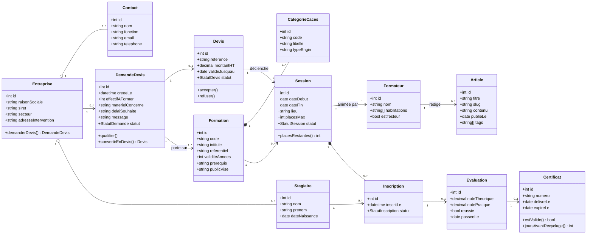

# Modélisation UML — architecture cible

**Statut : cible à valider, pas l'existant.** Le site actuel est constitué de 5 pages
HTML statiques : aucune base de données, aucune API, aucun compte utilisateur, aucune
inscription en ligne, aucun paiement, aucun back-office. Le formulaire de contact ouvre
un `mailto:`. Ce document modélise ce que le site *pourrait* devenir.

## Correction de fond sur le modèle métier

Le parcours type « un visiteur s'inscrit à une formation » est un schéma **B2C en
libre-service**. Houdin ne vend pas comme ça : il fait de l'**intra-entreprise**.
L'acheteur est une entreprise (responsable QSE ou RH), les personnes formées sont ses
salariés, et le point d'entrée est une **demande de devis**, pas une inscription.

D'où la séparation en trois entités distinctes : `Entreprise` (qui achète), `Contact`
(qui décide), `Stagiaire` (qui est formé).

---

## Diagramme de classes

## Justification des choix

**`CategorieCaces` est une entité, pas un attribut.** R482 couvre les catégories 1 à 10,
R489 les catégories 1 à 6 — et un devis porte sur des catégories précises, pas sur une
recommandation entière. En composition : une catégorie n'existe pas hors de sa
recommandation.

**`Certificat` porte une date d'expiration.** Point le plus stratégique du modèle : 5 ans
pour R485/R486/R489, 10 ans pour R482. `joursAvantRecyclage()` permet de relancer les
entreprises avant échéance — chiffre d'affaires récurrent, pas fonctionnalité cosmétique.

**`Evaluation` est séparée de `Inscription`.** Un stagiaire inscrit n'est pas un stagiaire
reçu, et l'échec doit être modélisable.

**Composition vs agrégation.** `Inscription` en composition dans `Session` : pas
d'existence propre. `Stagiaire` en agrégation dans `Entreprise` : le salarié survit à la
session.

---

## Points en suspens

1. **L'habilitation électrique casse le modèle `Certificat`.** Pour le CACES, le
   certificat est délivré à l'issue du test. Pour l'habilitation BT, le formateur émet
   seulement un **avis** — c'est l'employeur qui délivre le titre, sous sa responsabilité.
   Deux objets juridiquement différents : les fusionner avec un attribut `type`, ou créer
   `AvisHabilitation` à part ?

2. **Le back-office est-il dans le périmètre ?** Le client gère-t-il ses sessions et ses
   articles lui-même, ou le site reste-t-il une vitrine mise à jour par le prestataire ?

3. **Le stack cible n'est pas arrêté.** Le site actuel est en vanilla sans build ; passer
   à un framework avec base de données est une reconstruction complète, pas une évolution.

Les diagrammes de cas d'utilisation, de séquence et d'activité restent à produire une fois
ces trois points tranchés.
