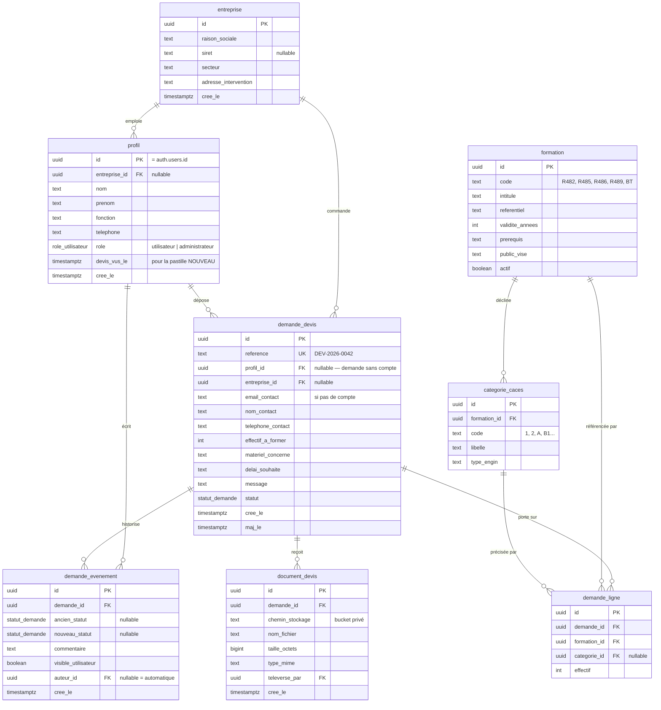

# Étape 1 — schéma de base de données (proposition)

> **Statut : proposition, rien n'est codé.** Conformément au déroulé demandé,
> j'attends validation avant d'écrire la moindre ligne.

## Préalable : le stack décrit dans le brief n'existe pas

Le brief annonce « Next.js/React ». Le projet est en **HTML/CSS/JS vanilla** :
pas de `package.json`, pas de `node_modules`, pas de `next.config`, aucune étape
de build. Cinq fichiers `.html` et un `<script src="js/main.js">`.

Ce n'est pas un détail de vocabulaire. Ajouter authentification et base de
données, ce n'est pas une évolution du site actuel : c'est une **reconstruction**
sous framework. Trois conséquences concrètes :

1. **L'hébergement change.** Cloudflare Pages, qu'on vient de préparer, sert des
   fichiers statiques. Une application avec base de données a besoin d'un
   véritable exécutant serveur. Le plan gratuit de Vercel étant réservé à
   l'usage non commercial, il faudra un hébergement payant.
2. **Un coût récurrent apparaît**, là où le site actuel peut tourner à zéro euro
   par mois. Base de données et hébergement applicatif, à provisionner avec le
   client.
3. **Le design system, lui, survit.** `css/style.css` repose sur des variables
   CSS natives : il s'importe tel quel dans un projet Next.js. Les couleurs, la
   typographie et les composants sont conservés sans réécriture.

**Le HTML et le CSS existants sont réutilisables ; l'architecture, non.**

## Deuxième préalable : le modèle du brief est B2C, l'activité est B2B

Le brief décrit un « utilisateur (client final) » qui crée un compte et suit ses
demandes. C'est un schéma de vente en libre-service.

Houdin Formation vend en **intra-entreprise** : l'acheteur est une entreprise,
la personne qui décide est un responsable QSE ou RH, et les personnes formées
sont ses salariés — qui n'ont aucune raison d'avoir un compte. C'est déjà la
conclusion du diagramme de classes (`03-modele-uml.md`).

Deux conséquences que je répercute dans le schéma :

- Un compte représente **une personne dans une entreprise**, pas un particulier.
  D'où `entreprise` et `profil` séparés : deux acheteurs de la même société
  doivent pouvoir voir les mêmes demandes.
- **Le compte ne doit pas être un préalable à la demande de devis.** Exiger une
  inscription avant de pouvoir demander un prix est un frein connu à la
  conversion, et le formulaire actuel n'en demande pas. Le schéma prévoit donc
  la demande **sans compte** (`profil_id` nullable + email de contact), le
  compte servant à *suivre* la demande, pas à la déposer.

---

## Choix technique recommandé

**PostgreSQL + Supabase** (Auth, Database, Storage).

La raison n'est pas la commodité, c'est la contrainte de sécurité du brief :
« vérifier les permissions côté serveur systématiquement ». Avec les *Row Level
Security policies* de Postgres, la règle « un utilisateur ne voit que les
demandes de son entreprise » est appliquée **par la base**, pas par le code
applicatif. Une route mal protégée ne peut pas fuiter de données : la requête
revient vide. C'est structurellement plus sûr qu'un contrôle en middleware, qui
dépend de la rigueur de chaque route écrite.

Supabase couvre aussi le stockage des PDF de devis (buckets privés + URLs
signées à durée limitée) et le rate limiting sur l'authentification, deux points
explicitement demandés.

⚠️ **À vérifier avant de s'engager** : sur le plan gratuit, une base Supabase
est mise en pause après une semaine sans requête. Pour un site B2B à faible
trafic, c'est un vrai problème — le premier visiteur du mois tombe sur une base
endormie. Le plan payant (~25 $/mois) lève cette limite.

---

## Schéma

### Les statuts

Le brief propose `en attente / en cours / devis envoyé / accepté / refusé /
expiré` en invitant à l'adapter au workflow réel. Proposition :

| Statut | Signification |
|---|---|
| `recue` | Déposée, pas encore regardée |
| `en_qualification` | Le formateur doit appeler pour cadrer : effectif, catégories exactes, site et matériel disponibles |
| `devis_envoye` | PDF déposé, en attente de réponse |
| `accepte` | Bon pour commande |
| `refuse` | Refusé par le client |
| `expire` | Date de validité du devis dépassée |
| `sans_suite` | Sans réponse après relances |

**`en_qualification` est une inférence de ma part**, pas une donnée du client :
en intra-entreprise, un devis ne peut pas être chiffré sans un échange
préalable — il dépend du nombre de personnes, des catégories visées et de la
disponibilité du matériel sur site. À faire confirmer avant implémentation.

---

## Justification des choix structurants

**L'historique est une table à part, en ajout seul.** `demande_evenement` ne
sert pas qu'à afficher une frise : c'est la trace de qui a changé quoi et quand.
Le champ `statut` sur `demande_devis` en est une copie dénormalisée, uniquement
pour que la liste des demandes se charge sans agrégation. Un déclencheur
maintient la cohérence.

**Un seul drapeau au lieu de deux tables.** Le brief distingue « commentaire
interne » et « réponse visible par l'utilisateur ». Ce sont les mêmes données
avec une visibilité différente : `visible_utilisateur` suffit, et c'est cette
colonne que filtre la policy RLS. Deux tables auraient doublé le risque d'écrire
une réponse dans la mauvaise.

**`demande_ligne` plutôt qu'un champ « formations ».** Une demande porte sur des
catégories précises (R489 catégorie 3, R482 catégories A et B1), pas sur des
recommandations entières — et chaque ligne a son propre effectif. C'est ce qui
permettra de chiffrer.

**La pastille « nouveau » tient dans une seule colonne.** `profil.devis_vus_le`
comparé à la date du dernier événement visible suffit. Une table de lecture par
événement serait du volume pour un signal qui se périme en un clic.

**Les PDF ne sont jamais servis par une URL publique.** Bucket privé, URL signée
générée à la demande avec expiration courte, et la génération est elle-même
soumise au contrôle d'accès. Un devis nominatif dans un dossier public
accessible par URL devinable, c'est une fuite de données.

**Pas de table pour le rate limiting.** Supabase Auth applique déjà une limite
par IP sur les tentatives de connexion. En réimplémenter une serait du code de
sécurité maison, moins testé que celui du fournisseur.

---

## Ce que le schéma ne couvre pas, et pourquoi

**La statistique « taux de conversion devis → inscription » est hors d'atteinte.**
Elle suppose de savoir qui s'est effectivement inscrit et présenté en session.
Ni les sessions, ni les stagiaires, ni les inscriptions ne sont dans ce
périmètre. Les indicateurs réellement calculables ici : nombre de demandes par
statut, délai moyen de réponse, taux d'acceptation des devis envoyés. Le reste
suppose d'embarquer la gestion des sessions — c'est un second projet, déjà
modélisé dans `03-modele-uml.md`.

**Le RGPD dépasse le schéma.** Stocker des demandes nominatives fait du client
un responsable de traitement. Il lui faudra une politique de confidentialité,
une base légale, une durée de conservation et une procédure de suppression de
compte. La suppression est prévue techniquement (cascade sur `profil`, avec les
demandes anonymisées plutôt que détruites — elles ont une valeur comptable),
mais **la partie juridique est à traiter avec le client, pas à coder**.

---

## Ce qu'il me faut pour passer à l'étape 2

1. **Le stack est-il arrêté ?** Le brief laisse les crochets non remplis. Ma
   recommandation : Next.js (App Router) + Supabase. Valides-tu ?
2. **Qui paie l'hébergement et la base**, et le client est-il d'accord sur le
   principe d'un abonnement mensuel ?
3. **Le compte est-il facultatif** pour déposer une demande, comme je le
   propose, ou ton client veut-il l'imposer ?
4. **Le workflow de statuts ci-dessus est-il le sien ?** En particulier l'étape
   de qualification par téléphone.
5. **Google comme fournisseur d'identité, ou email + mot de passe seul ?** Pour
   des responsables QSE en entreprise, le compte Google professionnel n'est pas
   systématique — je pencherais pour email + mot de passe, avec un lien magique
   plutôt qu'un mot de passe à retenir.
