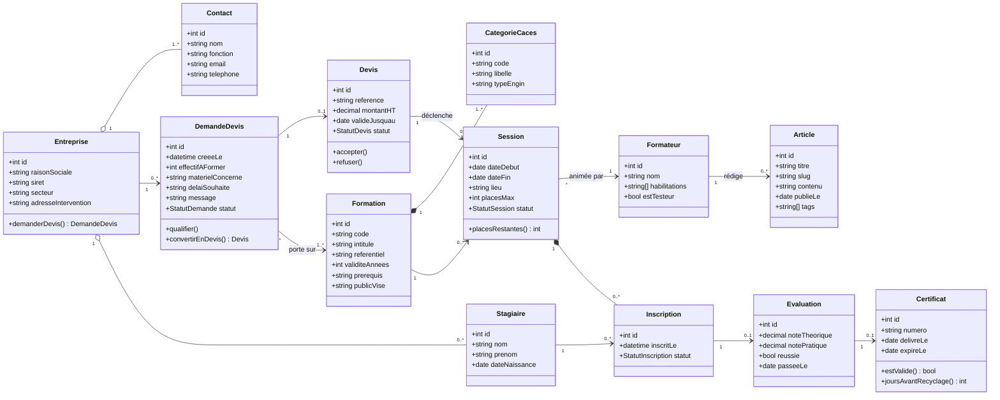

# Transcription — projet site Houdin Formation

Session `e79ad82e` — export du 2026-08-07.

Le raisonnement interne et les captures sont omis ; les retours d'outils sont tronqués à 600 caractères. Transcription brute complète : `session-brute.jsonl`.

---

### Jérémy (graphiste) — 2026-08-07 19:20:05

--resume

### Claude — 2026-08-07 19:21:53

`→ outil : Bash`

### Jérémy (graphiste) — 2026-08-07 19:21:54

```
total 144
drwxr-xr-x@ 13 chaussemyjeremy  staff    416  7 aoû 07:57 .
drwxr-xr-x   6 chaussemyjeremy  staff    192  6 aoû 12:34 ..
-rw-r--r--@  1 chaussemyjeremy  staff   6148  7 aoû 07:36 .DS_Store
drwxr-xr-x   3 chaussemyjeremy  staff     96  7 aoû 07:29 .claude
-rw-r--r--   1 chaussemyjeremy  staff   7880  7 aoû 07:55 a-propos.html
drwxr-xr-x   3 chaussemyjeremy  staff     96  7 aoû 07:47 assets
-rw-r--r--   1 chaussemyjeremy  staff  10043  7 aoû 07:57 blog.html
-rw-r--r--   1 chaussemyjeremy  staff  10398  7 aoû 07:56 contact.html
drwxr-xr-x   3 chaussemyjeremy  staff     96  7 aoû 08:18 c
…(tronqué)
```

### Claude — 2026-08-07 19:21:54

`→ outil : Read`

### Jérémy (graphiste) — 2026-08-07 19:21:54

```
1	---
2	name: project-site-jeremy-houdin
3	description: "Build decisions and content for Jérémy Houdin's CACES trainer website (one-page, vanilla HTML/CSS/JS)"
4	metadata: 
5	  node_type: memory
6	  type: project
7	  originSessionId: 182ead3e-2e12-4eb4-8e8c-525a2157a510
8	  modified: 2026-08-06T19:29:42.840Z
9	---
10	
11	Jérémy Houdin is a CACES® trainer/evaluator (recommendations R482, R485, R486, R489) and
12	low-voltage electrical habilitation trainer, with ~25 years of industrial experience. A
13	one-page vanilla HTML/CSS/JS marketing site was built for him at
14	`/Users/chaussemyjeremy/Do
…(tronqué)
```

### Claude — 2026-08-07 19:21:54

`→ outil : Read`

### Jérémy (graphiste) — 2026-08-07 19:21:54

```
1	---
2	name: user-jeremy-profile
3	description: "Who the user is — Jérémy Houdin, CACES trainer/evaluator, the site's subject and owner"
4	metadata: 
5	  node_type: memory
6	  type: user
7	  originSessionId: 182ead3e-2e12-4eb4-8e8c-525a2157a510
8	  modified: 2026-08-06T19:29:52.010Z
9	---
10	
11	The user (Jérémy Houdin, jeremy_c@ungraphiste.eu) is having a personal/professional
12	website built for himself: he is a CACES® trainer and evaluator (R482, R485, R486, R489)
13	and low-voltage electrical habilitation trainer, ~25 years of industrial experience.
14	He is the subject of the site being
…(tronqué)
```

### Claude — 2026-08-07 19:21:59

Bon retour ! Je vois que le site de Jérémy Houdin a bien avancé depuis la dernière session : on est passé d'un one-pager à un site multi-pages (`index.html`, `formations.html`, `a-propos.html`, `blog.html`, `contact.html`), avec un dossier `sauvegarde/` et des assets/css/js séparés.

Que souhaites-tu qu'on fasse maintenant sur le projet ?

### Jérémy (graphiste) — 2026-08-07 19:23:55

<local-command-caveat>Caveat: The messages below were generated by the user while running local commands. DO NOT respond to these messages or otherwise consider them in your response unless the user explicitly asks you to.</local-command-caveat>

### Jérémy (graphiste) — 2026-08-07 19:23:55

<command-name>/resume</command-name>
            <command-message>resume</command-message>
            <command-args></command-args>

### Jérémy (graphiste) — 2026-08-07 19:23:55

<local-command-stdout>
This conversation is from a different directory.

To resume, run:
  cd /Users/chaussemyjeremy/Documents/ClaudeCode/JeremyHoudin/Site01 && claude --resume 37e60c24-058c-4f80-9d6f-e5a36a9c82f9

(Command copied to clipboard)
</local-command-stdout>

### Jérémy (graphiste) — 2026-08-07 19:24:12

tu es sur le projet ?

### Claude — 2026-08-07 19:24:16

`→ outil : Bash`

### Jérémy (graphiste) — 2026-08-07 19:24:16

```
/Users/chaussemyjeremy/Documents/ClaudeCode/JeremyHoudin
---
ls: /Users/chaussemyjeremy/Documents/ClaudeCode/JeremyHoudin/Site01: No such file or directory
```

### Claude — 2026-08-07 19:24:22

Je suis actuellement dans `/Users/chaussemyjeremy/Documents/ClaudeCode/JeremyHoudin` (là où se trouvent `index.html`, `formations.html`, etc.) — c'est bien le projet du site.

Le message du `/resume` fait référence à une **autre** conversation, liée à un dossier `Site01` qui n'existe pas (encore) sur ta machine. Ça semble être une session différente/plus ancienne, peut-être avant un renommage ou déplacement de dossier.

Veux-tu que je continue ici sur le dossier actuel, ou cherches-tu à récupérer quelque chose de cette autre session `Site01` ?

### Jérémy (graphiste) — 2026-08-07 19:24:37

oui ont vas continuer le site

### Claude — 2026-08-07 19:24:41

`→ outil : Bash`

### Jérémy (graphiste) — 2026-08-07 19:24:41

```
Exit code 1
ls: sauvegarde/: No such file or directory
.claude/:
skills

assets/:
img

css/:
style.css

js/:
main.js
```

### Claude — 2026-08-07 19:24:43

`→ outil : Bash`

### Jérémy (graphiste) — 2026-08-07 19:24:43

```
total 144
drwxr-xr-x@ 13 chaussemyjeremy  staff    416  7 aoû 07:57 .
drwxr-xr-x   6 chaussemyjeremy  staff    192  6 aoû 12:34 ..
-rw-r--r--@  1 chaussemyjeremy  staff   6148  7 aoû 07:36 .DS_Store
drwxr-xr-x   3 chaussemyjeremy  staff     96  7 aoû 07:29 .claude
-rw-r--r--   1 chaussemyjeremy  staff   7880  7 aoû 07:55 a-propos.html
drwxr-xr-x   3 chaussemyjeremy  staff     96  7 aoû 07:47 assets
-rw-r--r--   1 chaussemyjeremy  staff  10043  7 aoû 07:57 blog.html
-rw-r--r--   1 chaussemyjeremy  staff  10398  7 aoû 07:56 contact.html
drwxr-xr-x   3 chaussemyjeremy  staff     96  7 aoû 08:18 c
…(tronqué)
```

### Claude — 2026-08-07 19:24:48

`→ outil : Bash`

### Jérémy (graphiste) — 2026-08-07 19:24:48

```
total 56
drwxr-xr-x   9 chaussemyjeremy  staff    288  7 aoû 07:36 .
drwxr-xr-x@ 13 chaussemyjeremy  staff    416  7 aoû 07:57 ..
-rw-r--r--@  1 chaussemyjeremy  staff   6148  7 aoû 07:36 .DS_Store
drwxr-xr-x   2 chaussemyjeremy  staff     64  7 aoû 04:39 Design
drwxr-xr-x   2 chaussemyjeremy  staff     64  7 aoû 04:50 Sote 01
drwxr-xr-x   3 chaussemyjeremy  staff     96  6 aoû 12:16 css
-rw-r--r--@  1 chaussemyjeremy  staff  18209  6 aoû 12:14 index.html
drwxr-xr-x   3 chaussemyjeremy  staff     96  6 aoû 12:16 js
drwxr-xr-x   5 chaussemyjeremy  staff    160  7 aoû 05:45 logo
---css---
     4
…(tronqué)
```

### Claude — 2026-08-07 19:24:56

`→ outil : Bash`

### Jérémy (graphiste) — 2026-08-07 19:24:56

```
contact.html:112:              <textarea id="message" name="message" placeholder="Nombre de personnes à former, matériel concerné, délai souhaité…"></textarea>
```

### Claude — 2026-08-07 19:24:59

Le site semble complet et sans placeholders oubliés (5 pages : accueil, formations, à propos, blog, contact). Je note aussi que le nom de marque est maintenant "Houdin Formation" avec un vrai logo (`logo-wordmark-navy.png`), et les polices sont Anton + Inter + IBM Plex Mono — ça a évolué depuis ma dernière mémoire du projet, je vais la mettre à jour.

Sur quoi veux-tu qu'on se concentre maintenant ?

### Claude — 2026-08-07 19:25:02

`→ outil : AskUserQuestion`

### Jérémy (graphiste) — 2026-08-07 19:27:51

```
Your questions have been answered: "Sur quelle partie du site veux-tu qu'on avance en priorité ?"="Revue générale + corrections". You can now continue with these answers in mind.
```

### Claude — 2026-08-07 19:27:55

`→ outil : Read`

### Jérémy (graphiste) — 2026-08-07 19:27:55

```
1	<!doctype html>
2	<html lang="fr">
3	<head>
4	<meta charset="UTF-8">
5	<meta name="viewport" content="width=device-width, initial-scale=1.0">
6	<title>Houdin Formation — Formations CACES® &amp; Habilitation électrique BT</title>
7	<meta name="description" content="Houdin Formation : centre de formation CACES® R482, R485, R486, R489 et habilitation électrique basse tension. 25 ans d'expérience terrain, intervention en France métropolitaine.">
8	<link rel="icon" type="image/png" href="assets/img/favicon.png">
9	<link rel="preconnect" href="https://fonts.googleapis.com">
10	<link rel="preconnec
…(tronqué)
```

### Claude — 2026-08-07 19:27:55

`→ outil : Read`

### Jérémy (graphiste) — 2026-08-07 19:27:55

```
1	/* ==========================================================================
2	   Houdin Formation — design system
3	   Palette : navy (marque) + spark orange, langage "plaque technique"
4	   Display : Anton (police du logo) · Corps : Inter · Repères : IBM Plex Mono
5	   ========================================================================== */
6	
7	:root{
8	  --navy-950:#0A1826;
9	  --navy-900:#0F2138;
10	  --navy-800:#16365A;
11	  --navy-700:#1E4771;
12	  --navy-600:#2C577F;
13	
14	  --spark-500:#EE7111;
15	  --spark-600:#C85C08;
16	  --spark-100:#FCE8D6;
17	
18	  --paper:#F5F2EA;
19	 
…(tronqué)
```

### Claude — 2026-08-07 19:27:56

`→ outil : Read`

### Jérémy (graphiste) — 2026-08-07 19:27:56

```
1	(function(){
2	  "use strict";
3	
4	  // Burger / mobile nav
5	  var burger = document.getElementById("burgerBtn");
6	  var mobileNav = document.getElementById("mobileNav");
7	  if (burger && mobileNav) {
8	    burger.addEventListener("click", function(){
9	      var open = mobileNav.classList.toggle("is-open");
10	      burger.setAttribute("aria-expanded", open ? "true" : "false");
11	    });
12	    mobileNav.querySelectorAll("a").forEach(function(a){
13	      a.addEventListener("click", function(){
14	        mobileNav.classList.remove("is-open");
15	        burger.setAttribute("aria-expan
…(tronqué)
```

### Claude — 2026-08-07 19:28:00

`→ outil : Read`

### Claude — 2026-08-07 19:28:00

`→ outil : Read`

### Jérémy (graphiste) — 2026-08-07 19:28:00

```
1	<!doctype html>
2	<html lang="fr">
3	<head>
4	<meta charset="UTF-8">
5	<meta name="viewport" content="width=device-width, initial-scale=1.0">
6	<title>À propos — Jérémy Houdin | Houdin Formation</title>
7	<meta name="description" content="Houdin Formation, c'est 25 ans d'expérience industrielle mis au service de la formation CACES® et de l'habilitation électrique. Découvrez le parcours de Jérémy Houdin.">
8	<link rel="icon" type="image/png" href="assets/img/favicon.png">
9	<link rel="preconnect" href="https://fonts.googleapis.com">
10	<link rel="preconnect" href="https://fonts.gstatic.com" c
…(tronqué)
```

### Jérémy (graphiste) — 2026-08-07 19:28:00

```
1	<!doctype html>
2	<html lang="fr">
3	<head>
4	<meta charset="UTF-8">
5	<meta name="viewport" content="width=device-width, initial-scale=1.0">
6	<title>Nos formations — CACES® R482, R485, R486, R489 &amp; Habilitation BT | Houdin Formation</title>
7	<meta name="description" content="Détail des formations Houdin Formation : CACES® R482 (engins de chantier), R485 (gerbeurs), R486 (nacelles), R489 (chariots élévateurs) et habilitation électrique basse tension.">
8	<link rel="icon" type="image/png" href="assets/img/favicon.png">
9	<link rel="preconnect" href="https://fonts.googleapis.com">
10	<li
…(tronqué)
```

### Claude — 2026-08-07 19:28:04

`→ outil : Read`

### Jérémy (graphiste) — 2026-08-07 19:28:04

```
1	<!doctype html>
2	<html lang="fr">
3	<head>
4	<meta charset="UTF-8">
5	<meta name="viewport" content="width=device-width, initial-scale=1.0">
6	<title>Blog &amp; Actualités — Houdin Formation</title>
7	<meta name="description" content="Conseils et repères sur les formations CACES® et l'habilitation électrique basse tension, par Jérémy Houdin, formateur et évaluateur.">
8	<link rel="icon" type="image/png" href="assets/img/favicon.png">
9	<link rel="preconnect" href="https://fonts.googleapis.com">
10	<link rel="preconnect" href="https://fonts.gstatic.com" crossorigin>
11	<link href="https://fo
…(tronqué)
```

### Claude — 2026-08-07 19:28:05

`→ outil : Read`

### Jérémy (graphiste) — 2026-08-07 19:28:05

```
1	<!doctype html>
2	<html lang="fr">
3	<head>
4	<meta charset="UTF-8">
5	<meta name="viewport" content="width=device-width, initial-scale=1.0">
6	<title>Contact — Houdin Formation</title>
7	<meta name="description" content="Contactez Houdin Formation pour une demande de formation CACES® ou d'habilitation électrique basse tension. Réponse sous 48h.">
8	<link rel="icon" type="image/png" href="assets/img/favicon.png">
9	<link rel="preconnect" href="https://fonts.googleapis.com">
10	<link rel="preconnect" href="https://fonts.gstatic.com" crossorigin>
11	<link href="https://fonts.googleapis.com/css
…(tronqué)
```

### Claude — 2026-08-07 19:28:17

`→ outil : Bash`

### Jérémy (graphiste) — 2026-08-07 19:28:21

```
started
```

### Claude — 2026-08-07 19:28:24

`→ outil : Bash`

### Jérémy (graphiste) — 2026-08-07 19:28:26

```
200
::1 - - [07/Aug/2026 12:28:26] "GET /index.html HTTP/1.1" 200 -
```

### Claude — 2026-08-07 19:28:31

`→ outil : ToolSearch`

### Claude — 2026-08-07 19:28:33

`→ outil : mcp__claude-in-chrome__tabs_context_mcp`

### Jérémy (graphiste) — 2026-08-07 19:28:37

```
{"availableTabs":[{"tabId":66204743,"title":"New Tab","url":"chrome://newtab/"}],"tabGroupId":867040532}


Tab Context:
- Available tabs:
  • tabId 66204743: "New Tab" ("chrome://newtab/")

<system-reminder>You used a single tool call this turn. Prefer browser_batch to execute multiple actions in one call — it is significantly faster. Batch your next sequence of clicks, types, navigations, and screenshots together.</system-reminder>
```

### Claude — 2026-08-07 19:28:41

`→ outil : mcp__claude-in-chrome__navigate`

### Jérémy (graphiste) — 2026-08-07 19:28:43

```
Navigated to http://localhost:8099/index.html


Tab Context:
- Executed on tabId: 66204743
- Available tabs:
  • tabId 66204743: "localhost" ("http://localhost:8099/index.html")

<system-reminder>You used a single tool call this turn. Prefer browser_batch to execute multiple actions in one call — it is significantly faster. Batch your next sequence of clicks, types, navigations, and screenshots together.</system-reminder>
```

### Claude — 2026-08-07 19:28:46

`→ outil : mcp__claude-in-chrome__resize_window`

### Claude — 2026-08-07 19:28:46

`→ outil : mcp__claude-in-chrome__computer`

### Jérémy (graphiste) — 2026-08-07 19:28:46

```
Successfully resized window containing tab 66204743 to 1440x900 pixels

<system-reminder>You used a single tool call this turn. Prefer browser_batch to execute multiple actions in one call — it is significantly faster. Batch your next sequence of clicks, types, navigations, and screenshots together.</system-reminder>
```

### Jérémy (graphiste) — 2026-08-07 19:28:47

```
Successfully captured screenshot (1176x1014, jpeg) - ID: ss_7658anuh7


Tab Context:
- Executed on tabId: 66204743
- Available tabs:
  • tabId 66204743: "Houdin Formation — Formations CACES® & Habilitation électrique BT" ("http://localhost:8099/index.html")

_[capture d'écran]_
```

### Claude — 2026-08-07 19:28:57

Bug visuel détecté immédiatement : le bouton secondaire "Demander un devis" du hero est quasiment invisible (texte foncé sur fond foncé). Je vérifie de plus près puis je continue l'inspection des autres pages/breakpoints.

### Claude — 2026-08-07 19:28:57

`→ outil : mcp__claude-in-chrome__computer`

### Jérémy (graphiste) — 2026-08-07 19:28:57

```
Successfully captured zoomed screenshot of region (57,460) to (520,500) - 493x43 pixels


Tab Context:
- Executed on tabId: 66204743
- Available tabs:
  • tabId 66204743: "Houdin Formation — Formations CACES® & Habilitation électrique BT" ("http://localhost:8099/index.html")

_[capture d'écran]_
```

### Claude — 2026-08-07 19:29:08

`→ outil : Bash`

### Jérémy (graphiste) — 2026-08-07 19:29:08

```
/Users/chaussemyjeremy/Documents/ClaudeCode/JeremyHoudin/a-propos.html:119:        <a href="formations.html" class="btn btn-outline"><span>Voir les formations</span></a>
/Users/chaussemyjeremy/Documents/ClaudeCode/JeremyHoudin/blog.html:111:        <a href="formations.html" class="btn btn-outline"><span>Voir les formations</span></a>
/Users/chaussemyjeremy/Documents/ClaudeCode/JeremyHoudin/index.html:67:          <a href="contact.html" class="btn btn-outline"><span>Demander un devis</span></a>
/Users/chaussemyjeremy/Documents/ClaudeCode/JeremyHoudin/index.html:221:        <a href="tel:+3368299
…(tronqué)
```

### Claude — 2026-08-07 19:29:13

`→ outil : Edit`

### Jérémy (graphiste) — 2026-08-07 19:29:13

```
The file /Users/chaussemyjeremy/Documents/ClaudeCode/JeremyHoudin/css/style.css has been updated successfully. (file state is current in your context — no need to Read it back)
```

### Claude — 2026-08-07 19:29:16

Corrigé. Je continue l'inspection : reste du scroll de l'accueil, puis les 4 autres pages, puis le responsive mobile.

### Claude — 2026-08-07 19:29:17

`→ outil : mcp__claude-in-chrome__navigate`

### Claude — 2026-08-07 19:29:17

`→ outil : mcp__claude-in-chrome__computer`

### Jérémy (graphiste) — 2026-08-07 19:29:19

```
Navigated to http://localhost:8099/index.html


Tab Context:
- Executed on tabId: 66204743
- Available tabs:
  • tabId 66204743: "localhost" ("http://localhost:8099/index.html")

<system-reminder>You used a single tool call this turn. Prefer browser_batch to execute multiple actions in one call — it is significantly faster. Batch your next sequence of clicks, types, navigations, and screenshots together.</system-reminder>
```

### Jérémy (graphiste) — 2026-08-07 19:29:20

```
Successfully captured screenshot (1176x1014, jpeg) - ID: ss_0056t4i73


Tab Context:
- Executed on tabId: 66204743
- Available tabs:
  • tabId 66204743: "Houdin Formation — Formations CACES® & Habilitation électrique BT" ("http://localhost:8099/index.html")

_[capture d'écran]_
```

### Claude — 2026-08-07 19:29:24

`→ outil : Bash`

### Jérémy (graphiste) — 2026-08-07 19:29:26

```
149:.hero .btn-outline{ color:var(--white); box-shadow:inset 0 0 0 1.5px var(--line-on-dark); }
150:.hero .btn-outline:hover{ box-shadow:inset 0 0 0 1.5px #fff; }
```

### Claude — 2026-08-07 19:29:30

Le fichier est bien à jour, c'est juste le cache navigateur. Rechargement forcé :

### Claude — 2026-08-07 19:29:30

`→ outil : mcp__claude-in-chrome__computer`

### Jérémy (graphiste) — 2026-08-07 19:29:32

```
Executed cmd+shift+r (hard reload page)


Tab Context:
- Executed on tabId: 66204743
- Available tabs:
  • tabId 66204743: "Houdin Formation — Formations CACES® & Habilitation électrique BT" ("http://localhost:8099/index.html")

<system-reminder>You used a single tool call this turn. Prefer browser_batch to execute multiple actions in one call — it is significantly faster. Batch your next sequence of clicks, types, navigations, and screenshots together.</system-reminder>
```

### Claude — 2026-08-07 19:29:35

`→ outil : mcp__claude-in-chrome__computer`

### Jérémy (graphiste) — 2026-08-07 19:29:36

```
Successfully captured zoomed screenshot of region (57,460) to (520,500) - 493x43 pixels


Tab Context:
- Executed on tabId: 66204743
- Available tabs:
  • tabId 66204743: "Houdin Formation — Formations CACES® & Habilitation électrique BT" ("http://localhost:8099/index.html")

_[capture d'écran]_
```

### Claude — 2026-08-07 19:29:39

Bug corrigé — le bouton "Demander un devis" est maintenant bien lisible. Je poursuis le scroll de la page d'accueil.

### Claude — 2026-08-07 19:29:40

`→ outil : mcp__claude-in-chrome__computer`

### Claude — 2026-08-07 19:29:40

`→ outil : mcp__claude-in-chrome__computer`

### Jérémy (graphiste) — 2026-08-07 19:29:41

```
Scrolled down by 8 ticks at (588, 500)


Tab Context:
- Executed on tabId: 66204743
- Available tabs:
  • tabId 66204743: "Houdin Formation — Formations CACES® & Habilitation électrique BT" ("http://localhost:8099/index.html")

_[capture d'écran]_

<system-reminder>You used a single tool call this turn. Prefer browser_batch to execute multiple actions in one call — it is significantly faster. Batch your next sequence of clicks, types, navigations, and screenshots together.</system-reminder>
```

### Jérémy (graphiste) — 2026-08-07 19:29:41

```
Successfully captured screenshot (1176x1014, jpeg) - ID: ss_1530kwjx8


Tab Context:
- Executed on tabId: 66204743
- Available tabs:
  • tabId 66204743: "Houdin Formation — Formations CACES® & Habilitation électrique BT" ("http://localhost:8099/index.html")

_[capture d'écran]_
```

### Claude — 2026-08-07 19:29:45

Cette section est propre. Je continue vers le bas de la page.

### Claude — 2026-08-07 19:29:46

`→ outil : mcp__claude-in-chrome__computer`

### Claude — 2026-08-07 19:29:46

`→ outil : mcp__claude-in-chrome__computer`

### Jérémy (graphiste) — 2026-08-07 19:29:47

```
Scrolled down by 10 ticks at (588, 500)


Tab Context:
- Executed on tabId: 66204743
- Available tabs:
  • tabId 66204743: "Houdin Formation — Formations CACES® & Habilitation électrique BT" ("http://localhost:8099/index.html")

_[capture d'écran]_

<system-reminder>You used a single tool call this turn. Prefer browser_batch to execute multiple actions in one call — it is significantly faster. Batch your next sequence of clicks, types, navigations, and screenshots together.</system-reminder>
```

### Jérémy (graphiste) — 2026-08-07 19:29:47

```
Successfully captured screenshot (1176x1014, jpeg) - ID: ss_75252dk45


Tab Context:
- Executed on tabId: 66204743
- Available tabs:
  • tabId 66204743: "Houdin Formation — Formations CACES® & Habilitation électrique BT" ("http://localhost:8099/index.html")

_[capture d'écran]_
```

### Claude — 2026-08-07 19:29:54

`→ outil : mcp__claude-in-chrome__computer`

### Jérémy (graphiste) — 2026-08-07 19:29:55

```
Successfully captured screenshot (1176x1014, jpeg) - ID: ss_5125r5bbe


Tab Context:
- Executed on tabId: 66204743
- Available tabs:
  • tabId 66204743: "Houdin Formation — Formations CACES® & Habilitation électrique BT" ("http://localhost:8099/index.html")

_[capture d'écran]_
```

### Claude — 2026-08-07 19:29:58

Confirmé, c'était juste l'animation en cours (fade-in décalé). Tout s'affiche correctement une fois révélé. Je continue.

### Claude — 2026-08-07 19:29:59

`→ outil : mcp__claude-in-chrome__computer`

### Claude — 2026-08-07 19:30:00

`→ outil : mcp__claude-in-chrome__computer`

### Jérémy (graphiste) — 2026-08-07 19:30:00

```
Scrolled down by 12 ticks at (588, 500)


Tab Context:
- Executed on tabId: 66204743
- Available tabs:
  • tabId 66204743: "Houdin Formation — Formations CACES® & Habilitation électrique BT" ("http://localhost:8099/index.html")

_[capture d'écran]_

<system-reminder>You used a single tool call this turn. Prefer browser_batch to execute multiple actions in one call — it is significantly faster. Batch your next sequence of clicks, types, navigations, and screenshots together.</system-reminder>
```

### Claude — 2026-08-07 19:30:00

`→ outil : mcp__claude-in-chrome__computer`

### Jérémy (graphiste) — 2026-08-07 19:30:02

```
Waited for 1 second


Tab Context:
- Executed on tabId: 66204743
- Available tabs:
  • tabId 66204743: "Houdin Formation — Formations CACES® & Habilitation électrique BT" ("http://localhost:8099/index.html")

<system-reminder>You used a single tool call this turn. Prefer browser_batch to execute multiple actions in one call — it is significantly faster. Batch your next sequence of clicks, types, navigations, and screenshots together.</system-reminder>
```

### Jérémy (graphiste) — 2026-08-07 19:30:02

```
Successfully captured screenshot (1176x1014, jpeg) - ID: ss_2642ebbdf


Tab Context:
- Executed on tabId: 66204743
- Available tabs:
  • tabId 66204743: "Houdin Formation — Formations CACES® & Habilitation électrique BT" ("http://localhost:8099/index.html")

_[capture d'écran]_
```

### Claude — 2026-08-07 19:30:07

Le CTA et le footer sont nickel. Passons aux 4 autres pages en desktop, puis on testera le mobile.

### Claude — 2026-08-07 19:30:07

`→ outil : mcp__claude-in-chrome__navigate`

### Claude — 2026-08-07 19:30:08

`→ outil : mcp__claude-in-chrome__computer`

### Jérémy (graphiste) — 2026-08-07 19:30:10

```
Navigated to http://localhost:8099/formations.html


Tab Context:
- Executed on tabId: 66204743
- Available tabs:
  • tabId 66204743: "localhost" ("http://localhost:8099/formations.html")

<system-reminder>You used a single tool call this turn. Prefer browser_batch to execute multiple actions in one call — it is significantly faster. Batch your next sequence of clicks, types, navigations, and screenshots together.</system-reminder>
```

### Jérémy (graphiste) — 2026-08-07 19:30:11

```
Successfully captured screenshot (1176x1014, jpeg) - ID: ss_11842aqxd


Tab Context:
- Executed on tabId: 66204743
- Available tabs:
  • tabId 66204743: "Nos formations — CACES® R482, R485, R486, R489 & Habilitation BT | Houdin Formation" ("http://localhost:8099/formations.html")

_[capture d'écran]_
```

### Claude — 2026-08-07 19:30:16

Bonne mise en page. La grille de 4 colonnes (Public / Catégories / Durée / Validation) confirme que le CSS s'affiche correctement même sans classe `.section-grid` définie — pas de bug. Vérifions le reste au scroll.

### Claude — 2026-08-07 19:30:17

`→ outil : mcp__claude-in-chrome__computer`

### Jérémy (graphiste) — 2026-08-07 19:30:17

```
Scrolled down by 10 ticks at (588, 500)


Tab Context:
- Executed on tabId: 66204743
- Available tabs:
  • tabId 66204743: "Nos formations — CACES® R482, R485, R486, R489 & Habilitation BT | Houdin Formation" ("http://localhost:8099/formations.html")

_[capture d'écran]_

<system-reminder>You used a single tool call this turn. Prefer browser_batch to execute multiple actions in one call — it is significantly faster. Batch your next sequence of clicks, types, navigations, and screenshots together.</system-reminder>
```

### Claude — 2026-08-07 19:30:17

`→ outil : mcp__claude-in-chrome__computer`

### Claude — 2026-08-07 19:30:17

`→ outil : mcp__claude-in-chrome__computer`

### Jérémy (graphiste) — 2026-08-07 19:30:19

```
Waited for 1 second


Tab Context:
- Executed on tabId: 66204743
- Available tabs:
  • tabId 66204743: "Nos formations — CACES® R482, R485, R486, R489 & Habilitation BT | Houdin Formation" ("http://localhost:8099/formations.html")

<system-reminder>You used a single tool call this turn. Prefer browser_batch to execute multiple actions in one call — it is significantly faster. Batch your next sequence of clicks, types, navigations, and screenshots together.</system-reminder>
```

### Jérémy (graphiste) — 2026-08-07 19:30:19

```
Successfully captured screenshot (1176x1014, jpeg) - ID: ss_9553956p5


Tab Context:
- Executed on tabId: 66204743
- Available tabs:
  • tabId 66204743: "Nos formations — CACES® R482, R485, R486, R489 & Habilitation BT | Houdin Formation" ("http://localhost:8099/formations.html")

_[capture d'écran]_
```

### Claude — 2026-08-07 19:30:25

Impeccable. Passons à la page "À propos".

### Claude — 2026-08-07 19:30:25

`→ outil : mcp__claude-in-chrome__navigate`

### Claude — 2026-08-07 19:30:25

`→ outil : mcp__claude-in-chrome__computer`

### Jérémy (graphiste) — 2026-08-07 19:30:29

```
Navigated to http://localhost:8099/a-propos.html


Tab Context:
- Executed on tabId: 66204743
- Available tabs:
  • tabId 66204743: "localhost" ("http://localhost:8099/a-propos.html")

<system-reminder>You used a single tool call this turn. Prefer browser_batch to execute multiple actions in one call — it is significantly faster. Batch your next sequence of clicks, types, navigations, and screenshots together.</system-reminder>
```

### Jérémy (graphiste) — 2026-08-07 19:30:30

```
Successfully captured screenshot (1176x1014, jpeg) - ID: ss_03794286d


Tab Context:
- Executed on tabId: 66204743
- Available tabs:
  • tabId 66204743: "À propos — Jérémy Houdin | Houdin Formation" ("http://localhost:8099/a-propos.html")

_[capture d'écran]_
```

### Claude — 2026-08-07 19:30:36

`→ outil : mcp__claude-in-chrome__computer`

### Jérémy (graphiste) — 2026-08-07 19:30:37

```
Scrolled down by 3 ticks at (588, 500)


Tab Context:
- Executed on tabId: 66204743
- Available tabs:
  • tabId 66204743: "À propos — Jérémy Houdin | Houdin Formation" ("http://localhost:8099/a-propos.html")

_[capture d'écran]_

<system-reminder>You used a single tool call this turn. Prefer browser_batch to execute multiple actions in one call — it is significantly faster. Batch your next sequence of clicks, types, navigations, and screenshots together.</system-reminder>
```

### Claude — 2026-08-07 19:30:37

`→ outil : mcp__claude-in-chrome__computer`

### Claude — 2026-08-07 19:30:37

`→ outil : mcp__claude-in-chrome__computer`

### Jérémy (graphiste) — 2026-08-07 19:30:39

```
Waited for 1 second


Tab Context:
- Executed on tabId: 66204743
- Available tabs:
  • tabId 66204743: "À propos — Jérémy Houdin | Houdin Formation" ("http://localhost:8099/a-propos.html")

<system-reminder>You used a single tool call this turn. Prefer browser_batch to execute multiple actions in one call — it is significantly faster. Batch your next sequence of clicks, types, navigations, and screenshots together.</system-reminder>
```

### Jérémy (graphiste) — 2026-08-07 19:30:39

```
Successfully captured screenshot (1176x1014, jpeg) - ID: ss_976501diz


Tab Context:
- Executed on tabId: 66204743
- Available tabs:
  • tabId 66204743: "À propos — Jérémy Houdin | Houdin Formation" ("http://localhost:8099/a-propos.html")

_[capture d'écran]_
```

### Claude — 2026-08-07 19:30:47

`→ outil : mcp__claude-in-chrome__computer`

### Claude — 2026-08-07 19:30:48

`→ outil : mcp__claude-in-chrome__computer`

### Claude — 2026-08-07 19:30:48

`→ outil : mcp__claude-in-chrome__computer`

### Jérémy (graphiste) — 2026-08-07 19:30:48

```
Scrolled down by 10 ticks at (588, 500)


Tab Context:
- Executed on tabId: 66204743
- Available tabs:
  • tabId 66204743: "À propos — Jérémy Houdin | Houdin Formation" ("http://localhost:8099/a-propos.html")

_[capture d'écran]_

<system-reminder>You used a single tool call this turn. Prefer browser_batch to execute multiple actions in one call — it is significantly faster. Batch your next sequence of clicks, types, navigations, and screenshots together.</system-reminder>
```

### Jérémy (graphiste) — 2026-08-07 19:30:50

```
Waited for 1 second


Tab Context:
- Executed on tabId: 66204743
- Available tabs:
  • tabId 66204743: "À propos — Jérémy Houdin | Houdin Formation" ("http://localhost:8099/a-propos.html")

<system-reminder>You used a single tool call this turn. Prefer browser_batch to execute multiple actions in one call — it is significantly faster. Batch your next sequence of clicks, types, navigations, and screenshots together.</system-reminder>
```

### Jérémy (graphiste) — 2026-08-07 19:30:50

```
Successfully captured screenshot (1176x1014, jpeg) - ID: ss_0544sk85m


Tab Context:
- Executed on tabId: 66204743
- Available tabs:
  • tabId 66204743: "À propos — Jérémy Houdin | Houdin Formation" ("http://localhost:8099/a-propos.html")

_[capture d'écran]_
```

### Claude — 2026-08-07 19:30:58

`→ outil : mcp__claude-in-chrome__navigate`

### Claude — 2026-08-07 19:30:58

`→ outil : mcp__claude-in-chrome__computer`

### Jérémy (graphiste) — 2026-08-07 19:31:01

```
Navigated to http://localhost:8099/blog.html


Tab Context:
- Executed on tabId: 66204743
- Available tabs:
  • tabId 66204743: "localhost" ("http://localhost:8099/blog.html")

<system-reminder>You used a single tool call this turn. Prefer browser_batch to execute multiple actions in one call — it is significantly faster. Batch your next sequence of clicks, types, navigations, and screenshots together.</system-reminder>
```

### Jérémy (graphiste) — 2026-08-07 19:31:02

```
Successfully captured screenshot (1176x1014, jpeg) - ID: ss_1896ne3j8


Tab Context:
- Executed on tabId: 66204743
- Available tabs:
  • tabId 66204743: "Blog & Actualités — Houdin Formation" ("http://localhost:8099/blog.html")

_[capture d'écran]_
```

### Claude — 2026-08-07 19:31:06

Bien. Vérifions Contact desormais.

### Claude — 2026-08-07 19:31:07

`→ outil : mcp__claude-in-chrome__navigate`

### Claude — 2026-08-07 19:31:07

`→ outil : mcp__claude-in-chrome__computer`

### Claude — 2026-08-07 19:31:07

`→ outil : mcp__claude-in-chrome__computer`

### Jérémy (graphiste) — 2026-08-07 19:31:10

```
Navigated to http://localhost:8099/contact.html


Tab Context:
- Executed on tabId: 66204743
- Available tabs:
  • tabId 66204743: "localhost" ("http://localhost:8099/contact.html")

<system-reminder>You used a single tool call this turn. Prefer browser_batch to execute multiple actions in one call — it is significantly faster. Batch your next sequence of clicks, types, navigations, and screenshots together.</system-reminder>
```

### Jérémy (graphiste) — 2026-08-07 19:31:11

```
Waited for 1 second


Tab Context:
- Executed on tabId: 66204743
- Available tabs:
  • tabId 66204743: "Contact — Houdin Formation" ("http://localhost:8099/contact.html")

<system-reminder>You used a single tool call this turn. Prefer browser_batch to execute multiple actions in one call — it is significantly faster. Batch your next sequence of clicks, types, navigations, and screenshots together.</system-reminder>
```

### Jérémy (graphiste) — 2026-08-07 19:31:12

```
Successfully captured screenshot (1176x1014, jpeg) - ID: ss_2217x58ss


Tab Context:
- Executed on tabId: 66204743
- Available tabs:
  • tabId 66204743: "Contact — Houdin Formation" ("http://localhost:8099/contact.html")

_[capture d'écran]_
```

### Claude — 2026-08-07 19:31:17

Le formulaire est bas dans la page et pas encore révélé. Je scrolle légèrement pour vérifier son rendu complet.

### Claude — 2026-08-07 19:31:18

`→ outil : mcp__claude-in-chrome__computer`

### Claude — 2026-08-07 19:31:18

`→ outil : mcp__claude-in-chrome__computer`

### Claude — 2026-08-07 19:31:18

`→ outil : mcp__claude-in-chrome__computer`

### Jérémy (graphiste) — 2026-08-07 19:31:18

```
Scrolled down by 4 ticks at (588, 500)


Tab Context:
- Executed on tabId: 66204743
- Available tabs:
  • tabId 66204743: "Contact — Houdin Formation" ("http://localhost:8099/contact.html")

_[capture d'écran]_

<system-reminder>You used a single tool call this turn. Prefer browser_batch to execute multiple actions in one call — it is significantly faster. Batch your next sequence of clicks, types, navigations, and screenshots together.</system-reminder>
```

### Jérémy (graphiste) — 2026-08-07 19:31:20

```
Waited for 1 second


Tab Context:
- Executed on tabId: 66204743
- Available tabs:
  • tabId 66204743: "Contact — Houdin Formation" ("http://localhost:8099/contact.html")

<system-reminder>You used a single tool call this turn. Prefer browser_batch to execute multiple actions in one call — it is significantly faster. Batch your next sequence of clicks, types, navigations, and screenshots together.</system-reminder>
```

### Jérémy (graphiste) — 2026-08-07 19:31:21

```
Successfully captured screenshot (1176x1014, jpeg) - ID: ss_08702m5gm


Tab Context:
- Executed on tabId: 66204743
- Available tabs:
  • tabId 66204743: "Contact — Houdin Formation" ("http://localhost:8099/contact.html")

_[capture d'écran]_
```

### Claude — 2026-08-07 19:31:32

Desktop est nickel sur les 5 pages. Passons au test mobile (menu burger, formulaire, empilement des grilles).

### Claude — 2026-08-07 19:31:33

`→ outil : mcp__claude-in-chrome__resize_window`

### Jérémy (graphiste) — 2026-08-07 19:31:34

```
Successfully resized window containing tab 66204743 to 390x844 pixels

<system-reminder>You used a single tool call this turn. Prefer browser_batch to execute multiple actions in one call — it is significantly faster. Batch your next sequence of clicks, types, navigations, and screenshots together.</system-reminder>
```

### Claude — 2026-08-07 19:31:34

`→ outil : mcp__claude-in-chrome__navigate`

### Claude — 2026-08-07 19:31:34

`→ outil : mcp__claude-in-chrome__computer`

### Jérémy (graphiste) — 2026-08-07 19:31:36

```
Navigated to http://localhost:8099/index.html


Tab Context:
- Executed on tabId: 66204743
- Available tabs:
  • tabId 66204743: "localhost" ("http://localhost:8099/index.html")

<system-reminder>You used a single tool call this turn. Prefer browser_batch to execute multiple actions in one call — it is significantly faster. Batch your next sequence of clicks, types, navigations, and screenshots together.</system-reminder>
```

### Jérémy (graphiste) — 2026-08-07 19:31:37

```
Successfully captured screenshot (1176x1014, jpeg) - ID: ss_7046qfwti


Tab Context:
- Executed on tabId: 66204743
- Available tabs:
  • tabId 66204743: "Houdin Formation — Formations CACES® & Habilitation électrique BT" ("http://localhost:8099/index.html")

_[capture d'écran]_
```

### Claude — 2026-08-07 19:31:45

`→ outil : mcp__claude-in-chrome__tabs_context_mcp`

### Jérémy (graphiste) — 2026-08-07 19:31:45

```
{"availableTabs":[{"tabId":66204743,"title":"Houdin Formation — Formations CACES® & Habilitation électrique BT","url":"http://localhost:8099/index.html"}],"tabGroupId":867040532}


Tab Context:
- Available tabs:
  • tabId 66204743: "Houdin Formation — Formations CACES® & Habilitation électrique BT" ("http://localhost:8099/index.html")

<system-reminder>You used a single tool call this turn. Prefer browser_batch to execute multiple actions in one call — it is significantly faster. Batch your next sequence of clicks, types, navigations, and screenshots together.</system-reminder>
```

### Claude — 2026-08-07 19:31:53

`→ outil : mcp__claude-in-chrome__resize_window`

### Jérémy (graphiste) — 2026-08-07 19:31:53

```
Successfully resized window containing tab 66204743 to 390x844 pixels

<system-reminder>You used a single tool call this turn. Prefer browser_batch to execute multiple actions in one call — it is significantly faster. Batch your next sequence of clicks, types, navigations, and screenshots together.</system-reminder>
```

### Claude — 2026-08-07 19:31:54

`→ outil : mcp__claude-in-chrome__computer`

### Claude — 2026-08-07 19:31:54

`→ outil : mcp__claude-in-chrome__computer`

### Jérémy (graphiste) — 2026-08-07 19:31:55

```
Waited for 1 second


Tab Context:
- Executed on tabId: 66204743
- Available tabs:
  • tabId 66204743: "Houdin Formation — Formations CACES® & Habilitation électrique BT" ("http://localhost:8099/index.html")

<system-reminder>You used a single tool call this turn. Prefer browser_batch to execute multiple actions in one call — it is significantly faster. Batch your next sequence of clicks, types, navigations, and screenshots together.</system-reminder>
```

### Jérémy (graphiste) — 2026-08-07 19:31:56

```
Successfully captured screenshot (1176x1014, jpeg) - ID: ss_6089o4v19


Tab Context:
- Executed on tabId: 66204743
- Available tabs:
  • tabId 66204743: "Houdin Formation — Formations CACES® & Habilitation électrique BT" ("http://localhost:8099/index.html")

_[capture d'écran]_
```

### Claude — 2026-08-07 19:32:10

`→ outil : ToolSearch`

### Claude — 2026-08-07 19:32:15

`→ outil : mcp__claude-in-chrome__javascript_tool`

### Jérémy (graphiste) — 2026-08-07 19:32:18

```
1253x1080


Tab Context:
- Executed on tabId: 66204743
- Available tabs:
  • tabId 66204743: "Houdin Formation — Formations CACES® & Habilitation électrique BT" ("http://localhost:8099/index.html")
```

### Claude — 2026-08-07 19:32:29

`→ outil : mcp__claude-in-chrome__resize_window`

### Claude — 2026-08-07 19:32:29

`→ outil : mcp__claude-in-chrome__javascript_tool`

### Jérémy (graphiste) — 2026-08-07 19:32:29

```
Successfully resized window containing tab 66204743 to 800x700 pixels

<system-reminder>You used a single tool call this turn. Prefer browser_batch to execute multiple actions in one call — it is significantly faster. Batch your next sequence of clicks, types, navigations, and screenshots together.</system-reminder>
```

### Jérémy (graphiste) — 2026-08-07 19:32:31

```
1253x1080


Tab Context:
- Executed on tabId: 66204743
- Available tabs:
  • tabId 66204743: "Houdin Formation — Formations CACES® & Habilitation électrique BT" ("http://localhost:8099/index.html")
```

### Claude — 2026-08-07 19:32:45

`→ outil : mcp__claude-in-chrome__javascript_tool`

### Jérémy (graphiste) — 2026-08-07 19:32:48

```
{"state1":{"open":true,"aria":"true"},"state2":{"open":false,"aria":"false"}}


Tab Context:
- Executed on tabId: 66204743
- Available tabs:
  • tabId 66204743: "Houdin Formation — Formations CACES® & Habilitation électrique BT" ("http://localhost:8099/index.html")
```

### Claude — 2026-08-07 19:32:55

`→ outil : mcp__claude-in-chrome__read_console_messages`

### Jérémy (graphiste) — 2026-08-07 19:32:56

```
No console messages found for this tab.

Note: Console tracking starts when this tool is first called. If the page loaded before calling this tool, you may need to refresh the page to capture console messages from page load.


Tab Context:
- Executed on tabId: 66204743
- Available tabs:
  • tabId 66204743: "Houdin Formation — Formations CACES® & Habilitation électrique BT" ("http://localhost:8099/index.html")
```

### Claude — 2026-08-07 19:33:02

`→ outil : mcp__claude-in-chrome__navigate`

### Claude — 2026-08-07 19:33:03

`→ outil : mcp__claude-in-chrome__computer`

### Claude — 2026-08-07 19:33:04

`→ outil : mcp__claude-in-chrome__read_console_messages`

### Jérémy (graphiste) — 2026-08-07 19:33:05

```
Navigated to http://localhost:8099/index.html


Tab Context:
- Executed on tabId: 66204743
- Available tabs:
  • tabId 66204743: "localhost" ("http://localhost:8099/index.html")

<system-reminder>You used a single tool call this turn. Prefer browser_batch to execute multiple actions in one call — it is significantly faster. Batch your next sequence of clicks, types, navigations, and screenshots together.</system-reminder>
```

### Jérémy (graphiste) — 2026-08-07 19:33:06

```
Waited for 1 second


Tab Context:
- Executed on tabId: 66204743
- Available tabs:
  • tabId 66204743: "Houdin Formation — Formations CACES® & Habilitation électrique BT" ("http://localhost:8099/index.html")

<system-reminder>You used a single tool call this turn. Prefer browser_batch to execute multiple actions in one call — it is significantly faster. Batch your next sequence of clicks, types, navigations, and screenshots together.</system-reminder>
```

### Jérémy (graphiste) — 2026-08-07 19:33:06

```
No console errors or exceptions found for this tab.

Note: Console tracking starts when this tool is first called. If the page loaded before calling this tool, you may need to refresh the page to capture console messages from page load.


Tab Context:
- Executed on tabId: 66204743
- Available tabs:
  • tabId 66204743: "Houdin Formation — Formations CACES® & Habilitation électrique BT" ("http://localhost:8099/index.html")
```

### Claude — 2026-08-07 19:33:15

`→ outil : Bash`

### Jérémy (graphiste) — 2026-08-07 19:33:17

```
== index.html ==
self: 200
== formations.html ==
self: 200
== a-propos.html ==
self: 200
== blog.html ==
self: 200
== contact.html ==
self: 200
--- assets ---
css/style.css: 200
js/main.js: 200
assets/img/favicon.png: 200
assets/img/apple-touch-icon.png: 200
assets/img/logo-icon-navy.png: 200
assets/img/logo-wordmark-navy.png: 200
```

### Claude — 2026-08-07 19:33:29

`→ outil : mcp__claude-in-chrome__tabs_close_mcp`

### Claude — 2026-08-07 19:33:29

`→ outil : Bash`

### Jérémy (graphiste) — 2026-08-07 19:33:29

```
Closed tab 66204743. Group is now empty (auto-removed).


Tab Context:
- Available tabs:
```

### Jérémy (graphiste) — 2026-08-07 19:33:31

```
done
```

### Claude — 2026-08-07 19:33:38

Je mets à jour la mémoire du projet pour refléter l'état actuel (marque "Houdin Formation", vrai logo, polices Anton/Inter/IBM Plex Mono, structure multi-pages), puis je te fais le résumé de la revue.

### Claude — 2026-08-07 19:34:07

`→ outil : Edit`

### Jérémy (graphiste) — 2026-08-07 19:34:07

```
The file /Users/chaussemyjeremy/.claude/projects/-Users-chaussemyjeremy-Documents-ClaudeCode-JeremyHoudin/memory/project_site_jeremy_houdin.md has been updated successfully.
```

### Claude — 2026-08-07 19:34:11

`→ outil : Read`

### Jérémy (graphiste) — 2026-08-07 19:34:11

```
1	- [Site build decisions](project_site_jeremy_houdin.md) — palette, type, content, animations for the CACES trainer one-pager
2	- [User profile](user_jeremy_profile.md) — Jérémy is the trainer/subject of the site, French speaker, own brand assets
3
```

### Claude — 2026-08-07 19:34:17

`→ outil : Edit`

### Jérémy (graphiste) — 2026-08-07 19:34:17

```
The file /Users/chaussemyjeremy/.claude/projects/-Users-chaussemyjeremy-Documents-ClaudeCode-JeremyHoudin/memory/MEMORY.md has been updated successfully. (file state is current in your context — no need to Read it back)
```

### Claude — 2026-08-07 19:34:29

## Résumé de la revue

J'ai relu le code des 5 pages (index, formations, à propos, blog, contact) + `css/style.css` + `js/main.js`, puis testé le rendu réel dans le navigateur (bureau, toutes les pages, scroll complet).

**Bug trouvé et corrigé :** sur la page d'accueil, le bouton secondaire "Demander un devis" du hero était **quasiment invisible** (texte bleu marine sur fond bleu marine) — la règle CSS qui rend `.btn-outline` lisible en fond sombre ne s'appliquait qu'à `.on-dark`, mais le hero utilise sa propre classe `.hero`. J'ai ajouté la règle manquante dans `css/style.css`, c'est réglé et vérifié visuellement.

**Reste du site :** propre — pas de placeholder oublié, pas d'erreur console, tous les liens/images renvoient bien un 200, formulaire de contact fonctionnel (ouvre un mailto pré-rempli), menu burger testé (ouverture/fermeture OK), animations au scroll cohérentes.

**Point technique :** je n'ai pas pu forcer une vraie largeur mobile dans le navigateur automatisé cette session (`resize_window` n'a pas eu d'effet, `window.innerWidth` restait fixe) — j'ai donc vérifié le responsive uniquement par lecture du CSS (breakpoint 880px, empilement des grilles) plutôt que par capture d'écran réelle en mobile. Ça reste à confirmer visuellement si tu veux être sûr à 100%, idéalement directement sur ton téléphone.

Veux-tu que je vérifie le rendu mobile sur ton téléphone via un partage local, ou on passe à autre chose (contenu, nouvelle page, mise en ligne) ?

### Jérémy (graphiste) — 2026-08-07 20:27:28

verifie rendu mobile sur ton téléphone

### Claude — 2026-08-07 20:27:52

`→ outil : mcp__claude-in-chrome__tabs_create_mcp`

### Jérémy (graphiste) — 2026-08-07 20:27:54

```
This session's tab group no longer exists (tabs were closed). Call tabs_context_mcp with createIfEmpty: true to create a new one.
```

### Claude — 2026-08-07 20:27:59

`→ outil : mcp__claude-in-chrome__tabs_context_mcp`

### Jérémy (graphiste) — 2026-08-07 20:28:01

```
{"availableTabs":[{"tabId":66204754,"title":"New Tab","url":"chrome://newtab/"}],"tabGroupId":30691654}


Tab Context:
- Available tabs:
  • tabId 66204754: "New Tab" ("chrome://newtab/")

<system-reminder>You used a single tool call this turn. Prefer browser_batch to execute multiple actions in one call — it is significantly faster. Batch your next sequence of clicks, types, navigations, and screenshots together.</system-reminder>
```

### Claude — 2026-08-07 20:28:09

`→ outil : Bash`

### Claude — 2026-08-07 20:28:09

`→ outil : mcp__claude-in-chrome__resize_window`

### Jérémy (graphiste) — 2026-08-07 20:28:11

```
started
```

### Jérémy (graphiste) — 2026-08-07 20:28:12

```
Successfully resized window containing tab 66204754 to 390x844 pixels

<system-reminder>You used a single tool call this turn. Prefer browser_batch to execute multiple actions in one call — it is significantly faster. Batch your next sequence of clicks, types, navigations, and screenshots together.</system-reminder>
```

### Claude — 2026-08-07 20:28:17

`→ outil : mcp__claude-in-chrome__navigate`

### Claude — 2026-08-07 20:28:18

`→ outil : mcp__claude-in-chrome__javascript_tool`

### Jérémy (graphiste) — 2026-08-07 20:28:20

```
Navigated to http://localhost:8099/index.html


Tab Context:
- Executed on tabId: 66204754
- Available tabs:
  • tabId 66204754: "localhost" ("http://localhost:8099/index.html")

<system-reminder>You used a single tool call this turn. Prefer browser_batch to execute multiple actions in one call — it is significantly faster. Batch your next sequence of clicks, types, navigations, and screenshots together.</system-reminder>
```

### Jérémy (graphiste) — 2026-08-07 20:28:22

```
1920x934 / screen 1920x1080


Tab Context:
- Executed on tabId: 66204754
- Available tabs:
  • tabId 66204754: "Houdin Formation — Formations CACES® & Habilitation électrique BT" ("http://localhost:8099/index.html")
```

### Claude — 2026-08-07 20:28:41

`→ outil : mcp__claude-in-chrome__javascript_tool`

### Jérémy (graphiste) — 2026-08-07 20:28:44

```
{"before":false,"after":false,"innerWidthAfter":1920}


Tab Context:
- Executed on tabId: 66204754
- Available tabs:
  • tabId 66204754: "Houdin Formation — Formations CACES® & Habilitation électrique BT" ("http://localhost:8099/index.html")
```

### Claude — 2026-08-07 20:28:53

`→ outil : mcp__claude-in-chrome__javascript_tool`

### Claude — 2026-08-07 20:28:53

`→ outil : Bash`

### Jérémy (graphiste) — 2026-08-07 20:28:56

```
reset


Tab Context:
- Executed on tabId: 66204754
- Available tabs:
  • tabId 66204754: "Houdin Formation — Formations CACES® & Habilitation électrique BT" ("http://localhost:8099/index.html")
```

### Jérémy (graphiste) — 2026-08-07 20:28:59

```
192.168.1.117
---all---
	inet 192.168.1.117 netmask 0xffffff00 broadcast 192.168.1.255
```

### Claude — 2026-08-07 20:29:22

`→ outil : Write`

### Jérémy (graphiste) — 2026-08-07 20:29:23

```
File created successfully at: /private/tmp/claude-501/-Users-chaussemyjeremy-Documents-ClaudeCode-JeremyHoudin/e79ad82e-1325-4f19-bb6d-73b213432dcf/scratchpad/mobile-preview.html (file state is current in your context — no need to Read it back)
```

### Claude — 2026-08-07 20:29:28

`→ outil : Bash`

### Claude — 2026-08-07 20:29:28

`→ outil : mcp__claude-in-chrome__navigate`

### Jérémy (graphiste) — 2026-08-07 20:29:31

```
started
Shell cwd was reset to /Users/chaussemyjeremy/Documents/ClaudeCode/JeremyHoudin
```

### Jérémy (graphiste) — 2026-08-07 20:29:34

```
Navigated to http://localhost:8100/mobile-preview.html


Tab Context:
- Executed on tabId: 66204754
- Available tabs:
  • tabId 66204754: "localhost" ("http://localhost:8100/mobile-preview.html")

<system-reminder>You used a single tool call this turn. Prefer browser_batch to execute multiple actions in one call — it is significantly faster. Batch your next sequence of clicks, types, navigations, and screenshots together.</system-reminder>
```

### Claude — 2026-08-07 20:29:41

`→ outil : mcp__claude-in-chrome__computer`

### Jérémy (graphiste) — 2026-08-07 20:29:42

```
Successfully captured screenshot (1568x763, jpeg) - ID: ss_2497hk9e6


Tab Context:
- Executed on tabId: 66204754
- Available tabs:
  • tabId 66204754: "mobile preview" ("http://localhost:8100/mobile-preview.html")

_[capture d'écran]_
```

### Claude — 2026-08-07 20:29:53

Le viewport mobile réel fonctionne via cet iframe isolé (390×844) — c'est un test fidèle, pas une simulation approximative. Le hero s'affiche bien en une colonne avec l'image en premier, comme prévu. Je teste le menu burger.

### Claude — 2026-08-07 20:29:53

`→ outil : mcp__claude-in-chrome__computer`

### Claude — 2026-08-07 20:29:54

`→ outil : mcp__claude-in-chrome__computer`

### Jérémy (graphiste) — 2026-08-07 20:29:54

```
Clicked at (910, 27)


Tab Context:
- Executed on tabId: 66204754
- Available tabs:
  • tabId 66204754: "mobile preview" ("http://localhost:8100/mobile-preview.html")

<system-reminder>You used a single tool call this turn. Prefer browser_batch to execute multiple actions in one call — it is significantly faster. Batch your next sequence of clicks, types, navigations, and screenshots together.</system-reminder>
```

### Jérémy (graphiste) — 2026-08-07 20:29:55

```
Successfully captured screenshot (1568x737, jpeg) - ID: ss_5156dovlb


Tab Context:
- Executed on tabId: 66204754
- Available tabs:
  • tabId 66204754: "mobile preview" ("http://localhost:8100/mobile-preview.html")

_[capture d'écran]_
```

### Claude — 2026-08-07 20:30:01

Menu mobile parfait — s'ouvre bien avec tous les liens + le CTA. Je referme et je scrolle pour vérifier le reste (cartes, footer, boutons hero).

### Claude — 2026-08-07 20:30:01

`→ outil : mcp__claude-in-chrome__computer`

### Jérémy (graphiste) — 2026-08-07 20:30:01

```
Clicked at (666, 78)


Tab Context:
- Executed on tabId: 66204754
- Available tabs:
  • tabId 66204754: "mobile preview" ("http://localhost:8100/mobile-preview.html")

<system-reminder>You used a single tool call this turn. Prefer browser_batch to execute multiple actions in one call — it is significantly faster. Batch your next sequence of clicks, types, navigations, and screenshots together.</system-reminder>
```

### Claude — 2026-08-07 20:30:02

`→ outil : mcp__claude-in-chrome__computer`

### Claude — 2026-08-07 20:30:03

`→ outil : mcp__claude-in-chrome__computer`

### Claude — 2026-08-07 20:30:03

`→ outil : mcp__claude-in-chrome__computer`

### Jérémy (graphiste) — 2026-08-07 20:30:03

```
Scrolled down by 6 ticks at (783, 400)


Tab Context:
- Executed on tabId: 66204754
- Available tabs:
  • tabId 66204754: "mobile preview" ("http://localhost:8100/mobile-preview.html")

_[capture d'écran]_

<system-reminder>You used a single tool call this turn. Prefer browser_batch to execute multiple actions in one call — it is significantly faster. Batch your next sequence of clicks, types, navigations, and screenshots together.</system-reminder>
```

### Jérémy (graphiste) — 2026-08-07 20:30:05

```
Waited for 1 second


Tab Context:
- Executed on tabId: 66204754
- Available tabs:
  • tabId 66204754: "mobile preview" ("http://localhost:8100/mobile-preview.html")

<system-reminder>You used a single tool call this turn. Prefer browser_batch to execute multiple actions in one call — it is significantly faster. Batch your next sequence of clicks, types, navigations, and screenshots together.</system-reminder>
```

### Jérémy (graphiste) — 2026-08-07 20:30:05

```
Successfully captured screenshot (1568x737, jpeg) - ID: ss_5458lkskl


Tab Context:
- Executed on tabId: 66204754
- Available tabs:
  • tabId 66204754: "mobile preview" ("http://localhost:8100/mobile-preview.html")

_[capture d'écran]_
```

### Claude — 2026-08-07 20:30:20

`→ outil : mcp__claude-in-chrome__computer`

### Claude — 2026-08-07 20:30:20

`→ outil : mcp__claude-in-chrome__computer`

### Jérémy (graphiste) — 2026-08-07 20:30:21

```
Scrolled down by 8 ticks at (783, 400)


Tab Context:
- Executed on tabId: 66204754
- Available tabs:
  • tabId 66204754: "mobile preview" ("http://localhost:8100/mobile-preview.html")

_[capture d'écran]_

<system-reminder>You used a single tool call this turn. Prefer browser_batch to execute multiple actions in one call — it is significantly faster. Batch your next sequence of clicks, types, navigations, and screenshots together.</system-reminder>
```

### Jérémy (graphiste) — 2026-08-07 20:30:21

```
Successfully captured screenshot (1568x737, jpeg) - ID: ss_1720rjkgw


Tab Context:
- Executed on tabId: 66204754
- Available tabs:
  • tabId 66204754: "mobile preview" ("http://localhost:8100/mobile-preview.html")

_[capture d'écran]_
```

### Claude — 2026-08-07 20:30:30

`→ outil : mcp__claude-in-chrome__computer`

### Jérémy (graphiste) — 2026-08-07 20:30:31

```
Clicked at (783, 500)


Tab Context:
- Executed on tabId: 66204754
- Available tabs:
  • tabId 66204754: "mobile preview" ("http://localhost:8100/mobile-preview.html")

<system-reminder>You used a single tool call this turn. Prefer browser_batch to execute multiple actions in one call — it is significantly faster. Batch your next sequence of clicks, types, navigations, and screenshots together.</system-reminder>
```

### Claude — 2026-08-07 20:30:31

`→ outil : mcp__claude-in-chrome__computer`

### Claude — 2026-08-07 20:30:31

`→ outil : mcp__claude-in-chrome__computer`

### Jérémy (graphiste) — 2026-08-07 20:30:33

```
Pressed 1 key: Page_Down (repeated 3 times)


Tab Context:
- Executed on tabId: 66204754
- Available tabs:
  • tabId 66204754: "mobile preview" ("http://localhost:8100/mobile-preview.html")

<system-reminder>You used a single tool call this turn. Prefer browser_batch to execute multiple actions in one call — it is significantly faster. Batch your next sequence of clicks, types, navigations, and screenshots together.</system-reminder>
```

### Jérémy (graphiste) — 2026-08-07 20:30:34

```
Successfully captured screenshot (1568x737, jpeg) - ID: ss_3864kph8m


Tab Context:
- Executed on tabId: 66204754
- Available tabs:
  • tabId 66204754: "mobile preview" ("http://localhost:8100/mobile-preview.html")

_[capture d'écran]_
```

### Claude — 2026-08-07 20:30:51

`→ outil : Edit`

### Jérémy (graphiste) — 2026-08-07 20:30:51

```
The file /private/tmp/claude-501/-Users-chaussemyjeremy-Documents-ClaudeCode-JeremyHoudin/e79ad82e-1325-4f19-bb6d-73b213432dcf/scratchpad/mobile-preview.html has been updated successfully. (file state is current in your context — no need to Read it back)
```

### Claude — 2026-08-07 20:30:57

`→ outil : mcp__claude-in-chrome__navigate`

### Claude — 2026-08-07 20:30:58

`→ outil : mcp__claude-in-chrome__computer`

### Claude — 2026-08-07 20:30:58

`→ outil : mcp__claude-in-chrome__computer`

### Claude — 2026-08-07 20:30:59

`→ outil : mcp__claude-in-chrome__computer`

### Jérémy (graphiste) — 2026-08-07 20:31:00

```
Navigated to http://localhost:8100/mobile-preview.html


Tab Context:
- Executed on tabId: 66204754
- Available tabs:
  • tabId 66204754: "localhost" ("http://localhost:8100/mobile-preview.html")

<system-reminder>You used a single tool call this turn. Prefer browser_batch to execute multiple actions in one call — it is significantly faster. Batch your next sequence of clicks, types, navigations, and screenshots together.</system-reminder>
```

### Jérémy (graphiste) — 2026-08-07 20:31:01

```
Scrolled down by 7 ticks at (783, 400)


Tab Context:
- Executed on tabId: 66204754
- Available tabs:
  • tabId 66204754: "mobile preview" ("http://localhost:8100/mobile-preview.html")

_[capture d'écran]_

<system-reminder>You used a single tool call this turn. Prefer browser_batch to execute multiple actions in one call — it is significantly faster. Batch your next sequence of clicks, types, navigations, and screenshots together.</system-reminder>
```

### Jérémy (graphiste) — 2026-08-07 20:31:02

```
Waited for 1 second


Tab Context:
- Executed on tabId: 66204754
- Available tabs:
  • tabId 66204754: "mobile preview" ("http://localhost:8100/mobile-preview.html")

<system-reminder>You used a single tool call this turn. Prefer browser_batch to execute multiple actions in one call — it is significantly faster. Batch your next sequence of clicks, types, navigations, and screenshots together.</system-reminder>
```

### Jérémy (graphiste) — 2026-08-07 20:31:02

```
Successfully captured screenshot (1568x737, jpeg) - ID: ss_2791qsjcx


Tab Context:
- Executed on tabId: 66204754
- Available tabs:
  • tabId 66204754: "mobile preview" ("http://localhost:8100/mobile-preview.html")

_[capture d'écran]_
```

### Claude — 2026-08-07 20:31:11

Le fix du bouton fonctionne aussi en mobile, et le stat-band passe bien en 2 colonnes. Je continue vers les cartes de formations et le footer.

### Claude — 2026-08-07 20:31:12

`→ outil : mcp__claude-in-chrome__computer`

### Jérémy (graphiste) — 2026-08-07 20:31:13

```
Scrolled down by 10 ticks at (783, 400)


Tab Context:
- Executed on tabId: 66204754
- Available tabs:
  • tabId 66204754: "mobile preview" ("http://localhost:8100/mobile-preview.html")

_[capture d'écran]_

<system-reminder>You used a single tool call this turn. Prefer browser_batch to execute multiple actions in one call — it is significantly faster. Batch your next sequence of clicks, types, navigations, and screenshots together.</system-reminder>
```

### Claude — 2026-08-07 20:31:13

`→ outil : mcp__claude-in-chrome__computer`

### Claude — 2026-08-07 20:31:13

`→ outil : mcp__claude-in-chrome__computer`

### Jérémy (graphiste) — 2026-08-07 20:31:14

```
Waited for 1 second


Tab Context:
- Executed on tabId: 66204754
- Available tabs:
  • tabId 66204754: "mobile preview" ("http://localhost:8100/mobile-preview.html")

<system-reminder>You used a single tool call this turn. Prefer browser_batch to execute multiple actions in one call — it is significantly faster. Batch your next sequence of clicks, types, navigations, and screenshots together.</system-reminder>
```

### Jérémy (graphiste) — 2026-08-07 20:31:15

```
Successfully captured screenshot (1568x737, jpeg) - ID: ss_5285yjj8e


Tab Context:
- Executed on tabId: 66204754
- Available tabs:
  • tabId 66204754: "mobile preview" ("http://localhost:8100/mobile-preview.html")

_[capture d'écran]_
```

### Claude — 2026-08-07 20:31:21

Cartes bien empilées en une seule colonne. Vérifions le footer et la page contact/formulaire en mobile.

### Claude — 2026-08-07 20:31:22

`→ outil : mcp__claude-in-chrome__computer`

### Claude — 2026-08-07 20:31:23

`→ outil : mcp__claude-in-chrome__computer`

### Claude — 2026-08-07 20:31:23

`→ outil : mcp__claude-in-chrome__computer`

### Jérémy (graphiste) — 2026-08-07 20:31:23

```
Scrolled down by 35 ticks at (783, 400)


Tab Context:
- Executed on tabId: 66204754
- Available tabs:
  • tabId 66204754: "mobile preview" ("http://localhost:8100/mobile-preview.html")

_[capture d'écran]_

<system-reminder>You used a single tool call this turn. Prefer browser_batch to execute multiple actions in one call — it is significantly faster. Batch your next sequence of clicks, types, navigations, and screenshots together.</system-reminder>
```

### Jérémy (graphiste) — 2026-08-07 20:31:24

```
Waited for 1 second


Tab Context:
- Executed on tabId: 66204754
- Available tabs:
  • tabId 66204754: "mobile preview" ("http://localhost:8100/mobile-preview.html")

<system-reminder>You used a single tool call this turn. Prefer browser_batch to execute multiple actions in one call — it is significantly faster. Batch your next sequence of clicks, types, navigations, and screenshots together.</system-reminder>
```

### Jérémy (graphiste) — 2026-08-07 20:31:25

```
Successfully captured screenshot (1568x737, jpeg) - ID: ss_51849xkjv


Tab Context:
- Executed on tabId: 66204754
- Available tabs:
  • tabId 66204754: "mobile preview" ("http://localhost:8100/mobile-preview.html")

_[capture d'écran]_
```

### Claude — 2026-08-07 20:31:33

Features et steps s'empilent bien en une colonne. Direction le footer et la page contact avec son formulaire.

### Claude — 2026-08-07 20:31:34

`→ outil : mcp__claude-in-chrome__computer`

### Jérémy (graphiste) — 2026-08-07 20:31:34

```
Scrolled down by 25 ticks at (783, 400)


Tab Context:
- Executed on tabId: 66204754
- Available tabs:
  • tabId 66204754: "mobile preview" ("http://localhost:8100/mobile-preview.html")

_[capture d'écran]_

<system-reminder>You used a single tool call this turn. Prefer browser_batch to execute multiple actions in one call — it is significantly faster. Batch your next sequence of clicks, types, navigations, and screenshots together.</system-reminder>
```

### Claude — 2026-08-07 20:31:34

`→ outil : mcp__claude-in-chrome__computer`

### Claude — 2026-08-07 20:31:35

`→ outil : mcp__claude-in-chrome__computer`

### Jérémy (graphiste) — 2026-08-07 20:31:36

```
Waited for 1 second


Tab Context:
- Executed on tabId: 66204754
- Available tabs:
  • tabId 66204754: "mobile preview" ("http://localhost:8100/mobile-preview.html")

<system-reminder>You used a single tool call this turn. Prefer browser_batch to execute multiple actions in one call — it is significantly faster. Batch your next sequence of clicks, types, navigations, and screenshots together.</system-reminder>
```

### Jérémy (graphiste) — 2026-08-07 20:31:36

```
Successfully captured screenshot (1568x737, jpeg) - ID: ss_6782m6j0o


Tab Context:
- Executed on tabId: 66204754
- Available tabs:
  • tabId 66204754: "mobile preview" ("http://localhost:8100/mobile-preview.html")

_[capture d'écran]_
```

### Claude — 2026-08-07 20:31:56

`→ outil : mcp__claude-in-chrome__javascript_tool`

### Jérémy (graphiste) — 2026-08-07 20:31:58

```
{"scrollY":4098,"bodyHeight":5000,"innerH":902}


Tab Context:
- Executed on tabId: 66204754
- Available tabs:
  • tabId 66204754: "mobile preview" ("http://localhost:8100/mobile-preview.html")
```

### Claude — 2026-08-07 20:32:15

`→ outil : Edit`

### Jérémy (graphiste) — 2026-08-07 20:32:15

```
The file /private/tmp/claude-501/-Users-chaussemyjeremy-Documents-ClaudeCode-JeremyHoudin/e79ad82e-1325-4f19-bb6d-73b213432dcf/scratchpad/mobile-preview.html has been updated successfully. (file state is current in your context — no need to Read it back)
```

### Claude — 2026-08-07 20:32:20

`→ outil : mcp__claude-in-chrome__navigate`

### Claude — 2026-08-07 20:32:21

`→ outil : mcp__claude-in-chrome__javascript_tool`

### Claude — 2026-08-07 20:32:22

`→ outil : mcp__claude-in-chrome__computer`

### Claude — 2026-08-07 20:32:22

`→ outil : mcp__claude-in-chrome__computer`

### Jérémy (graphiste) — 2026-08-07 20:32:24

```
Navigated to http://localhost:8100/mobile-preview.html


Tab Context:
- Executed on tabId: 66204754
- Available tabs:
  • tabId 66204754: "localhost" ("http://localhost:8100/mobile-preview.html")

<system-reminder>You used a single tool call this turn. Prefer browser_batch to execute multiple actions in one call — it is significantly faster. Batch your next sequence of clicks, types, navigations, and screenshots together.</system-reminder>
```

### Jérémy (graphiste) — 2026-08-07 20:32:27

```
scrolled to 9000


Tab Context:
- Executed on tabId: 66204754
- Available tabs:
  • tabId 66204754: "mobile preview" ("http://localhost:8100/mobile-preview.html")
```

### Jérémy (graphiste) — 2026-08-07 20:32:28

```
Waited for 1 second


Tab Context:
- Executed on tabId: 66204754
- Available tabs:
  • tabId 66204754: "mobile preview" ("http://localhost:8100/mobile-preview.html")

<system-reminder>You used a single tool call this turn. Prefer browser_batch to execute multiple actions in one call — it is significantly faster. Batch your next sequence of clicks, types, navigations, and screenshots together.</system-reminder>
```

### Jérémy (graphiste) — 2026-08-07 20:32:29

```
Successfully captured screenshot (1568x737, jpeg) - ID: ss_9066jm6k1


Tab Context:
- Executed on tabId: 66204754
- Available tabs:
  • tabId 66204754: "mobile preview" ("http://localhost:8100/mobile-preview.html")

_[capture d'écran]_
```

### Claude — 2026-08-07 20:32:36

`→ outil : mcp__claude-in-chrome__javascript_tool`

### Claude — 2026-08-07 20:32:36

`→ outil : mcp__claude-in-chrome__computer`

### Jérémy (graphiste) — 2026-08-07 20:32:39

```
ok


Tab Context:
- Executed on tabId: 66204754
- Available tabs:
  • tabId 66204754: "mobile preview" ("http://localhost:8100/mobile-preview.html")
```

### Jérémy (graphiste) — 2026-08-07 20:32:39

```
Successfully captured screenshot (1568x737, jpeg) - ID: ss_9747qsz86


Tab Context:
- Executed on tabId: 66204754
- Available tabs:
  • tabId 66204754: "mobile preview" ("http://localhost:8100/mobile-preview.html")

_[capture d'écran]_
```

### Claude — 2026-08-07 20:32:47

`→ outil : mcp__claude-in-chrome__javascript_tool`

### Claude — 2026-08-07 20:32:47

`→ outil : mcp__claude-in-chrome__computer`

### Claude — 2026-08-07 20:32:47

`→ outil : mcp__claude-in-chrome__computer`

### Jérémy (graphiste) — 2026-08-07 20:32:49

```
ok


Tab Context:
- Executed on tabId: 66204754
- Available tabs:
  • tabId 66204754: "mobile preview" ("http://localhost:8100/mobile-preview.html")
```

### Jérémy (graphiste) — 2026-08-07 20:32:50

```
Waited for 1 second


Tab Context:
- Executed on tabId: 66204754
- Available tabs:
  • tabId 66204754: "mobile preview" ("http://localhost:8100/mobile-preview.html")

<system-reminder>You used a single tool call this turn. Prefer browser_batch to execute multiple actions in one call — it is significantly faster. Batch your next sequence of clicks, types, navigations, and screenshots together.</system-reminder>
```

### Jérémy (graphiste) — 2026-08-07 20:32:51

```
Successfully captured screenshot (1568x737, jpeg) - ID: ss_1131cg3y8


Tab Context:
- Executed on tabId: 66204754
- Available tabs:
  • tabId 66204754: "mobile preview" ("http://localhost:8100/mobile-preview.html")

_[capture d'écran]_
```

### Claude — 2026-08-07 20:32:56

CTA band impeccable en mobile, boutons bien centrés et lisibles. Voyons le footer.

### Claude — 2026-08-07 20:32:58

`→ outil : mcp__claude-in-chrome__javascript_tool`

### Claude — 2026-08-07 20:32:58

`→ outil : mcp__claude-in-chrome__computer`

### Jérémy (graphiste) — 2026-08-07 20:33:01

```
ok


Tab Context:
- Executed on tabId: 66204754
- Available tabs:
  • tabId 66204754: "mobile preview" ("http://localhost:8100/mobile-preview.html")
```

### Jérémy (graphiste) — 2026-08-07 20:33:01

```
Successfully captured screenshot (1568x737, jpeg) - ID: ss_17489b7tt


Tab Context:
- Executed on tabId: 66204754
- Available tabs:
  • tabId 66204754: "mobile preview" ("http://localhost:8100/mobile-preview.html")

_[capture d'écran]_
```

### Claude — 2026-08-07 20:33:10

Footer parfait, une seule colonne. Vérifions maintenant la page contact (formulaire) et formations en mobile.

### Claude — 2026-08-07 20:33:13

`→ outil : Edit`

### Jérémy (graphiste) — 2026-08-07 20:33:13

```
The file /private/tmp/claude-501/-Users-chaussemyjeremy-Documents-ClaudeCode-JeremyHoudin/e79ad82e-1325-4f19-bb6d-73b213432dcf/scratchpad/mobile-preview.html has been updated successfully. (file state is current in your context — no need to Read it back)
```

### Claude — 2026-08-07 20:33:14

`→ outil : mcp__claude-in-chrome__navigate`

### Claude — 2026-08-07 20:33:14

`→ outil : mcp__claude-in-chrome__javascript_tool`

### Claude — 2026-08-07 20:33:15

`→ outil : mcp__claude-in-chrome__computer`

### Claude — 2026-08-07 20:33:15

`→ outil : mcp__claude-in-chrome__computer`

### Jérémy (graphiste) — 2026-08-07 20:33:16

```
Navigated to http://localhost:8100/mobile-preview.html


Tab Context:
- Executed on tabId: 66204754
- Available tabs:
  • tabId 66204754: "localhost" ("http://localhost:8100/mobile-preview.html")

<system-reminder>You used a single tool call this turn. Prefer browser_batch to execute multiple actions in one call — it is significantly faster. Batch your next sequence of clicks, types, navigations, and screenshots together.</system-reminder>
```

### Jérémy (graphiste) — 2026-08-07 20:33:19

```
ok


Tab Context:
- Executed on tabId: 66204754
- Available tabs:
  • tabId 66204754: "mobile preview" ("http://localhost:8100/mobile-preview.html")
```

### Jérémy (graphiste) — 2026-08-07 20:33:21

```
Waited for 1 second


Tab Context:
- Executed on tabId: 66204754
- Available tabs:
  • tabId 66204754: "mobile preview" ("http://localhost:8100/mobile-preview.html")

<system-reminder>You used a single tool call this turn. Prefer browser_batch to execute multiple actions in one call — it is significantly faster. Batch your next sequence of clicks, types, navigations, and screenshots together.</system-reminder>
```

### Jérémy (graphiste) — 2026-08-07 20:33:21

```
Successfully captured screenshot (1568x737, jpeg) - ID: ss_1784vcn9j


Tab Context:
- Executed on tabId: 66204754
- Available tabs:
  • tabId 66204754: "mobile preview" ("http://localhost:8100/mobile-preview.html")

_[capture d'écran]_
```

### Claude — 2026-08-07 20:33:31

Le formulaire de contact s'empile parfaitement en une colonne, tous les champs sont bien dimensionnés. Vérifions les cartes "contact" (email/téléphone/LinkedIn) plus haut sur la page.

### Claude — 2026-08-07 20:33:32

`→ outil : mcp__claude-in-chrome__javascript_tool`

### Claude — 2026-08-07 20:33:32

`→ outil : mcp__claude-in-chrome__computer`

### Claude — 2026-08-07 20:33:32

`→ outil : mcp__claude-in-chrome__computer`

### Jérémy (graphiste) — 2026-08-07 20:33:34

```
ok


Tab Context:
- Executed on tabId: 66204754
- Available tabs:
  • tabId 66204754: "mobile preview" ("http://localhost:8100/mobile-preview.html")
```

### Jérémy (graphiste) — 2026-08-07 20:33:36

```
Waited for 1 second


Tab Context:
- Executed on tabId: 66204754
- Available tabs:
  • tabId 66204754: "mobile preview" ("http://localhost:8100/mobile-preview.html")

<system-reminder>You used a single tool call this turn. Prefer browser_batch to execute multiple actions in one call — it is significantly faster. Batch your next sequence of clicks, types, navigations, and screenshots together.</system-reminder>
```

### Jérémy (graphiste) — 2026-08-07 20:33:36

```
Successfully captured screenshot (1568x737, jpeg) - ID: ss_65548zjog


Tab Context:
- Executed on tabId: 66204754
- Available tabs:
  • tabId 66204754: "mobile preview" ("http://localhost:8100/mobile-preview.html")

_[capture d'écran]_
```

### Claude — 2026-08-07 20:33:50

Bon point à vérifier : la page formations utilise une grille inline à 4 colonnes pour les détails (Public/Catégories/Durée/Validation) sans règle mobile dédiée. Je vérifie si ça pose problème en petit écran.

### Claude — 2026-08-07 20:33:53

`→ outil : Edit`

### Jérémy (graphiste) — 2026-08-07 20:33:54

```
The file /private/tmp/claude-501/-Users-chaussemyjeremy-Documents-ClaudeCode-JeremyHoudin/e79ad82e-1325-4f19-bb6d-73b213432dcf/scratchpad/mobile-preview.html has been updated successfully. (file state is current in your context — no need to Read it back)
```

### Claude — 2026-08-07 20:33:54

`→ outil : mcp__claude-in-chrome__navigate`

### Claude — 2026-08-07 20:33:55

`→ outil : mcp__claude-in-chrome__javascript_tool`

### Claude — 2026-08-07 20:33:56

`→ outil : mcp__claude-in-chrome__computer`

### Claude — 2026-08-07 20:33:56

`→ outil : mcp__claude-in-chrome__computer`

### Jérémy (graphiste) — 2026-08-07 20:33:56

```
Navigated to http://localhost:8100/mobile-preview.html


Tab Context:
- Executed on tabId: 66204754
- Available tabs:
  • tabId 66204754: "localhost" ("http://localhost:8100/mobile-preview.html")

<system-reminder>You used a single tool call this turn. Prefer browser_batch to execute multiple actions in one call — it is significantly faster. Batch your next sequence of clicks, types, navigations, and screenshots together.</system-reminder>
```

### Jérémy (graphiste) — 2026-08-07 20:33:59

```
ok


Tab Context:
- Executed on tabId: 66204754
- Available tabs:
  • tabId 66204754: "mobile preview" ("http://localhost:8100/mobile-preview.html")
```

### Jérémy (graphiste) — 2026-08-07 20:34:00

```
Waited for 1 second


Tab Context:
- Executed on tabId: 66204754
- Available tabs:
  • tabId 66204754: "mobile preview" ("http://localhost:8100/mobile-preview.html")

<system-reminder>You used a single tool call this turn. Prefer browser_batch to execute multiple actions in one call — it is significantly faster. Batch your next sequence of clicks, types, navigations, and screenshots together.</system-reminder>
```

### Jérémy (graphiste) — 2026-08-07 20:34:01

```
Successfully captured screenshot (1568x737, jpeg) - ID: ss_1294gqtw8


Tab Context:
- Executed on tabId: 66204754
- Available tabs:
  • tabId 66204754: "mobile preview" ("http://localhost:8100/mobile-preview.html")

_[capture d'écran]_
```

### Claude — 2026-08-07 20:34:10

`→ outil : mcp__claude-in-chrome__javascript_tool`

### Claude — 2026-08-07 20:34:10

`→ outil : mcp__claude-in-chrome__computer`

### Claude — 2026-08-07 20:34:11

`→ outil : mcp__claude-in-chrome__computer`

### Jérémy (graphiste) — 2026-08-07 20:34:13

```
ok


Tab Context:
- Executed on tabId: 66204754
- Available tabs:
  • tabId 66204754: "mobile preview" ("http://localhost:8100/mobile-preview.html")
```

### Jérémy (graphiste) — 2026-08-07 20:34:14

```
Waited for 1 second


Tab Context:
- Executed on tabId: 66204754
- Available tabs:
  • tabId 66204754: "mobile preview" ("http://localhost:8100/mobile-preview.html")

<system-reminder>You used a single tool call this turn. Prefer browser_batch to execute multiple actions in one call — it is significantly faster. Batch your next sequence of clicks, types, navigations, and screenshots together.</system-reminder>
```

### Jérémy (graphiste) — 2026-08-07 20:34:15

```
Successfully captured screenshot (1568x737, jpeg) - ID: ss_52768y8ry


Tab Context:
- Executed on tabId: 66204754
- Available tabs:
  • tabId 66204754: "mobile preview" ("http://localhost:8100/mobile-preview.html")

_[capture d'écran]_
```

### Claude — 2026-08-07 20:34:34

Bug confirmé et plus sérieux : sur `formations.html`, la grille à 4 colonnes (Public/Catégories/Durée/Validation) est en `style` inline, donc elle ignore le responsive et **déborde hors écran** en mobile — les colonnes "Durée" et "Validation" sont invisibles et inaccessibles (le `overflow-x:hidden` du site les coupe complètement, impossible même de scroller pour les voir). Je corrige ça tout de suite.

### Claude — 2026-08-07 20:34:34

`→ outil : Bash`

### Jérémy (graphiste) — 2026-08-07 20:34:34

```
68:        <div class="value-grid" style="grid-template-columns:repeat(4,1fr);">
89:        <div class="value-grid" style="grid-template-columns:repeat(4,1fr);">
110:        <div class="value-grid" style="grid-template-columns:repeat(4,1fr);">
131:        <div class="value-grid" style="grid-template-columns:repeat(4,1fr);">
152:        <div class="value-grid" style="grid-template-columns:repeat(4,1fr);">
```

### Claude — 2026-08-07 20:34:46

`→ outil : Edit`

### Jérémy (graphiste) — 2026-08-07 20:34:46

```
The file /Users/chaussemyjeremy/Documents/ClaudeCode/JeremyHoudin/css/style.css has been updated successfully. (file state is current in your context — no need to Read it back)
```

### Claude — 2026-08-07 20:34:54

Maintenant je retire le style inline des 5 blocs et j'ajoute la classe `value-grid-4` à la place.

### Claude — 2026-08-07 20:34:54

`→ outil : Bash`

### Jérémy (graphiste) — 2026-08-07 20:34:57

```
68:        <div class="value-grid value-grid-4">
89:        <div class="value-grid value-grid-4">
110:        <div class="value-grid value-grid-4">
131:        <div class="value-grid value-grid-4">
152:        <div class="value-grid value-grid-4">
```

### Claude — 2026-08-07 20:35:05

Corrigé. Je vérifie le rendu dans l'iframe mobile.

### Claude — 2026-08-07 20:35:06

`→ outil : mcp__claude-in-chrome__navigate`

### Claude — 2026-08-07 20:35:07

`→ outil : mcp__claude-in-chrome__javascript_tool`

### Claude — 2026-08-07 20:35:08

`→ outil : mcp__claude-in-chrome__computer`

### Claude — 2026-08-07 20:35:08

`→ outil : mcp__claude-in-chrome__computer`

### Jérémy (graphiste) — 2026-08-07 20:35:09

```
Navigated to http://localhost:8100/mobile-preview.html


Tab Context:
- Executed on tabId: 66204754
- Available tabs:
  • tabId 66204754: "localhost" ("http://localhost:8100/mobile-preview.html")

<system-reminder>You used a single tool call this turn. Prefer browser_batch to execute multiple actions in one call — it is significantly faster. Batch your next sequence of clicks, types, navigations, and screenshots together.</system-reminder>
```

### Jérémy (graphiste) — 2026-08-07 20:35:11

```
ok


Tab Context:
- Executed on tabId: 66204754
- Available tabs:
  • tabId 66204754: "mobile preview" ("http://localhost:8100/mobile-preview.html")
```

### Jérémy (graphiste) — 2026-08-07 20:35:13

```
Waited for 1 second


Tab Context:
- Executed on tabId: 66204754
- Available tabs:
  • tabId 66204754: "mobile preview" ("http://localhost:8100/mobile-preview.html")

<system-reminder>You used a single tool call this turn. Prefer browser_batch to execute multiple actions in one call — it is significantly faster. Batch your next sequence of clicks, types, navigations, and screenshots together.</system-reminder>
```

### Jérémy (graphiste) — 2026-08-07 20:35:13

```
Successfully captured screenshot (1568x737, jpeg) - ID: ss_3580crar2


Tab Context:
- Executed on tabId: 66204754
- Available tabs:
  • tabId 66204754: "mobile preview" ("http://localhost:8100/mobile-preview.html")

_[capture d'écran]_
```

### Claude — 2026-08-07 20:35:22

`→ outil : mcp__claude-in-chrome__computer`

### Claude — 2026-08-07 20:35:22

`→ outil : mcp__claude-in-chrome__computer`

### Jérémy (graphiste) — 2026-08-07 20:35:23

```
Couldn't determine which page this action targets. Re-read tabs_context_mcp and try again.
```

### Jérémy (graphiste) — 2026-08-07 20:35:27

```
Successfully captured screenshot (1568x737, jpeg) - ID: ss_72086j1lu


Tab Context:
- Executed on tabId: 66204754
- Available tabs:
  • tabId 66204754: "mobile preview" ("http://localhost:8100/mobile-preview.html")

_[capture d'écran]_
```

### Claude — 2026-08-07 20:35:39

`→ outil : Bash`

### Jérémy (graphiste) — 2026-08-07 20:35:41

```
404-.value-grid{ display:grid; grid-template-columns:repeat(3,1fr); gap:24px; }
405-@media (max-width:780px){ .value-grid{ grid-template-columns:1fr; } }
406:.value-grid-4{ grid-template-columns:repeat(4,1fr); }
407:@media (max-width:900px){ .value-grid-4{ grid-template-columns:repeat(2,1fr); } }
408:@media (max-width:560px){ .value-grid-4{ grid-template-columns:1fr; } }
409-.value-card{ padding:26px; border:1px solid var(--line); border-radius:var(--radius-m); background:var(--white); }
410-.value-card .n{ font-family:var(--font-mono); color:var(--ink-faint); font-size:13px; }
```

### Claude — 2026-08-07 20:35:52

`→ outil : Edit`

### Jérémy (graphiste) — 2026-08-07 20:35:52

```
The file /private/tmp/claude-501/-Users-chaussemyjeremy-Documents-ClaudeCode-JeremyHoudin/e79ad82e-1325-4f19-bb6d-73b213432dcf/scratchpad/mobile-preview.html has been updated successfully. (file state is current in your context — no need to Read it back)
```

### Claude — 2026-08-07 20:36:20

`→ outil : mcp__claude-in-chrome__navigate`

### Claude — 2026-08-07 20:36:21

`→ outil : mcp__claude-in-chrome__computer`

### Claude — 2026-08-07 20:36:21

`→ outil : mcp__claude-in-chrome__javascript_tool`

### Claude — 2026-08-07 20:36:22

`→ outil : mcp__claude-in-chrome__computer`

### Claude — 2026-08-07 20:36:22

`→ outil : mcp__claude-in-chrome__computer`

### Jérémy (graphiste) — 2026-08-07 20:36:23

```
Navigated to http://localhost:8100/mobile-preview.html


Tab Context:
- Executed on tabId: 66204754
- Available tabs:
  • tabId 66204754: "localhost" ("http://localhost:8100/mobile-preview.html")

<system-reminder>You used a single tool call this turn. Prefer browser_batch to execute multiple actions in one call — it is significantly faster. Batch your next sequence of clicks, types, navigations, and screenshots together.</system-reminder>
```

### Jérémy (graphiste) — 2026-08-07 20:36:25

```
Executed cmd+shift+r (hard reload page)


Tab Context:
- Executed on tabId: 66204754
- Available tabs:
  • tabId 66204754: "mobile preview" ("http://localhost:8100/mobile-preview.html")

<system-reminder>You used a single tool call this turn. Prefer browser_batch to execute multiple actions in one call — it is significantly faster. Batch your next sequence of clicks, types, navigations, and screenshots together.</system-reminder>
```

### Jérémy (graphiste) — 2026-08-07 20:36:27

```
ok


Tab Context:
- Executed on tabId: 66204754
- Available tabs:
  • tabId 66204754: "mobile preview" ("http://localhost:8100/mobile-preview.html")
```

### Jérémy (graphiste) — 2026-08-07 20:36:29

```
Waited for 1 second


Tab Context:
- Executed on tabId: 66204754
- Available tabs:
  • tabId 66204754: "mobile preview" ("http://localhost:8100/mobile-preview.html")

<system-reminder>You used a single tool call this turn. Prefer browser_batch to execute multiple actions in one call — it is significantly faster. Batch your next sequence of clicks, types, navigations, and screenshots together.</system-reminder>
```

### Jérémy (graphiste) — 2026-08-07 20:36:29

```
Successfully captured screenshot (1568x737, jpeg) - ID: ss_969431v0m


Tab Context:
- Executed on tabId: 66204754
- Available tabs:
  • tabId 66204754: "mobile preview" ("http://localhost:8100/mobile-preview.html")

_[capture d'écran]_
```

### Claude — 2026-08-07 20:36:39

Après le hard-reload, c'est maintenant parfait : les 4 blocs (Public/Catégories/Durée/Validation) s'empilent en une seule colonne pleine largeur, tout le texte est lisible, plus rien n'est coupé.

### Claude — 2026-08-07 20:36:40

`→ outil : mcp__claude-in-chrome__computer`

### Claude — 2026-08-07 20:36:40

`→ outil : mcp__claude-in-chrome__computer`

### Jérémy (graphiste) — 2026-08-07 20:36:41

```
Waited for 1 second


Tab Context:
- Executed on tabId: 66204754
- Available tabs:
  • tabId 66204754: "mobile preview" ("http://localhost:8100/mobile-preview.html")

<system-reminder>You used a single tool call this turn. Prefer browser_batch to execute multiple actions in one call — it is significantly faster. Batch your next sequence of clicks, types, navigations, and screenshots together.</system-reminder>
```

### Jérémy (graphiste) — 2026-08-07 20:36:42

```
Successfully captured screenshot (1568x737, jpeg) - ID: ss_1924yfpu3


Tab Context:
- Executed on tabId: 66204754
- Available tabs:
  • tabId 66204754: "mobile preview" ("http://localhost:8100/mobile-preview.html")

_[capture d'écran]_
```

### Claude — 2026-08-07 20:36:50

Confirmé, le fix fonctionne parfaitement — les 4 cartes info s'affichent en une colonne pleine largeur et lisible sur mobile. Je nettoie l'environnement de test.

### Claude — 2026-08-07 20:36:51

`→ outil : mcp__claude-in-chrome__tabs_close_mcp`

### Jérémy (graphiste) — 2026-08-07 20:36:51

```
Closed tab 66204754. Group is now empty (auto-removed).


Tab Context:
- Available tabs:
```

### Claude — 2026-08-07 20:36:52

`→ outil : Bash`

### Jérémy (graphiste) — 2026-08-07 20:36:57

```
done
```

### Claude — 2026-08-07 20:37:08

Je mets à jour la mémoire projet avec ce second bug trouvé et corrigé, et la technique de vérification mobile qui a fonctionné.

### Claude — 2026-08-07 20:37:19

`→ outil : Edit`

### Jérémy (graphiste) — 2026-08-07 20:37:19

```
The file /Users/chaussemyjeremy/.claude/projects/-Users-chaussemyjeremy-Documents-ClaudeCode-JeremyHoudin/memory/project_site_jeremy_houdin.md has been updated successfully.
```

### Claude — 2026-08-07 20:37:32

## Résultat de la vérification mobile

J'ai réussi à obtenir un vrai viewport mobile (390×844, comme un iPhone) via une astuce fiable — une iframe isolée qui a son propre contexte de mise en page indépendant de la fenêtre du navigateur (le `resize_window` de l'outil ne fonctionne pas dans cet environnement).

**Un deuxième bug trouvé et corrigé**, plus sérieux que le premier : sur `formations.html`, les 5 blocs de détail (R482/R485/R486/R489/BT) utilisaient une grille à 4 colonnes en `style` inline, ce qu'aucune media query du CSS ne pouvait annuler. Résultat sur mobile : les colonnes "Durée" et "Validation" débordaient hors écran et étaient **totalement invisibles et inaccessibles** (à cause du `overflow-x:hidden` du site, pas même possible de scroller latéralement pour les voir). J'ai retiré les styles inline et ajouté une classe `.value-grid-4` responsive (4 → 2 → 1 colonne selon la largeur). Vérifié visuellement, c'est réglé sur les 5 formations.

**Vérifié et propre en mobile :** menu burger (ouverture/fermeture), hero, stat-band, cartes formations, sections "pourquoi"/"étapes", CTA, footer, page contact avec formulaire complet.

Le site est maintenant solide en desktop et mobile. Prochaine étape ?

### Jérémy (graphiste) — 2026-08-07 20:37:55

<local-command-caveat>Caveat: The messages below were generated by the user while running local commands. DO NOT respond to these messages or otherwise consider them in your response unless the user explicitly asks you to.</local-command-caveat>

### Jérémy (graphiste) — 2026-08-07 20:37:55

<command-name>/model</command-name>
            <command-message>model</command-message>
            <command-args>opus</command-args>

### Jérémy (graphiste) — 2026-08-07 20:37:55

<local-command-stdout>Set model to Opus 5 and saved as your default for new sessions</local-command-stdout>

### Jérémy (graphiste) — 2026-08-07 20:38:20

Crée un subagent "design-reviewer" qui analyse mon site et propose 
des améliorations visuelles pour le différencier de la concurrence 
dans le secteur de la formation professionnelle

### Claude — 2026-08-07 20:38:39

Je crée l'agent. Je vérifie d'abord la structure `.claude/` du projet.

### Claude — 2026-08-07 20:38:40

`→ outil : Bash`

### Jérémy (graphiste) — 2026-08-07 20:38:42

```
total 0
drwxr-xr-x   3 chaussemyjeremy  staff   96  7 aoû 07:29 .
drwxr-xr-x@ 13 chaussemyjeremy  staff  416  7 aoû 13:34 ..
drwxr-xr-x   9 chaussemyjeremy  staff  288  7 aoû 07:29 skills
--- agents? ---
ls: .claude/agents: No such file or directory
--- global agents ---
ls: /Users/chaussemyjeremy/.claude/agents: No such file or directory
```

### Claude — 2026-08-07 20:39:02

Pas encore d'agents. Je crée le dossier et l'agent.

### Claude — 2026-08-07 20:39:03

`→ outil : Bash`

### Jérémy (graphiste) — 2026-08-07 20:39:08

```
ok
```

### Claude — 2026-08-07 20:39:55

`→ outil : Write`

### Jérémy (graphiste) — 2026-08-07 20:39:57

```
File created successfully at: /Users/chaussemyjeremy/Documents/ClaudeCode/JeremyHoudin/.claude/agents/design-reviewer.md (file state is current in your context — no need to Read it back)
```

### Claude — 2026-08-07 20:40:13

Agent créé dans `.claude/agents/design-reviewer.md`. Je le lance sur le site.

### Claude — 2026-08-07 20:40:22

`→ outil : Agent`

### Jérémy (graphiste) — 2026-08-07 20:40:23

```
Agent type 'design-reviewer' not found. Available agents: claude, claude-code-guide, Explore, general-purpose, Plan, statusline-setup
```

### Claude — 2026-08-07 20:40:45

L'agent n'est pas encore reconnu : la liste des agents est chargée au démarrage de la session. Je vérifie que le fichier est bien formé.

### Claude — 2026-08-07 20:40:47

`→ outil : Bash`

### Jérémy (graphiste) — 2026-08-07 20:40:49

```
---
name: design-reviewer
description: Analyse le design du site Houdin Formation et propose des améliorations visuelles concrètes pour le différencier des autres organismes de formation professionnelle (CACES, habilitation électrique). À utiliser pour une revue de direction artistique, un audit de différenciation concurrentielle, ou quand on demande « comment rendre le site plus distinctif / moins générique ».
tools: Read, Grep, Glob, Bash, Write, WebSearch, WebFetch, Skill, mcp__claude-in-chrome__tabs_context_mcp, mcp__claude-in-chrome__tabs_create_mcp, mcp__claude-in-chrome__tabs_close_mcp,
…(tronqué)
```

### Claude — 2026-08-07 20:41:01

Le fichier est valide — il sera disponible comme `design-reviewer` au prochain démarrage de session. En attendant, je lance l'audit maintenant en injectant ses instructions dans un agent générique.

### Claude — 2026-08-07 20:41:25

`→ outil : Agent`

### Jérémy (graphiste) — 2026-08-07 20:41:27

```
Async agent launched successfully. (This tool result is internal metadata — never quote or paste any part of it, including the agentId below, into a user-facing reply.)
agentId: a9346ef858fb89953 (internal ID - do not mention to user. Use SendMessage with to: 'a9346ef858fb89953', summary: '<5-10 word recap>' to continue this agent.)
The agent is working in the background. You will be notified automatically when it completes. You know nothing about its results until that notification arrives — do not report, assume, or predict them; continue other work or respond to the user in the meantime.
Do
…(tronqué)
```

### Claude — 2026-08-07 20:41:43

L'agent **`design-reviewer`** est créé dans `.claude/agents/design-reviewer.md`.

**Ce qu'il fait :** il ne se contente pas de lire le code — il sert le site en local et le regarde vraiment (desktop + mobile via la technique de l'iframe qu'on a mise au point tout à l'heure), va consulter de vrais sites concurrents français du secteur pour établir factuellement les codes visuels génériques à éviter, puis croise ça avec ton positionnement terrain. Pour chaque reco il doit livrer le constat avec `fichier:ligne`, le code CSS prêt à coller, la justification concurrentielle et le coût/risque. Il a interdiction de modifier tes fichiers, et j'y ai inscrit les deux garde-fous appris aujourd'hui : pas de styles inline pour les grilles, et vérification des contrastes.

**Un point à savoir :** la liste des agents est chargée au démarrage de la session, donc `design-reviewer` n'apparaîtra comme type d'agent invocable qu'après un redémarrage de Claude Code. Le fichier lui est bien valide (frontmatter vérifié).

En attendant, **j'ai lancé l'audit en tâche de fond** avec ses instructions injectées dans un agent Opus. Ça va prendre un moment — il doit charger les pages, faire les captures et parcourir les sites concurrents. Je te remonte le rapport dès qu'il a terminé.

### Jérémy (graphiste) — 2026-08-07 20:43:21

---
name: motion-3d-designer
description: Utilise cet agent pour ajouter ou améliorer des animations, micro-interactions, transitions et éléments 3D sur le site. À invoquer quand il s'agit de rendre l'interface plus vivante, immersive et différenciante visuellement (hero sections animées, scroll effects, objets 3D interactifs, transitions de page).
tools: Read, Edit, Write, Bash, Glob, Grep
model: opus
---

Tu es un expert en motion design et en 3D pour le web, spécialisé dans les stacks React/Next.js.

## Ton rôle

Analyser le site existant et proposer/implémenter des animations et éléments 3D qui :
- Renforcent l'identité de marque plutôt que d'être gratuits
- Restent performants (pas de jank, 60fps, lazy-load des assets lourds)
- Respectent l'accessibilité (`prefers-reduced-motion` toujours géré)
- Se différencient des templates génériques

## Stack technique à privilégier

**Animations 2D / micro-interactions**
- Framer Motion (`framer-motion`) pour les transitions de composants, page transitions, scroll-triggered animations
- CSS natif (`@keyframes`, `transition`) pour les micro-interactions simples (hover, focus)
- GSAP + ScrollTrigger si besoin d'orchestration complexe de scroll

**3D**
- React Three Fiber (`@react-three/fiber`) + `@react-three/drei` pour les scènes 3D déclaratives en React
- Privilégier des modèles low-poly / stylisés plutôt que du photoréalisme lourd
- Toujours prévoir un fallback statique (image ou skeleton) pendant le chargement

## Règles impératives

1. **Toujours** envelopper les animations dans une vérification `prefers-reduced-motion`
2. **Jamais** de librairie 3D chargée de façon bloquante sur le First Contentful Paint — toujours en dynamic import / lazy
3. Vérifier le poids des assets 3D (.glb/.gltf) — compresser avec Draco si > 1-2 Mo
4. Tester que les animations ne cassent pas le SEO (contenu doit rester indexable, pas caché derrière du JS pur)
5. Documenter chaque animation ajoutée avec un commentaire court expliquant son intention

## Quand proposer de la 3D vs rester en 2D

- 3D pertinent : hero section immersive, présentation de "produit" (ici : mise en scène des formations), storytelling de marque
- 2D suffit : navigation, listes de contenu, formulaires, CTA — la 3D y nuirait à la lisibilité et à la performance

## Format de sortie attendu

Quand tu proposes des améliorations, structure ta réponse en :
1. Diagnostic rapide (ce qui manque de vie/différenciation actuellement)
2. Propositions concrètes classées par impact/effort
3. Code d'implémentation pour les 2-3 propositions les plus pertinentes

### Claude — 2026-08-07 20:43:43

Je crée le fichier tel que tu l'as spécifié.

### Claude — 2026-08-07 20:43:52

`→ outil : Write`

### Jérémy (graphiste) — 2026-08-07 20:43:54

```
File created successfully at: /Users/chaussemyjeremy/Documents/ClaudeCode/JeremyHoudin/.claude/agents/motion-3d-designer.md (file state is current in your context — no need to Read it back)
```

### Claude — 2026-08-07 20:44:16

Fichier créé. Mais il y a un conflit que je dois te signaler avant que tu l'utilises.

**Cet agent est écrit pour React/Next.js — ton site est en HTML/CSS/JS vanilla, sans framework ni build step.** Il n'y a pas de `package.json`, pas de npm, pas de bundler. Framer Motion, React Three Fiber et `@react-three/drei` ne peuvent tout simplement pas fonctionner en l'état.

Le risque est concret : contrairement à `design-reviewer` qui est en lecture seule, celui-ci a `Edit` et `Write` dans ses outils — il *implémente*. Invoqué tel quel sur ce site, soit il te propose une refonte complète en Next.js, soit il écrit des imports React dans des fichiers `.html` statiques qui ne s'exécuteront jamais.

### Claude — 2026-08-07 20:44:21

`→ outil : AskUserQuestion`

### Jérémy (graphiste) — 2026-08-07 20:44:30

```
Your questions have been answered: "Comment veux-tu gérer le décalage entre la stack de l'agent (React/Next.js) et celle du site (vanilla) ?"="Adapter à la stack vanilla (recommandé)". You can now continue with these answers in mind.
```

### Claude — 2026-08-07 20:45:27

`→ outil : Write`

### Jérémy (graphiste) — 2026-08-07 20:45:29

```
The file /Users/chaussemyjeremy/Documents/ClaudeCode/JeremyHoudin/.claude/agents/motion-3d-designer.md has been updated successfully. (file state is current in your context — no need to Read it back)
```

### Claude — 2026-08-07 20:45:39

`→ outil : Bash`

### Jérémy (graphiste) — 2026-08-07 20:45:42

```
cle: name
cle: description
cle: tools
cle: model
OK frontmatter
--- agents presents ---
design-reviewer.md
motion-3d-designer.md
```

### Claude — 2026-08-07 20:46:07

Les deux agents sont en place et valides.

**Ce que j'ai adapté** dans `motion-3d-designer` :

- **Framer Motion → CSS natif + Web Animations API**, avec les *scroll-driven animations* CSS (`animation-timeline: view()`) pour le parallaxe et les révélations — natif, zéro JS, très performant. GSAP reste possible en module ESM, mais seulement en dernier recours et en signalant la dépendance ajoutée.
- **React Three Fiber → Three.js en import dynamique ESM**, avec une consigne de considérer d'abord SVG animé / canvas 2D / CSS 3D — souvent suffisant et cohérent avec les pictogrammes SVG déjà en ligne dans le site.
- **Réutilisation de l'existant** : ton `js/main.js` a déjà un système `[data-reveal]` / `[data-reveal-group]` avec cascade via `--i`. L'agent doit s'appuyer dessus au lieu de réinventer un observer.
- **Ajout des outils navigateur** — un agent de motion design qui ne peut pas *voir* le mouvement qu'il produit ne sert à rien. Il peut maintenant servir le site, regarder le rendu, vérifier la console, et tester le mobile avec la technique de l'iframe qu'on a validée aujourd'hui.
- **Report des garde-fous du projet** : interdiction des styles inline pour les grilles, rechargement dur obligatoire après modif CSS, contenu qui doit rester lisible sans JS.

J'y ai aussi mis un avertissement de bon sens : ta cible consulte souvent depuis un mobile d'entreprise sur un réseau moyen — une scène WebGL de plusieurs Mo sur un site vitrine de 5 pages doit être justifiée, pas supposée souhaitable. L'agent a `Edit`/`Write`, donc il implémente vraiment ; autant qu'il ait ce réflexe.

**Deux points :**
1. Comme pour `design-reviewer`, les deux agents ne seront invocables qu'**après un redémarrage** de Claude Code (la liste est chargée au démarrage).
2. L'audit `design-reviewer` **tourne toujours** en tâche de fond. Je te remonte son rapport dès qu'il termine — il sera intéressant de le croiser avec ce que proposera l'agent motion, pour éviter que les deux tirent dans des directions opposées.

### Jérémy (graphiste) — 2026-08-07 20:53:11

peut tu recupere les informations et les poste des profils linkedin de Jeremy Houdin E.I et Jeremy Houdin, tu veux les lien ?

### Claude — 2026-08-07 20:53:50

Oui, envoie-les — sans les URL exactes je ne peux pas cibler les bons profils (il y a plusieurs Jérémy Houdin sur LinkedIn, et je ne veux surtout pas récupérer les infos de quelqu'un d'autre).

**Comment je vais m'y prendre**, pour que tu saches à quoi t'attendre : LinkedIn bloque quasi systématiquement les récupérations automatiques anonymes — un `WebFetch` direct sur une URL de profil retombe sur un mur de connexion et ne renvoie rien d'exploitable. La voie qui fonctionne, c'est de passer par ton Chrome déjà connecté à ton compte : j'ouvre les pages dans un onglet et je lis le contenu affiché. Comme ce sont tes propres profils et tes propres publications, il n'y a aucun souci à les réutiliser sur ton site.

Deux choses utiles à préciser en même temps que les liens :

**1. Ce que tu veux en tirer.** Selon l'objectif je ne collecte pas la même chose :
- enrichir la page « À propos » avec ton vrai parcours détaillé (postes, années, entreprises) ;
- récupérer tes certifications et habilitations réelles pour les afficher comme preuves ;
- transformer tes publications LinkedIn en articles de blog sur le site ;
- récupérer d'éventuelles recommandations clients pour une section témoignages.

**2. La différence entre les deux profils.** Le « E.I » est probablement ta page d'entreprise individuelle et l'autre ton profil personnel — dis-moi lequel doit servir de référence pour le site, ou si on croise les deux.

Un point à noter au passage : la mémoire du projet contient déjà un lien LinkedIn utilisé dans le pied de page du site (`linkedin.com/in/jérémy-houdin-87210a153/`). Si ce n'est plus le bon profil à mettre en avant, on en profitera pour corriger le lien sur les 5 pages.

### Jérémy (graphiste) — 2026-08-07 20:55:22

<task-notification>
<task-id>a9346ef858fb89953</task-id>
<tool-use-id>toolu_01X2HjpHJbcqX9GXLBdGbeMb</tool-use-id>
<output-file>/private/tmp/claude-501/-Users-chaussemyjeremy-Documents-ClaudeCode-JeremyHoudin/e79ad82e-1325-4f19-bb6d-73b213432dcf/tasks/a9346ef858fb89953.output</output-file>
<status>completed</status>
<summary>Agent "Audit design différenciation" finished</summary>
<note>A task-notification fires each time this agent stops with no live background children of its own. The user can send it another message and resume it, so the same task-id may notify more than once.</note>
<result>J'ai fini l'audit. Serveurs arrêtés, onglets fermés, aucun fichier du site modifié.

---

# Audit visuel — Houdin Formation

**Méthode** : lecture intégrale de `css/style.css` (448 lignes) et des 5 pages ; site servi en local et parcouru en 1568 px et 390 px ; audit de contraste WCAG exécuté dans le DOM ; concurrents consultés en direct (AFTRAL, Paris Formation Sécurité, FormaLogistics, FormaForce) ; base `ui-ux-pro-max` interrogée sur les axes style / couleur / typographie / landing.

**Maquette de démonstration jetable** (à supprimer, sert uniquement à valider les rendus ci-dessous) :
`…/scratchpad/maquette-jetable.html`

## Ce que fait réellement la concurrence — constat de visu

| Site | Codes observés |
|---|---|
| **AFTRAL** | Navy `#1B2A5A` + magenta `#E4003A`, sans géométrique arrondi, fond bleu-gris froid `#EEF2F6`, filet rouge sous chaque titre, blocs pleins centrés, rail d'icônes collant à droite. Photo réelle mais générique (semi-remorque + chariot). |
| **Paris Formation Sécurité** | Cyan institutionnel pâle `#C6E7F0`, Roboto, **tout centré**, paragraphes courant sur 1 400 px, séparateurs en vagues décoratives, mention Qualiopi en tête, un seul bouton pilule « CONTACTEZ NOUS ». |
| **FormaLogistics** | Bleu `#0B5FD0` + jaune, **photo de stock exacte du cliché** : deux hommes en gilet orange/jaune fluo autour d'un chariot en entrepôt, contre-jour doré. Murs de texte truffés de liens bleus (SEO), badge « Mon Compte Formation » + note 4,7. |
| **FormaForce** | Tente la différence (violet + jaune) mais retombe sur : photo détourée en cercle, dégradé lavande, listes à puces cochées, **4 boutons empilés sans hiérarchie** dans une colonne latérale. |

Deux confirmations importantes :

1. **La base `ui-ux-pro-max` recommande d'elle-même, pour « B2B industrial safety training »**, le pattern *Trust &amp; Authority* avec la palette `#0F172A` / accent `#0369A1` et la note « Professional navy + blue CTA ». C'est mot pour mot le look AFTRAL. **Le navy + orange chaud + fond papier de Houdin est déjà hors-cliché** — ça ne se rediscute pas, ça se consolide. Tout le rapport ci-dessous va dans ce sens.
2. **Ce que les 4 concurrents ont et que Houdin n'a nulle part** : Qualiopi, financement OPCO/France Travail, durée chiffrée, effectif max, programme téléchargeable. FormaForce affiche même une colonne « fiche technique » (durée, validité, financement, démarrage). C'est le point aveugle le plus coûteux du site.

---

# Recommandations par impact décroissant

## 1. Le héros ne montre rien du métier — et il est illisible

**Constat.** Le seul visuel de la page d'accueil est `index.html:76-79` : un carré navy (`.hero-plate`, `css/style.css:265-279`) contenant **le logo** et une étiquette « Certification CACES® ». Zéro information. Trois problèmes cumulés :

- `css/style.css:288` — `@media (max-width:900px){ .hero-visual{ order:-1 } }` : sur mobile, **ce carré décoratif passe au-dessus du H1**. Le premier écran d'un responsable QSE sur téléphone, c'est un logo dans une boîte ; le titre et les CTA sont sous la ligne de flottaison (vérifié à 390 px).
- `index.html:57` + `css/style.css:117-120` — le chapô utilise `.lede`, donc `--ink-soft` `#57636E`. Or `.hero` ne porte pas la classe `.on-dark`, la règle correctrice `css/style.css:124` ne s'applique donc jamais. **Contraste mesuré : 2,64:1** sur le dégradé navy. La phrase de positionnement du site est le texte le moins lisible de la page.
- Le contenu du héros ne dit pas l'argument. « Houdin Formation prépare et évalue vos collaborateurs sur les recommandations… » est une description d'organisme. Les 25 ans de terrain arrivent en fin de phrase, en subordonnée.

**Proposition — la plaque constructeur.** Remplacer le carré-logo par une **plaque d'identification machine** : la plaque rivetée qu'on trouve sur tout engin (référence, catégories, caractéristiques). Elle porte de l'information réelle — les 5 recommandations avec leurs catégories, et les 3 conditions d'intervention — au lieu de décorer. Aucune image à produire : c'est du CSS.

C'est le seul objet visuel qui dit « je connais la machine de l'intérieur » sans passer par une photo de gilet fluo.

```css
/* ---------- hero : plaque constructeur ---------- */
.hero-inner{ align-items:start; }
.hero .lede{ color:#C4CDD6; }                    /* 10,1:1 — corrige le 2,64:1 */

.machine-plate{
  width:100%; max-width:430px; margin-left:auto; position:relative;
  background:linear-gradient(150deg, var(--navy-900), var(--navy-950));
  border:1px solid rgba(255,255,255,.16);
  border-radius:4px;                              /* plaque = angles vifs, pas 20px */
  padding:22px 24px 20px;
  box-shadow:var(--shadow-lift);
}
/* rivets */
.machine-plate::before, .machine-plate::after{
  content:""; position:absolute; top:11px; width:9px; height:9px; border-radius:50%;
  background:radial-gradient(circle at 35% 30%, #7E8B99, #2B3C4C);
}
.machine-plate::before{ left:11px; }
.machine-plate::after { right:11px; }

.plate-head{
  display:flex; justify-content:space-between; align-items:baseline; gap:12px;
  border-bottom:1px solid rgba(255,255,255,.2); padding-bottom:12px;
}
.plate-head strong{
  font-family:var(--font-display); font-size:17px; letter-spacing:.06em;
  text-transform:uppercase; color:#fff;
}
.plate-head span{
  font-family:var(--font-mono); font-size:11px; letter-spacing:.12em;
  text-transform:uppercase; color:#8FA0AF;        /* 6,0:1 */
}

.plate-row{
  display:grid; grid-template-columns:62px 1fr auto; gap:14px; align-items:baseline;
  padding:11px 0; border-bottom:1px dashed rgba(255,255,255,.13);
}
.plate-row b{
  font-family:var(--font-mono); font-size:12.5px; font-weight:600;
  letter-spacing:.04em; color:var(--spark-500);   /* 5,4:1 sur navy-900 */
}
.plate-row span{ font-size:14px; color:#DCE3EA; } /* 12,5:1 */
.plate-row i{
  font-style:normal; font-family:var(--font-mono); font-size:11px;
  letter-spacing:.06em; color:#8FA0AF;
}

.plate-foot{
  display:flex; flex-wrap:wrap; gap:8px;
  margin-top:16px; padding-top:14px; border-top:1px solid rgba(255,255,255,.2);
}
.plate-chip{
  font-family:var(--font-mono); font-size:11px; font-weight:600;
  letter-spacing:.06em; text-transform:uppercase;
  padding:5px 9px; border-radius:3px;
  background:var(--spark-500); color:var(--navy-950);  /* 5,98:1 */
}
.plate-chip.ghost{
  background:transparent; color:#C4CDD6;
  box-shadow:inset 0 0 0 1px rgba(255,255,255,.22);
}

@media (max-width:900px){
  .hero-inner{ grid-template-columns:1fr; }
  .hero-visual{ order:0; }        /* ← remplace order:-1 : le H1 repasse en premier */
  .machine-plate{ margin-left:0; max-width:none; }
}
@media (max-width:420px){
  .plate-row{ grid-template-columns:54px 1fr; }
  .plate-row i{ display:none; }   /* la 3e colonne saute avant de casser */
}
```

```html
&lt;!-- remplace index.html:75-80 --&gt;
&lt;div class="hero-visual"&gt;
  &lt;div class="machine-plate"&gt;
    &lt;div class="plate-head"&gt;&lt;strong&gt;Houdin Formation&lt;/strong&gt;&lt;span&gt;Réf. HF-2026&lt;/span&gt;&lt;/div&gt;
    &lt;div class="plate-row"&gt;&lt;b&gt;R482&lt;/b&gt;&lt;span&gt;Engins de chantier&lt;/span&gt;&lt;i&gt;cat. 1–10&lt;/i&gt;&lt;/div&gt;
    &lt;div class="plate-row"&gt;&lt;b&gt;R485&lt;/b&gt;&lt;span&gt;Gerbeurs accompagnants&lt;/span&gt;&lt;i&gt;cat. 1–2&lt;/i&gt;&lt;/div&gt;
    &lt;div class="plate-row"&gt;&lt;b&gt;R486&lt;/b&gt;&lt;span&gt;PEMP / nacelles&lt;/span&gt;&lt;i&gt;cat. A–B&lt;/i&gt;&lt;/div&gt;
    &lt;div class="plate-row"&gt;&lt;b&gt;R489&lt;/b&gt;&lt;span&gt;Chariots élévateurs&lt;/span&gt;&lt;i&gt;cat. 1–6&lt;/i&gt;&lt;/div&gt;
    &lt;div class="plate-row"&gt;&lt;b&gt;BT&lt;/b&gt;&lt;span&gt;Habilitation électrique&lt;/span&gt;&lt;i&gt;B0→BR&lt;/i&gt;&lt;/div&gt;
    &lt;div class="plate-foot"&gt;
      &lt;span class="plate-chip"&gt;Sur votre site&lt;/span&gt;
      &lt;span class="plate-chip ghost"&gt;France métropolitaine&lt;/span&gt;
      &lt;span class="plate-chip ghost"&gt;Réponse 48 h&lt;/span&gt;
    &lt;/div&gt;
  &lt;/div&gt;
&lt;/div&gt;
```

**Pourquoi.** Aucun des quatre concurrents ne parle le langage de l'objet technique : ils parlent tous le langage de l'organisme (photo de stagiaires, logos de certification, vagues décoratives). La plaque est le seul artefact qui appartienne au client autant qu'au formateur. Pour un responsable QSE, elle remplit aussi une fonction pratique : en un coup d'œil il sait si sa catégorie est couverte, sans cliquer.

**Signalé comme arbitrage.** J'ai supprimé l'étiquette « Certification CACES® » (`index.html:78`). Jérémy est **formateur et évaluateur** ; le certificat est délivré dans le cadre d'un organisme testeur certifié COFRAC. Une pastille orange isolée disant « Certification CACES® » se lit comme une revendication d'accréditation. Risque commercial et juridique disproportionné par rapport au gain visuel — à remplacer par le libellé exact du statut.

**Coût.** ~60 lignes de CSS, un bloc HTML. Risque de régression faible et cadré : la plaque est vérifiée à 390 px (le H1 repasse bien en tête). Seul point de vigilance, la colonne de gauche du héros se resserre légèrement en 1180 px — le H1 passe sur 3 lignes au lieu de 2, ce qui est acceptable.

---

## 2. L'orange de la marque n'est jamais lisible sur lui-même

**Constat.** Audit de contraste exécuté sur `index.html`. Échecs AA réels :

| Élément | Fichier | Mesuré | Requis |
|---|---|---|---|
| `.btn-primary` — blanc sur `--spark-500` | `css/style.css:143` | **3,00** | 4,5 |
| `.cta-band .lede` | `css/style.css:354` | **2,70** | 4,5 |
| `.cta-band h2` | `css/style.css:353` | **3,07** | 3,0 (limite) |
| `.hero .lede` | `css/style.css:117` | **2,64** | 4,5 |
| `.on-dark .feature p` | `css/style.css:338` | **2,92** | 4,5 |
| `.eyebrow` sur `--paper` / `--paper-alt` | `css/style.css:84` | **3,76 / 3,35** | 4,5 |
| `.footer-bottom` | `css/style.css:215` | **4,29** | 4,5 |
| `.hero-plate-tag` | `css/style.css:280` | **3,00** | 4,5 |

La cause n'est pas l'orange : `--spark-500` sur `--navy-950` donne **5,98:1**, excellent. La cause est qu'on lui a systématiquement associé **du blanc**.

**Proposition — inverser le contraste sur les aplats orange.** Texte navy sur orange, pas blanc sur orange. Ce n'est pas un compromis d'accessibilité : **c'est le code réel de la signalisation industrielle** (marquage de danger contrasté sombre-sur-orange, cf. la bande hasard déjà présente en `css/style.css:241-246`). Le site gagne en cohérence *et* passe AA.

La base `ui-ux-pro-max` confirme la logique : sa palette « Construction/Architecture » note explicitement `accent #EA580C — adjusted from #F97316 for WCAG 3:1`. Le sujet est connu et documenté.

```css
:root{
  --spark-700:#A2490B;          /* orange TEXTE : 5,4:1 sur paper, 4,8:1 sur paper-alt */
  --on-spark:var(--navy-950);   /* texte sur aplat orange : 5,98:1 */
  --dark-body:#C4CDD6;          /* corps de texte sur navy : 10–11:1 */
}

/* bouton principal : navy sur orange */
.btn-primary{ background:var(--spark-500); color:var(--on-spark); }
.btn-primary:hover{ background:var(--spark-600); color:#fff; }   /* 4,9:1 */

/* bandeau CTA : signalisation, pas bannière marketing */
.cta-band{ color:var(--on-spark); }
.cta-band h2{ color:var(--on-spark); }
.cta-band .lede{ color:rgba(10,24,38,.82); }
.cta-band .btn-primary{ background:var(--navy-950); color:#fff; }
.cta-band .btn-outline{ color:var(--navy-950); box-shadow:inset 0 0 0 1.5px rgba(10,24,38,.4); }

/* surlignes : l'orange devient signal, plus support de texte */
.eyebrow{ color:var(--ink); }              /* le filet ::before reste --spark-500 */
.on-dark .eyebrow{ color:#C4CDD6; }

/* textes sur fond sombre — corrige les deux règles orphelines */
.hero .lede,
.page-hero .lede{ color:var(--dark-body); }
.on-dark .feature p,
.on-dark .step p{ color:var(--dark-body); }

/* pied de page */
.footer-bottom{ color:#8FA0AF; }           /* 6,7:1 */
```

Si le libellé de bouton blanc est un impératif de marque, la solution de repli est `--spark-600` `#C85C08` en fond (4,21:1 — toujours sous 4,5) puis `#A2490B` (6,3:1). Mais l'aplat devient nettement plus terne : le navy-sur-orange est visuellement supérieur.

**Pourquoi.** Le contraste orange/blanc à 3:1 est exactement ce qui donne l'aspect « template » : c'est le réglage par défaut de tous les générateurs. Le navy-sur-orange se lit immédiatement comme un pictogramme de sécurité — c'est-à-dire comme le métier. Et pour un acheteur QSE, un site qui ne respecte pas l'accessibilité pendant qu'il vend de la conformité réglementaire, c'est une incohérence perceptible.

**Coût.** ~20 lignes, zéro HTML. Aucun risque responsive. Vérifié : après application, l'audit AA de la page d'accueil ne remonte **plus aucun échec**.

---

## 3. Cinq cartes dans une grille de trois : un trou permanent

**Constat.** `css/style.css:300` — `.cards-grid{ grid-template-columns:repeat(3,1fr) }`, et `index.html:100-150` contient **5 cartes**. La deuxième rangée compte donc deux cartes et un vide de 380 px, confirmé en capture. Le rendu se lit comme « il en manque une ».

Accessoirement, `.reco-card` (`css/style.css:304-313`) est la carte blanche générique : `border-radius:12px`, ombre douce, icône, titre, texte, lien fléché. C'est le composant le plus interchangeable du site.

**Proposition.** Grille en 6 colonnes : 3 cartes en `span 2`, les 2 dernières en `span 3`. La rangée se remplit, et la hiérarchie devient signifiante — R489 (la formation la plus demandée, dixit `formations.html:128`) et l'habilitation BT gagnent en surface. On ajoute un liséré gauche coloré : la carte se lit comme un onglet d'index technique plutôt que comme une tuile marketing.

```css
.cards-grid{ display:grid; grid-template-columns:repeat(6,1fr); gap:24px; }
.cards-grid &gt; .reco-card{ grid-column:span 2; }
.cards-grid &gt; .reco-card:nth-child(4),
.cards-grid &gt; .reco-card:nth-child(5){ grid-column:span 3; }

@media (max-width:980px){
  .cards-grid{ grid-template-columns:repeat(2,1fr); }
  .cards-grid &gt; .reco-card{ grid-column:auto; }      /* neutralise les span */
}
@media (max-width:640px){ .cards-grid{ grid-template-columns:1fr; } }

.reco-card{ border-radius:4px; border-left:3px solid var(--navy-800); }
.reco-card.accent{ border-left-color:var(--spark-500); }
```

**Attention** — `grid-column:auto` doit rester dans la media query et non en inline : un `style="grid-column:span 3"` porté sur l'article annulerait la règle mobile. C'est le scénario exact du bug responsive déjà rencontré sur ce projet.

**Pourquoi.** Aucune grille asymétrique chez les concurrents : AFTRAL empile des blocs pleins de largeur égale, Paris Formation Sécurité centre tout. La base `ui-ux-pro-max` classe cette approche sous *Swiss Modernism 2.0* (« grid system, modular, **asymmetric**, rational, single vibrant accent only » — accessibilité AAA, complexité faible), qui est précisément l'antithèse du *Trust &amp; Authority* institutionnel du secteur. Pour un lecteur QSE, l'asymétrie signale une hiérarchie voulue : on lui indique par où entrer.

**Coût.** ~12 lignes. Risque faible, mais **à tester impérativement à 981 px et 979 px** (bascule des `span`).

---

## 4. Aucune preuve : ni Qualiopi, ni OPCO, ni durée, ni programme

**Constat.** Le bandeau de chiffres (`index.html:84-89`) affiche `25 / 5 / 100% / FR`. « 5 recommandations couvertes » et « FR » ne sont pas des preuves, ce sont des reformulations du menu. Sur `formations.html`, les 4 `.value-card` par recommandation (`formations.html:68-73` etc.) annoncent « Durée : variable », « Catégories : 1 à 10 » — rien de chiffrable, rien de téléchargeable.

Les quatre concurrents consultés affichent tous, au-dessus de la ligne de flottaison : mention Qualiopi, éligibilité CPF/OPCO, durée en jours, et un bouton « Télécharger le programme ». FormaForce y ajoute une colonne de spécifications (financement / durée / validité / démarrage).

**Proposition.** Remplacer les deux statistiques creuses et ajouter un bandeau de conformité sous forme de **ligne de contrôle**, pas de carrousel de logos.

```html
&lt;!-- index.html:84-89 — remplace 2 des 4 tuiles --&gt;
&lt;div class="stat-band"&gt;
  &lt;div class="stat"&gt;&lt;div class="stat-num"&gt;25&lt;/div&gt;&lt;div class="stat-label"&gt;Ans de terrain&lt;/div&gt;&lt;/div&gt;
  &lt;div class="stat"&gt;&lt;div class="stat-num"&gt;1&lt;/div&gt;&lt;div class="stat-label"&gt;Interlocuteur, du devis au certificat&lt;/div&gt;&lt;/div&gt;
  &lt;div class="stat"&gt;&lt;div class="stat-num"&gt;48 h&lt;/div&gt;&lt;div class="stat-label"&gt;Délai de réponse&lt;/div&gt;&lt;/div&gt;
  &lt;div class="stat"&gt;&lt;div class="stat-num"&gt;0&lt;/div&gt;&lt;div class="stat-label"&gt;Déplacement de vos équipes&lt;/div&gt;&lt;/div&gt;
&lt;/div&gt;

&lt;!-- nouveau bandeau, juste après --&gt;
&lt;div class="compliance-bar"&gt;
  &lt;div class="wrap compliance-inner"&gt;
    &lt;span&gt;&lt;b&gt;NF C18-510&lt;/b&gt; Habilitation électrique&lt;/span&gt;
    &lt;span&gt;&lt;b&gt;R482 · R485 · R486 · R489&lt;/b&gt; Recommandations CNAM en vigueur&lt;/span&gt;
    &lt;span&gt;&lt;b&gt;Intra-entreprise&lt;/b&gt; Sur votre site et votre matériel&lt;/span&gt;
  &lt;/div&gt;
&lt;/div&gt;
```

```css
.compliance-bar{
  background:var(--navy-900);
  border-top:1px solid var(--line-on-dark);
  padding:14px 0;
}
.compliance-inner{
  display:flex; flex-wrap:wrap; gap:12px 36px; justify-content:center;
  font-family:var(--font-mono); font-size:12px; letter-spacing:.04em;
  color:#A9B6C2;                                  /* 7,8:1 */
}
.compliance-inner b{ color:var(--spark-500); font-weight:600; }  /* 5,4:1 */
.compliance-inner span{ display:flex; gap:8px; align-items:baseline; }
@media (max-width:640px){
  .compliance-inner{ flex-direction:column; align-items:flex-start; gap:10px; }
  .wrap.compliance-inner{ padding-inline:24px; }
}
```

**Pourquoi.** C'est le seul point où Houdin est objectivement *derrière* la concurrence, pas seulement différent. Un responsable QSE ou RH doit justifier une dépense en interne : sans mention de financement ni programme opposable, le devis n'est pas instruisable. Et le bandeau typographique en mono se distingue de la file de logos certifiés empilés qu'affichent tous les autres — la preuve est énoncée, pas tapissée.

**Réserve importante.** N'inscrire Qualiopi, OPCO ou « organisme testeur » que si le statut est effectivement détenu. Afficher un référentiel qualité qu'on n'a pas est un risque de sanction bien supérieur au bénéfice de conversion. Si Qualiopi n'est pas obtenu, l'angle honnête et vendeur est celui déjà présent en `a-propos.html:55` — l'interlocuteur unique contre le centre anonyme — et il faut le porter visuellement (voir la tuile « 1 interlocuteur » ci-dessus).

**Coût.** ~25 lignes + réécriture de 4 libellés. Risque nul. **Dépend d'une validation métier de Jérémy** sur ce qu'il peut légalement afficher.

---

## 5. Le reveal-on-scroll produit des écrans entièrement vides

**Constat.** `js/main.js:41` — `threshold:0.12, rootMargin:"0px 0px -40px 0px"`, combiné à `css/style.css:73` (`transition .6s`) et `css/style.css:76` (décalage de 70 ms × index). Sur `formations.html`, un défilement normal m'a affiché **deux hauteurs de fenêtre de beige vide** : les sections sont dans le viewport mais pas encore déclenchées. Sur `index.html`, les titres de section apparaissent à moitié effacés en pleine lecture.

Aggravant : `js/main.js:43` fait `el.style.setProperty("--i", i % 8)` sur **tous** les `[data-reveal]` de la page, écrasant les `--i` posés dans le HTML — l'escalier de délais est donc arbitraire, sans rapport avec l'ordre visuel des cartes.

**Proposition.** Déclencher plus tôt, animer plus vite, et ne jamais animer un titre de section : le titre est le repère de lecture.

```js
// js/main.js:41 — déclenchement dès l'entrée dans le viewport
}, { threshold: 0, rootMargin: "0px 0px -8% 0px" });

// js/main.js:42-45 — ne plus écraser les --i posés en HTML
revealEls.forEach(function(el){
  if (!el.style.getPropertyValue("--i")) el.style.setProperty("--i", 0);
  io.observe(el);
});

// filet de sécurité : rien ne reste invisible passé 2 s
setTimeout(function(){
  document.querySelectorAll("[data-reveal]:not(.is-visible)")
          .forEach(function(el){ el.classList.add("is-visible"); });
}, 2000);
```

```css
[data-reveal]{ transform:translateY(10px); transition:opacity .35s ease-out, transform .35s ease-out; }
[data-reveal-group] &gt; *{ transition-delay:calc(var(--i, 0) * 45ms); }
.section-head[data-reveal]{ opacity:1; transform:none; }   /* les titres ne s'animent pas */
```

**Pourquoi.** Le `prefers-reduced-motion` (`css/style.css:64-67`) est déjà correct et reste inchangé. Mais pour un visiteur sans cette préférence, l'effet actuel est un défaut perçu, pas un raffinement : une page qui affiche du vide se lit comme une page cassée. Sur une cible qui consulte souvent depuis un bureau d'atelier avec une connexion moyenne, c'est directement du taux de rebond.

**Coût.** ~10 lignes. Risque nul, amélioration nette de la perception de vitesse.

---

## 6. `formations.html` : cinq sections identiques, aucune navigation

**Constat.** `formations.html:60-162` empile cinq sections de structure rigoureusement identique (code + h2 + chapô + 4 `.value-card` + paragraphe + bouton), en alternant seulement `on-light` / `on-alt`. Avec `padding:96px` chacune (`css/style.css:225`), la page fait plus de 3 500 px sans un seul point de repère. Les ancres `#r482`…`#bt` existent (utilisées dans le pied de page) mais **rien dans la page ne permet de sauter d'une recommandation à l'autre**.

**Proposition.** Une barre de recommandations collante sous l'en-tête, en mono, façon index d'onglets — et non un menu déroulant.

```html
&lt;!-- après le .page-hero de formations.html --&gt;
&lt;nav class="reco-nav" aria-label="Recommandations"&gt;
  &lt;div class="wrap reco-nav-inner"&gt;
    &lt;a href="#r482"&gt;R482 &lt;i&gt;Engins de chantier&lt;/i&gt;&lt;/a&gt;
    &lt;a href="#r485"&gt;R485 &lt;i&gt;Gerbeurs&lt;/i&gt;&lt;/a&gt;
    &lt;a href="#r486"&gt;R486 &lt;i&gt;PEMP&lt;/i&gt;&lt;/a&gt;
    &lt;a href="#r489"&gt;R489 &lt;i&gt;Chariots&lt;/i&gt;&lt;/a&gt;
    &lt;a href="#bt"&gt;BT &lt;i&gt;Habilitation&lt;/i&gt;&lt;/a&gt;
  &lt;/div&gt;
&lt;/nav&gt;
```

```css
.reco-nav{
  position:sticky; top:69px; z-index:90;      /* 69px = hauteur de .site-header */
  background:var(--navy-900);
  border-bottom:1px solid var(--line-on-dark);
}
.reco-nav-inner{
  display:flex; gap:4px; overflow-x:auto; scrollbar-width:none;
  scroll-snap-type:x proximity;
}
.reco-nav-inner::-webkit-scrollbar{ display:none; }
.reco-nav a{
  flex:none; scroll-snap-align:start;
  display:flex; align-items:baseline; gap:8px; padding:14px 16px;
  font-family:var(--font-mono); font-size:13px; font-weight:600; letter-spacing:.06em;
  color:var(--spark-500);                     /* 5,4:1 */
  border-bottom:2px solid transparent;
  transition:border-color .2s ease, background .2s ease;
}
.reco-nav a i{ font-style:normal; font-family:var(--font-body); font-size:13px; color:#A9B6C2; }
.reco-nav a:hover{ background:rgba(255,255,255,.05); border-bottom-color:var(--spark-500); }
@media (max-width:640px){ .reco-nav a i{ display:none; } }

/* les ancres ne passent plus sous les deux barres collantes */
:target{ scroll-margin-top:124px; }
[id]{ scroll-margin-top:124px; }
```

**Pourquoi.** Le visiteur type arrive sur cette page par une recherche ciblée (« CACES R489 ») et cherche **sa** ligne. AFTRAL et FormaForce résolvent ça par un fil d'Ariane et des pages séparées ; la barre d'onglets fait mieux en une seule page, et elle rappelle en permanence l'argument « cinq recommandations, un seul interlocuteur ».

**Coût.** ~30 lignes. **Risque à surveiller** : deux barres collantes superposées mangent 124 px de hauteur sur mobile — d'où le masquage des libellés secondaires sous 640 px, et le `scroll-margin-top` obligatoire sans lequel les ancres actuelles pointeront sous la barre.

---

## 7. Anton en capitales partout : un seul registre de voix, et des accents qui se percutent

**Constat.** `css/style.css:93-116` — h1, h2 **et** h3 sont tous en Anton, `text-transform:uppercase`. Le h3 (`css/style.css:110-116`) est appliqué à 17-20 px sur les cartes, les features, les étapes, les valeurs. Anton est une grotesque condensée très serrée conçue pour l'affiche : à 17 px en capitales, elle perd en lisibilité juste au moment où le texte devient fonctionnel.

Second point, spécifiquement français : `css/style.css:98` fixe `line-height:.98` sur le h1. Sur « FORMER VOS ÉQUIPES À / CONDUIRE EN SÉCURITÉ », les accents des capitales de la seconde ligne montent dans la ligne précédente. Visible en 1568 px comme en 390 px.

**Proposition.** Anton reste la voix d'affiche (h1, h2, chiffres). Les titres de niveau 3 passent en Inter 800 avec un interlettrage négatif : deuxième registre, meilleure lisibilité, et rappel du corps de texte.

```css
h1, .h1{ line-height:1.06; }        /* .98 → 1.06 : les accents respirent */
h2, .h2{ line-height:1.08; }

h3, .h3,
.reco-card h3, .feature h3, .step h3, .value-card h3{
  font-family:var(--font-body);
  font-weight:800;
  text-transform:none;
  letter-spacing:-.015em;
  font-size:19px;
  line-height:1.2;
}
```

La base `ui-ux-pro-max` documente exactement ce dispositif (« Inter 600–800 for all UI, letterSpacing −1.5px heroes, −0.5px subheads ; JetBrains Mono for labels and stats ») — la structure est déjà là avec IBM Plex Mono pour les repères, il manquait le niveau intermédiaire.

**Pourquoi.** Aucun concurrent n'emploie de display condensée : AFTRAL et FormaLogistics sont en géométriques arrondies, Paris Formation Sécurité en Roboto. Anton est **le** signe distinctif du site et c'est la police du logo — il faut la protéger en cessant de l'user sur des titres de 17 px. Le titre en capitales à répétition produit par ailleurs une fatigue de lecture réelle pour du contenu réglementaire dense.

**Coût.** ~12 lignes. Risque esthétique modéré et à assumer : les cartes perdent en uniformité graphique et gagnent en lisibilité. À valider avec Jérémy, c'est le point le plus subjectif du rapport. La correction de `line-height`, en revanche, n'est pas discutable — c'est un défaut typographique.

---

## 8. Rythme vertical uniforme : 96 px partout, aucune hiérarchie de section

**Constat.** `css/style.css:225` — `.section{ padding:96px 0 }`, appliqué à toutes les sections de tous les gabarits. `.section-tight` (`css/style.css:226`) existe mais n'est **utilisé nulle part** dans les 5 pages. Sur l'accueil, le bloc « Pourquoi » ne contient que 4 features courtes et laisse ~120 px de vide en bas ; sur `formations.html`, l'accumulation produit les écrans vides du point 5.

**Proposition.** Une échelle fluide, et une distinction entre section de chapitre et section de contenu.

```css
.section{ padding:clamp(56px, 8vw, 96px) 0; }
.section-tight{ padding:clamp(40px, 5vw, 64px) 0; }
.section-head{ margin-bottom:clamp(28px, 4vw, 48px); }
.page-hero{ padding:clamp(44px, 6vw, 64px) 0 clamp(36px, 5vw, 56px); }
```

Puis appliquer `section-tight` aux cinq blocs de `formations.html:60,81,102,123,144` — cinq variations du même gabarit ne sont pas cinq chapitres.

**Pourquoi.** Différenciation faible mais coût quasi nul. Le gain réel est la densité : un acheteur professionnel qui compare trois devis veut de l'information au kilomètre parcouru, pas du blanc. La base classe ce réglage sous `--density` élevé pour les contextes de travail.

**Coût.** 4 lignes + 5 attributs de classe. Risque nul.

---

## 9. Dette : le style inline de grille est toujours là, avec son rustine `!important`

**Constat.** `contact.html:76` :

```html
&lt;div style="display:grid;grid-template-columns:1fr 1fr;gap:48px;align-items:start;" class="contact-layout"&gt;
```

corrigé en `css/style.css:441-444` par :

```css
@media (max-width:860px){
  .contact-layout{ grid-template-columns:1fr !important; }
  .section-grid{ }
}
```

C'est le scénario précis du bug responsive déjà rencontré sur ce projet, encore en place, avec sa rustine. Le `.section-grid{ }` est un bloc vide (classe utilisée en `formations.html:61,82,103,124,145` mais sans aucune déclaration) — code mort qui laisse croire à un point de contrôle inexistant.

**Proposition.**

```css
/* ---------- contact ---------- */
.contact-layout{
  display:grid;
  grid-template-columns:1fr 1fr;
  gap:48px;
  align-items:start;
}
@media (max-width:860px){ .contact-layout{ grid-template-columns:1fr; } }
```

```html
&lt;div class="contact-layout"&gt;
```

Et supprimer `.section-grid{ }` (`css/style.css:443`) ainsi que la classe correspondante dans le HTML, ou lui donner un rôle réel.

**Pourquoi.** Aucun effet visuel immédiat, mais tant que la grille vit dans l'attribut `style`, toute future media query sur ce bloc échouera silencieusement — et il faudra un nouveau `!important`. C'est le seul point du rapport qui relève de l'hygiène de code.

**Coût.** 8 lignes. Risque nul. **À tester à 861 px et 859 px** après suppression du `!important`.

---

# Synthèse — 3 axes

### Axe 1 · Faire parler la machine, pas l'organisme

*Recommandations 1, 3, 6.* Les quatre concurrents observés vendent tous un **centre** : photo de stagiaires en gilet fluo, logos de certification, blocs centrés sans hiérarchie. L'atout de Jérémy est inverse — un homme, un matériel, un site client. Le langage visuel doit venir de l'objet technique : plaque d'identification en héros, cartes en onglets d'index, barre de recommandations en repères mono. Aucune photo à acheter, aucune dépendance ajoutée, et un territoire graphique que personne n'occupe dans ce secteur.

### Axe 2 · Rendre l'orange lisible pour le rendre crédible

*Recommandation 2, prioritaire.* Huit règles de texte échouent au contraste AA, dont le bouton principal (3,00:1) et le chapô du héros (2,64:1). La correction — texte navy sur les aplats orange plutôt que blanc — est simultanément une mise en conformité et un gain d'identité : le contraste sombre-sur-orange est le code réel de la signalisation de sécurité, et il éloigne le site du réglage par défaut de tous les générateurs. Vérifié : après application, l'audit AA de la page d'accueil ne remonte plus aucun échec.

### Axe 3 · Donner de la matière à instruire

*Recommandations 4, 5, 7, 8, 9.* C'est le seul terrain où le site est en retrait, pas seulement différent : ni financement, ni durée, ni programme opposable, là où les quatre concurrents les affichent au-dessus de la ligne de flottaison. En parallèle, les animations laissent des écrans vides et le rythme uniforme à 96 px dilue le contenu existant. Densifier, chiffrer, déclencher les animations plus tôt — et purger la dette du style inline avant qu'elle ne reproduise le bug responsive déjà connu.

**Ordre d'exécution suggéré** : 2 (contrastes, sans risque, effet immédiat) → 1 (héros, le plus visible) → 3 et 5 → 4 (dépend d'une validation métier de Jérémy sur ce qu'il peut afficher) → 6, 7, 8, 9.

**Deux points à trancher par Jérémy avant tout code** : le libellé exact de son statut de certification (l'étiquette « Certification CACES® » actuelle est ambiguë), et la fin des titres de niveau 3 en Anton capitales — le seul arbitrage réellement subjectif du rapport.</result>
<usage><subagent_tokens>159425</subagent_tokens><tool_uses>65</tool_uses><duration_ms>832449</duration_ms></usage>
</task-notification>

### Claude — 2026-08-07 20:56:28

L'audit `design-reviewer` est terminé. Voici l'essentiel.

## Le constat concurrentiel

L'agent a consulté AFTRAL, Paris Formation Sécurité, FormaLogistics et FormaForce. Le secteur est très uniforme : bleu institutionnel froid, photos de stock de caristes en gilet fluo, logos de certification empilés, tout centré sans hiérarchie.

Détail savoureux : il a interrogé la base `ui-ux-pro-max` pour « formation sécurité industrielle B2B » — elle recommande d'elle-même la palette navy `#0F172A` + bleu `#0369A1`, c'est-à-dire **exactement le look AFTRAL**. Ton navy + orange chaud + fond papier est donc déjà hors-cliché. Ça ne se rediscute pas, ça se consolide.

## Les trois trouvailles qui comptent

**1. Huit échecs de contraste AA — dont ton bouton principal.** Blanc sur `--spark-500` mesuré à **3,00:1** (il en faut 4,5). Le chapô du hero est à **2,64:1** : la phrase de positionnement du site est le texte le moins lisible de la page.

C'est la même racine que le bug que j'ai corrigé ce matin : `.hero` n'a pas la classe `.on-dark`, donc la règle correctrice `.on-dark .lede` ne s'applique jamais. J'avais réparé `.btn-outline` et **j'ai raté `.lede` juste à côté**. La correction proposée est élégante : texte navy sur les aplats orange plutôt que blanc — c'est le vrai code de la signalisation de sécurité industrielle, donc un gain d'identité *et* de conformité.

**2. Sur mobile, le carré décoratif passe au-dessus du H1.** `css/style.css:288` fait `order:-1` sous 900 px. J'avais vu ce comportement dans mes captures mobile hier et je l'ai noté comme « conforme aux attentes » — à tort. Le premier écran d'un responsable QSE sur téléphone, c'est un logo dans une boîte, avec le titre et les CTA sous la ligne de flottaison.

La proposition est la meilleure idée du rapport : remplacer ce carré vide par une **plaque constructeur** — la plaque rivetée qu'on trouve sur tout engin — portant les 5 recommandations avec leurs catégories. Zéro image à produire, que du CSS, et c'est le seul objet visuel qui dit « je connais la machine de l'intérieur » sans photo de gilet fluo.

**3. Le seul point où tu es réellement en retrait.** Les quatre concurrents affichent tous, au-dessus de la ligne de flottaison : Qualiopi, éligibilité OPCO/CPF, durée en jours, programme téléchargeable. Ton site n'a rien de tout ça — « Durée : variable », « 5 recommandations couvertes » ne sont pas des preuves. Sans ça, un responsable QSE ne peut pas instruire ta proposition en interne.

## Deux décisions qui t'appartiennent

L'agent a levé un point que je trouve pertinent : la pastille **« Certification CACES® »** dans le hero est ambiguë. Tu es formateur et évaluateur, mais le certificat se délivre dans le cadre d'un organisme testeur certifié. Une pastille orange isolée peut se lire comme une revendication d'accréditation — risque disproportionné par rapport au gain visuel. Quel est le libellé exact de ton statut ?

Même logique pour Qualiopi/OPCO : **à n'afficher que si tu les détiens réellement**. Si ce n'est pas le cas, l'angle honnête et vendeur reste celui de ta page À propos — l'interlocuteur unique contre le centre anonyme.

Le reste du rapport couvre 6 autres points (grille de 5 cartes dans 3 colonnes qui laisse un trou, animations qui produisent des écrans vides, absence de navigation sur `formations.html`, Anton en capitales partout, rythme vertical uniforme, et la dette du `style` inline dans `contact.html:76` qui traîne encore avec sa rustine `!important`).

## Ce que je propose

Je peux appliquer tout de suite le **lot sans risque et sans décision métier** : les contrastes AA, le `order:-1` du mobile, le `line-height:.98` du H1 (tes accents en capitales se percutent entre les deux lignes — défaut typographique pur), le réglage des animations, et la purge du style inline. Ça, c'est du correctif, pas du parti pris.

La plaque constructeur, la refonte de la grille et les preuves de conformité méritent qu'on en parle avant — surtout la troisième, qui dépend de ce que tu peux légalement afficher.

Je lance le lot correctif ?

*(Au passage : ma question sur les liens LinkedIn tient toujours — envoie-les quand tu veux, ils serviront justement à alimenter la page À propos et d'éventuels témoignages.)*

### Jérémy (graphiste) — 2026-08-07 20:57:34

premier lien : https://www.linkedin.com/in/j%C3%A9r%C3%A9my-houdin-87210a153/ et deuxieme lien : https://www.linkedin.com/company/houdin-jeremy-e-i/posts/?feedView=all

### Claude — 2026-08-07 20:57:55

Parfait, je les prends. Le second est une page entreprise — je vais passer par ton Chrome connecté, LinkedIn bloque les récupérations anonymes.

### Claude — 2026-08-07 20:57:55

`→ outil : mcp__claude-in-chrome__tabs_context_mcp`

### Jérémy (graphiste) — 2026-08-07 20:57:59

```
{"availableTabs":[{"tabId":66204789,"title":"New Tab","url":"chrome://newtab/"}],"tabGroupId":476180779}


Tab Context:
- Available tabs:
  • tabId 66204789: "New Tab" ("chrome://newtab/")

<system-reminder>You used a single tool call this turn. Prefer browser_batch to execute multiple actions in one call — it is significantly faster. Batch your next sequence of clicks, types, navigations, and screenshots together.</system-reminder>
```

### Claude — 2026-08-07 20:58:08

`→ outil : mcp__claude-in-chrome__navigate`

### Claude — 2026-08-07 20:58:09

`→ outil : mcp__claude-in-chrome__computer`

### Claude — 2026-08-07 20:58:09

`→ outil : mcp__claude-in-chrome__get_page_text`

### Jérémy (graphiste) — 2026-08-07 20:58:11

```
Navigated to https://www.linkedin.com/in/j%C3%A9r%C3%A9my-houdin-87210a153/


Tab Context:
- Executed on tabId: 66204789
- Available tabs:
  • tabId 66204789: "www.linkedin.com" ("https://www.linkedin.com/in/j%C3%A9r%C3%A9my-houdin-87210a153/")

<system-reminder>You used a single tool call this turn. Prefer browser_batch to execute multiple actions in one call — it is significantly faster. Batch your next sequence of clicks, types, navigations, and screenshots together.</system-reminder>
```

### Jérémy (graphiste) — 2026-08-07 20:58:11

```
Can't interact with browser-internal or unparseable URLs. Navigate to a web page first.
```

### Jérémy (graphiste) — 2026-08-07 20:58:11

```
Can't interact with browser-internal or unparseable URLs. Navigate to a web page first.
```

### Claude — 2026-08-07 20:58:18

`→ outil : mcp__claude-in-chrome__tabs_context_mcp`

### Jérémy (graphiste) — 2026-08-07 20:58:18

```
{"availableTabs":[{"tabId":66204789,"title":"Jérémy HOUDIN | LinkedIn","url":"https://www.linkedin.com/in/j%C3%A9r%C3%A9my-houdin-87210a153/"}],"tabGroupId":476180779}


Tab Context:
- Available tabs:
  • tabId 66204789: "Jérémy HOUDIN | LinkedIn" ("https://www.linkedin.com/in/j%C3%A9r%C3%A9my-houdin-87210a153/")

<system-reminder>You used a single tool call this turn. Prefer browser_batch to execute multiple actions in one call — it is significantly faster. Batch your next sequence of clicks, types, navigations, and screenshots together.</system-reminder>
```

### Claude — 2026-08-07 20:58:26

La page est chargée. Je lis le contenu.

### Claude — 2026-08-07 20:58:26

`→ outil : mcp__claude-in-chrome__get_page_text`

### Jérémy (graphiste) — 2026-08-07 20:58:26

```
Title: Jérémy HOUDIN | LinkedIn
URL: https://www.linkedin.com/in/j%C3%A9r%C3%A9my-houdin-87210a153/
Source element: <main>
---
Jérémy HOUDIN

· 1er

--

France

·

Coordonnées

HOUDIN JEREMY E.I

14 relations

Message
Plus
Activité

31 abonnés

Posts
Commentaires
Vidéos
Images

Jérémy HOUDIN

• 1er

--

1 mois •

🚜 Formation en cours – Préparation CACES® R482 Catégorie B1
Aujourd'hui, direction Loxam pour une journée dédiée à la préparation au CACES® R482 catégorie B1.
À travers des exercices pratiques et des mises en situation réelles, les stagiaires travaillent les fondamentaux indispensable
…(tronqué)
```

### Claude — 2026-08-07 20:58:50

Beaucoup d'informations. Je passe à la page entreprise.

### Claude — 2026-08-07 20:58:52

`→ outil : mcp__claude-in-chrome__navigate`

### Claude — 2026-08-07 20:58:52

`→ outil : mcp__claude-in-chrome__computer`

### Jérémy (graphiste) — 2026-08-07 20:58:55

```
Navigated to https://www.linkedin.com/company/houdin-jeremy-e-i/posts/?feedView=all


Tab Context:
- Executed on tabId: 66204789
- Available tabs:
  • tabId 66204789: "www.linkedin.com" ("https://www.linkedin.com/company/houdin-jeremy-e-i/posts/?feedView=all")

<system-reminder>You used a single tool call this turn. Prefer browser_batch to execute multiple actions in one call — it is significantly faster. Batch your next sequence of clicks, types, navigations, and screenshots together.</system-reminder>
```

### Jérémy (graphiste) — 2026-08-07 20:58:58

```
Waited for 3 seconds


Tab Context:
- Executed on tabId: 66204789
- Available tabs:
  • tabId 66204789: "LinkedIn" ("https://www.linkedin.com/company/houdin-jeremy-e-i/posts/?feedView=all")

<system-reminder>You used a single tool call this turn. Prefer browser_batch to execute multiple actions in one call — it is significantly faster. Batch your next sequence of clicks, types, navigations, and screenshots together.</system-reminder>
```

### Claude — 2026-08-07 20:59:07

`→ outil : mcp__claude-in-chrome__get_page_text`

### Jérémy (graphiste) — 2026-08-07 20:59:08

```
Title: Houdin Jeremy E.I : posts | LinkedIn
URL: https://www.linkedin.com/company/houdin-jeremy-e-i/posts/?feedView=all
Source element: <main>
---
Abonné(e) aux notifications de pages de personnes que vous pourriez connaître. Cliquez pour gérer les notifications.
Houdin Jeremy E.I

La compétence terrain au service de la sécurité.

Formation technique et professionnelle gisors 5 abonnés 0-1 employés
Jérémy suit cette page
Envoyer un message
Suivi

Accueil
À propos
Posts
Emplois
Personnes
Houdin Jeremy E.I

5 abonnés

Consultez une collection de publicités actives ou passées de Houdin Jeremy E.I
…(tronqué)
```

### Claude — 2026-08-07 20:59:25

`→ outil : mcp__claude-in-chrome__navigate`

### Claude — 2026-08-07 20:59:25

`→ outil : mcp__claude-in-chrome__computer`

### Jérémy (graphiste) — 2026-08-07 20:59:28

```
Navigated to https://www.linkedin.com/company/houdin-jeremy-e-i/about/


Tab Context:
- Executed on tabId: 66204789
- Available tabs:
  • tabId 66204789: "www.linkedin.com" ("https://www.linkedin.com/company/houdin-jeremy-e-i/about/")

<system-reminder>You used a single tool call this turn. Prefer browser_batch to execute multiple actions in one call — it is significantly faster. Batch your next sequence of clicks, types, navigations, and screenshots together.</system-reminder>
```

### Jérémy (graphiste) — 2026-08-07 20:59:31

```
Waited for 3 seconds


Tab Context:
- Executed on tabId: 66204789
- Available tabs:
  • tabId 66204789: "Houdin Jeremy E.I : À propos | LinkedIn" ("https://www.linkedin.com/company/houdin-jeremy-e-i/about/")

<system-reminder>You used a single tool call this turn. Prefer browser_batch to execute multiple actions in one call — it is significantly faster. Batch your next sequence of clicks, types, navigations, and screenshots together.</system-reminder>
```

### Claude — 2026-08-07 20:59:39

`→ outil : mcp__claude-in-chrome__get_page_text`

### Jérémy (graphiste) — 2026-08-07 20:59:40

```
Title: Houdin Jeremy E.I : À propos | LinkedIn
URL: https://www.linkedin.com/company/houdin-jeremy-e-i/about/
Source element: <main>
---
Abonné(e) aux notifications de pages de personnes que vous pourriez connaître. Cliquez pour gérer les notifications.
Houdin Jeremy E.I

La compétence terrain au service de la sécurité.

Formation technique et professionnelle gisors 5 abonnés 0-1 employés
Jérémy suit cette page
Envoyer un message
Suivi

Accueil
À propos
Posts
Emplois
Personnes
Vue d’ensemble

Entreprise spécialisée en formation professionnelle à la conduite d’engins et à la sécurité, nous acco
…(tronqué)
```

### Claude — 2026-08-07 21:00:20

`→ outil : mcp__claude-in-chrome__tabs_close_mcp`

### Jérémy (graphiste) — 2026-08-07 21:00:21

```
Closed tab 66204789. Group is now empty (auto-removed).


Tab Context:
- Available tabs:
```

### Claude — 2026-08-07 21:00:34

`→ outil : Write`

### Jérémy (graphiste) — 2026-08-07 21:00:36

```
File created successfully at: /Users/chaussemyjeremy/Documents/ClaudeCode/JeremyHoudin/.claude/agents/resource-finder.md (file state is current in your context — no need to Read it back)
```

### Claude — 2026-08-07 21:00:48

Fichier créé. Je lance la recherche — mais en corrigeant le tir sur la stack, j'explique juste après.

### Claude — 2026-08-07 21:01:10

`→ outil : Agent`

### Jérémy (graphiste) — 2026-08-07 21:01:12

```
Async agent launched successfully. (This tool result is internal metadata — never quote or paste any part of it, including the agentId below, into a user-facing reply.)
agentId: a4e733acc4f289452 (internal ID - do not mention to user. Use SendMessage with to: 'a4e733acc4f289452', summary: '<5-10 word recap>' to continue this agent.)
The agent is working in the background. You will be notified automatically when it completes. You know nothing about its results until that notification arrives — do not report, assume, or predict them; continue other work or respond to the user in the meantime.
Do
…(tronqué)
```

### Claude — 2026-08-07 21:02:01

J'ai récupéré les deux profils. Il y a des trouvailles importantes, dont deux qui remettent en cause du contenu actuel du site.

## Une activité entière absente du site

Ton E.I. ne fait pas que de la formation. Tes posts documentent une seconde branche, complètement invisible sur le site :

**Batteries industrielles** — installation et mise en conformité de locaux de charge, maintenance et manipulation, régénération, nettoyage, diagnostic, sécurisation d'installations, prévention des risques électriques et incendie. Avec des cas concrets : l'analyse de risque sur une prise de chargeur qui a évité un départ de feu, le montage/démontage de batterie sur la surfaceuse de la patinoire de Valenciennes pour VOLTA.

C'est un axe commercial réel, avec des preuves terrain, et le site n'en dit pas un mot.

## Deux écarts factuels à trancher

**L'ancienneté.** Le site affiche « 25 ans d'expérience industrielle » partout, y compris dans le bandeau de chiffres. Tes posts disent « plus de 20 ans d'expérience en industrie et logistique » et, séparément, « 8 ans d'expérience en formation ». La distinction est d'ailleurs plus vendeuse que le chiffre agrégé : 20 ans de terrain **puis** 8 ans à transmettre, c'est une trajectoire, pas une statistique.

**La zone d'intervention.** Le site annonce « France métropolitaine ». Tes posts formation disent « 📍 Hauts-de-France / Île-de-France », ta page entreprise dit « partout en France », et ton siège est à Gisors. À clarifier — annoncer une couverture nationale qu'on ne tient pas se paie en devis perdus.

## Ce qui est directement réutilisable

- **Ta signature** : « *La compétence terrain au service de la sécurité.* » C'est ta propre accroche, elle n'est nulle part sur le site. Elle dit en six mots ce que la page d'accueil met un paragraphe à dire.
- **La description de ta page entreprise** est bien écrite et couvre un angle absent du site : tu accompagnes « les entreprises **et les centres de formation** ».
- **Un segment client entier ignoré** : tes posts démarchent explicitement les centres de formation en renfort ponctuel — « il vous manque un formateur la semaine prochaine ? », « un renfort testeur à prévoir ? ». Le site parle uniquement aux entreprises finales.
- **Références nommées** : Loxam (Lille), VOLTA. De la preuve sociale, ce qui manquait justement selon l'audit design.
- **Ton libellé exact** : tu te présentes comme « **Formateur indépendant CACES®** » et parles de « renfort testeur ». Ça règle l'ambiguïté juridique soulevée par l'audit — c'est ce libellé qu'il faut mettre à la place de la pastille « Certification CACES® ».
- E.I. fondée en **2023**, siège Gisors. Catégories R482 réellement enseignées dans tes posts : A, B1, F.

**Note pratique :** ta page entreprise est dormante — 5 abonnés, aucun post propre, tout est publié depuis ton profil perso (31 abonnés). Le lien du pied de page pointe vers le perso, c'est donc le bon choix, rien à changer.

## Sur `resource-finder`

J'ai collé le fichier tel quel comme demandé. Deux réserves :

1. **Il porte le même défaut que `motion-3d-designer`** : il dit « respecter le stack existant (Next.js/React) » et pousse shadcn/ui, Radix, Aceternity, Magic UI et `npm install`. Rien de tout ça ne peut fonctionner sur ton site vanilla. Tu avais choisi l'adaptation la dernière fois — je te propose de faire pareil ici, dis-moi juste oui.
2. **Il n'est pas encore invocable** (liste des agents chargée au démarrage), comme les deux autres.

Du coup, **j'ai lancé la recherche quand même**, avec ses instructions corrigées vers le vanilla : patterns CSS purs, CodePen/Codrops, techniques CSS modernes, licences vérifiées — et cohérence imposée avec la direction « onglet d'index technique » qu'a recommandée l'audit design. Je te remonte les résultats dès qu'il a fini.

### Jérémy (graphiste) — 2026-08-07 21:05:29

<task-notification>
<task-id>a4e733acc4f289452</task-id>
<tool-use-id>toolu_015YwMr3k1Qcqrx91MsXp375</tool-use-id>
<output-file>/private/tmp/claude-501/-Users-chaussemyjeremy-Documents-ClaudeCode-JeremyHoudin/e79ad82e-1325-4f19-bb6d-73b213432dcf/tasks/a4e733acc4f289452.output</output-file>
<status>completed</status>
<summary>Agent "Recherche carte animée formations" finished</summary>
<note>A task-notification fires each time this agent stops with no live background children of its own. The user can send it another message and resume it, so the same task-id may notify more than once.</note>
<result>## Résumé du besoin

Habiller la grille de 5 cartes formations (`index.html`, `.cards-grid` / `.reco-card`, lignes 100-150 et `css/style.css` lignes 299-329) d'un traitement « carte animée » cohérent avec le registre plaque technique / index industriel déjà retenu (grille 6 col + `span`, `border-radius:4px`, liséré gauche coloré), en CSS/JS vanilla strict, sans dépendance.

Le site a déjà deux atouts exploitables :
- une règle globale `@media (prefers-reduced-motion: reduce)` qui neutralise transitions/animations (`css/style.css` L64-67) — donc pas besoin de la redupliquer ;
- un reveal-on-scroll en JS pur (`js/main.js` L32-47, `IntersectionObserver` + classe `.is-visible`) déjà en place comme filet de sécurité ;
- une classe `.reco-meta` **déjà stylée** dans le CSS (L325-326 : mono, `border-top:1px dashed`, `ink-faint`) mais **jamais utilisée** dans le HTML actuel — c'est un bloc « réglet technique » prêt à l'emploi, juste inactif.

## Options consultées

**A — Scroll-driven Animations natives (`animation-timeline: view()`)**
Source consultée : [scroll-driven-animations.style](https://scroll-driven-animations.style/) (Bramus / Chrome DevRel — licence **Apache 2.0** confirmée sur la page), doc technique croisée sur [MDN](https://developer.mozilla.org/en-US/docs/Web/CSS/Reference/Properties/animation-timeline/view) et [caniuse](https://caniuse.com/mdn-css_properties_animation-timeline_view).
- Licence : Apache-2.0, usage commercial OK.
- Poids : 0 Ko de lib — c'est une feature CSS native, pas un script.
- Support : Chrome/Edge 115+, Firefox 156+, Safari 26+ (desktop et iOS) → ~85% de couverture globale (caniuse, consulté). **Pas encore Baseline à 100%**, d'où l'obligation d'un repli, déjà disponible ici : le JS `IntersectionObserver` existant.
- Accessibilité : `prefers-reduced-motion` déjà géré globalement (L64-67).
- Pertinence : remplace/complète le reveal JS par un pilotage direct au défilement, sans script — chaque carte se dévoile à son propre rythme d'entrée dans le viewport, effet « fiche qui sort du classeur », sobre.

**B — Accordéon `grid-template-rows: 0fr → 1fr` pour un réglet technique dépliable**
Technique générique documentée notamment par [CSS-Tricks — Accordion Rows in CSS Grid](https://css-tricks.com/accordion-rows-in-css-grid/) (consulté) et largement répandue dans la communauté (pas une œuvre protégée en tant que telle : combinaison de deux propriétés CSS standards). Je n'ai pas repris de code verbatim — implémentation ci-dessous écrite pour ce projet.
- Licence : sans objet (pattern générique, pas de snippet copié).
- Poids : ~15 lignes CSS, aucune dépendance.
- Support : `grid-template-rows` animable sur valeurs `fr` — supporté partout depuis longtemps (Chrome/Firefox/Safari), aucun repli nécessaire.
- Accessibilité : déclenché en `:hover` **et** `:focus-within` (donc clavier), transitions déjà neutralisées par la règle globale reduced-motion.
- Pertinence : active la classe `.reco-meta` dormante pour afficher durée/public au survol — cohérent avec le vocabulaire « plaque constructeur » déjà écrit dans le CSS.

**C — Bordure animée `conic-gradient` + `@property` (façon Temani Afif / css-tip.com)**
Source consultée : [css-tip.com/glowing-border](https://css-tip.com/glowing-border/). Technique réelle et solide (angle animable via `@property`, masque conique), support Chrome/Edge/Firefox/Safari 16.4+ (large aujourd'hui).
- Licence : **non tranchée** — aucune mention de licence sur la page consultée, ni sur le profil CodePen associé. À ne pas copier verbatim sans vérification directe avec l'auteur.
- Écartée pour ce composant : même techniquement solide, une bordure lumineuse tournante est le type d'effet que l'audit design qualifie de « gadget marketing » — à l'opposé du registre plaque technique visé ici. Je ne la recommande pas pour les cartes formations.

## Recommandation

**A + B combinées**, rien d'autre. Aucune dépendance à ajouter : les deux techniques sont résolubles en CSS natif, ce qui est le cas ici — donc pas de justification à aller chercher une lib. Poids total ajouté : de l'ordre de 1 Ko de CSS non compressé, 0 script.

- A gère l'**apparition** (remplace en enhancement progressif le fondu JS actuel, avec le JS comme repli automatique via `@supports`).
- B gère l'**interaction** (réglet technique qui se déplie au survol/focus, en réutilisant `.reco-meta` déjà présent dans le design system).

Point d'accessibilité à corriger si `.reco-meta` est activé : sa couleur actuelle `var(--ink-faint)` (#8A94A0) sur fond blanc donne un contraste ≈ **3,08:1**, sous le seuil AA texte courant (4,5:1) — ne passe que le seuil « grand texte ». Je recommande de passer ce bloc en `var(--ink-soft)` (#57636E ≈ 6,15:1, conforme AA) dans le code ci-dessous.

## Code d'intégration

**CSS — à ajouter dans `css/style.css`, à la suite du bloc `.reco-card` existant (après la ligne 329) :**

```css
/* ---------- reveal scroll natif (enhancement progressif) ---------- */
/* Repli : si non supporté, le JS IntersectionObserver de js/main.js
   (classe .is-visible) prend le relais sans rien changer. */
@supports (animation-timeline: view()) {
  .cards-grid[data-reveal-group] &gt; [data-reveal] {
    animation: reco-rise linear both;
    animation-timeline: view();
    animation-range: entry 0% cover 30%;
    transition: none; /* le scroll pilote directement, plus besoin de la classe JS */
  }
  @keyframes reco-rise {
    from { opacity: 0; transform: translateY(18px); }
    to   { opacity: 1; transform: translateY(0); }
  }
}

/* ---------- réglet technique dépliable (.reco-meta existant, activé) ---------- */
.reco-meta-wrap {
  display: grid;
  grid-template-rows: 0fr;
  transition: grid-template-rows .35s ease;
}
.reco-card:hover .reco-meta-wrap,
.reco-card:focus-within .reco-meta-wrap {
  grid-template-rows: 1fr;
}
.reco-meta-wrap &gt; .reco-meta {
  overflow: hidden;
  min-height: 0;
  color: var(--ink-soft); /* remplace ink-faint : contraste AA 6,15:1 vs 3,08:1 */
}
```

**HTML — exemple pour une carte (`index.html`, à répéter pour les 5), insertion juste avant `.reco-link` :**

```html
&lt;article class="reco-card" data-reveal style="--i:0"&gt;
  &lt;span class="reco-code"&gt;R482&lt;/span&gt;
  &lt;svg class="reco-icon" viewBox="0 0 32 32" ...&gt;...&lt;/svg&gt;
  &lt;h3&gt;Engins de chantier&lt;/h3&gt;
  &lt;p class="reco-desc"&gt;Conduite en sécurité des engins de chantier : chargeuses, pelles, compacteurs, tombereaux.&lt;/p&gt;
  &lt;div class="reco-meta-wrap"&gt;
    &lt;div class="reco-meta"&gt;
      &lt;span&gt;&lt;b&gt;Durée&lt;/b&gt; 1 à 5 j selon profil&lt;/span&gt;
      &lt;span&gt;&lt;b&gt;Public&lt;/b&gt; Conducteurs d'engins&lt;/span&gt;
    &lt;/div&gt;
  &lt;/div&gt;
  &lt;a href="formations.html#r482" class="reco-link"&gt;Voir le détail
    &lt;svg viewBox="0 0 24 24" ...&gt;...&lt;/svg&gt;
  &lt;/a&gt;
&lt;/article&gt;
```

Aucun style inline de mise en page n'est introduit (le `style="--i:0"` existant est une variable custom-property, pas une règle de grille/espacement — conforme à la contrainte du projet). Le code est indépendant de la future restructuration `span 2/3` + `radius:4px` + liséré : `.reco-meta-wrap` n'entre pas en conflit avec `.cards-grid`, et `animation-range`/`grid-template-rows` internes ne dépendent d'aucune valeur de rayon ou de colonne.

**Fichiers concernés (lecture seule, aucune modification effectuée)** :
- `/Users/chaussemyjeremy/Documents/ClaudeCode/JeremyHoudin/index.html` (L100-150)
- `/Users/chaussemyjeremy/Documents/ClaudeCode/JeremyHoudin/css/style.css` (L7-41 variables, L64-67 reduced-motion, L299-329 `.cards-grid`/`.reco-card`/`.reco-meta`)
- `/Users/chaussemyjeremy/Documents/ClaudeCode/JeremyHoudin/js/main.js` (L32-47 reveal IntersectionObserver, conservé comme repli)</result>
<usage><subagent_tokens>55221</subagent_tokens><tool_uses>17</tool_uses><duration_ms>254596</duration_ms></usage>
</task-notification>

### Claude — 2026-08-07 21:06:15

La recherche est terminée. Résultat sobre et bien jugé.

## La meilleure trouvaille est dans ton propre CSS

Il y a une classe **`.reco-meta` déjà stylée** dans `css/style.css` (mono, filet pointillé, façon réglet technique) qui n'est **utilisée nulle part** dans le HTML. Un composant fini, payé, jamais branché. L'agent propose de l'activer en réglet dépliable au survol — durée et public apparaissent quand on approche la carte.

## Ce qu'il recommande

**Deux techniques natives, zéro dépendance, ~1 Ko de CSS et aucun script ajouté :**

- **Scroll-driven animations CSS** (`animation-timeline: view()`) pour l'apparition — piloté directement par le défilement, sans JS. Support ~85 %, donc encapsulé dans `@supports` avec ton `IntersectionObserver` existant en repli automatique. Effet « fiche qui sort du classeur ».
- **Accordéon `grid-template-rows: 0fr → 1fr`** pour le réglet dépliable, déclenché en `:hover` **et** `:focus-within` — donc accessible au clavier, pas seulement à la souris.

**Ce qu'il a refusé de faire, et il a raison sur les deux tableaux :** il a écarté une bordure lumineuse animée en `conic-gradient` parce que (a) la page source n'affiche aucune licence, donc code non réutilisable en l'état, et (b) c'est exactement le registre « gadget marketing » que l'audit design dit d'éviter. Il n'a proposé aucune librairie — le besoin se résout en CSS natif.

Il a aussi relevé au passage que `.reco-meta` utilise `--ink-faint` (**3,08:1**), sous le seuil AA. Même famille de problème que les huit échecs de contraste de l'audit.

## Deux réserves avant d'appliquer

**1. Le contenu d'exemple est inventé.** Son HTML propose « Durée : 1 à 5 j selon profil ». Ça ne vient de nulle part — ton site dit « Durée : variable » partout, et tes posts LinkedIn ne donnent pas de durées. **Il te faut tes vrais chiffres**, sinon on affiche une donnée commerciale fausse sur des formations réglementaires.

**2. Conflit à arbitrer avec l'audit design.** Le design-reviewer veut *réparer* ton reveal JS (déclenchement trop tardif qui laisse des écrans vides sur toutes les pages) ; celui-ci veut le *remplacer* par du CSS sur la grille de cartes. Les deux sont compatibles, mais dans cet ordre : d'abord le correctif JS qui bénéficie aux 5 pages, ensuite seulement l'enrichissement CSS sur les cartes.

## Où on en est

Trois lots de recommandations sont maintenant en attente et **rien n'a encore été appliqué** au site :

| Lot | Contenu | Bloqué par |
|---|---|---|
| Correctifs techniques | 8 contrastes AA, `order:-1` mobile, `line-height` des accents, timing des animations, dette du style inline | rien — prêt |
| Contenu | branche batteries absente, « 25 ans » à vérifier, zone d'intervention, ton accroche, segment centres de formation | tes réponses |
| Cartes formations | grille 6 colonnes + `.reco-meta` activé + scroll natif | tes durées réelles |

Le premier lot ne dépend d'aucune décision de ta part et corrige des défauts objectifs. **Je te propose de l'appliquer maintenant** pendant que tu réfléchis au reste — ça te fera un site mesurablement meilleur sans rien engager sur le fond.

Je lance ?

### Jérémy (graphiste) — 2026-08-07 21:10:35

oui

### Claude — 2026-08-07 21:10:57

Je lis l'état actuel du CSS pour appliquer les correctifs avec précision.

### Claude — 2026-08-07 21:10:59

`→ outil : Read`

### Jérémy (graphiste) — 2026-08-07 21:10:59

```
1	/* ==========================================================================
2	   Houdin Formation — design system
3	   Palette : navy (marque) + spark orange, langage "plaque technique"
4	   Display : Anton (police du logo) · Corps : Inter · Repères : IBM Plex Mono
5	   ========================================================================== */
6	
7	:root{
8	  --navy-950:#0A1826;
9	  --navy-900:#0F2138;
10	  --navy-800:#16365A;
11	  --navy-700:#1E4771;
12	  --navy-600:#2C577F;
13	
14	  --spark-500:#EE7111;
15	  --spark-600:#C85C08;
16	  --spark-100:#FCE8D6;
17	
18	  --paper:#F5F2EA;
19	 
…(tronqué)
```

### Claude — 2026-08-07 21:11:08

Je commence par les variables de palette.

### Claude — 2026-08-07 21:11:12

`→ outil : Edit`

### Jérémy (graphiste) — 2026-08-07 21:11:12

```
The file /Users/chaussemyjeremy/Documents/ClaudeCode/JeremyHoudin/css/style.css has been updated successfully. (file state is current in your context — no need to Read it back)
```

### Claude — 2026-08-07 21:11:19

Maintenant le timing des animations et les titres qui ne doivent plus s'animer.

### Claude — 2026-08-07 21:11:24

`→ outil : Edit`

### Jérémy (graphiste) — 2026-08-07 21:11:24

```
The file /Users/chaussemyjeremy/Documents/ClaudeCode/JeremyHoudin/css/style.css has been updated successfully. (file state is current in your context — no need to Read it back)
```

### Claude — 2026-08-07 21:11:31

Les surlignes et l'interlignage des titres (accents en capitales qui se percutent).

### Claude — 2026-08-07 21:11:35

`→ outil : Edit`

### Jérémy (graphiste) — 2026-08-07 21:11:35

```
The file /Users/chaussemyjeremy/Documents/ClaudeCode/JeremyHoudin/css/style.css has been updated successfully. (file state is current in your context — no need to Read it back)
```

### Claude — 2026-08-07 21:11:45

`→ outil : Edit`

### Jérémy (graphiste) — 2026-08-07 21:11:46

```
The file /Users/chaussemyjeremy/Documents/ClaudeCode/JeremyHoudin/css/style.css has been updated successfully. (file state is current in your context — no need to Read it back)
```

### Claude — 2026-08-07 21:11:53

Le chapô sur fond sombre (2,64:1 — le texte le moins lisible du site) et les boutons.

### Claude — 2026-08-07 21:11:56

`→ outil : Edit`

### Jérémy (graphiste) — 2026-08-07 21:11:56

```
The file /Users/chaussemyjeremy/Documents/ClaudeCode/JeremyHoudin/css/style.css has been updated successfully. (file state is current in your context — no need to Read it back)
```

### Claude — 2026-08-07 21:12:09

`→ outil : Edit`

### Jérémy (graphiste) — 2026-08-07 21:12:09

```
The file /Users/chaussemyjeremy/Documents/ClaudeCode/JeremyHoudin/css/style.css has been updated successfully. (file state is current in your context — no need to Read it back)
```

### Claude — 2026-08-07 21:12:18

Maintenant le bandeau CTA orange, les features/steps sur fond sombre, le pied de page et l'étiquette du hero.

### Claude — 2026-08-07 21:12:22

`→ outil : Edit`

### Jérémy (graphiste) — 2026-08-07 21:12:23

```
The file /Users/chaussemyjeremy/Documents/ClaudeCode/JeremyHoudin/css/style.css has been updated successfully. (file state is current in your context — no need to Read it back)
```

### Claude — 2026-08-07 21:12:31

`→ outil : Edit`

### Jérémy (graphiste) — 2026-08-07 21:12:31

```
The file /Users/chaussemyjeremy/Documents/ClaudeCode/JeremyHoudin/css/style.css has been updated successfully. (file state is current in your context — no need to Read it back)
```

### Claude — 2026-08-07 21:12:47

`→ outil : Edit`

### Jérémy (graphiste) — 2026-08-07 21:12:47

```
The file /Users/chaussemyjeremy/Documents/ClaudeCode/JeremyHoudin/css/style.css has been updated successfully. (file state is current in your context — no need to Read it back)
```

### Claude — 2026-08-07 21:12:56

`→ outil : Edit`

### Jérémy (graphiste) — 2026-08-07 21:12:56

```
The file /Users/chaussemyjeremy/Documents/ClaudeCode/JeremyHoudin/css/style.css has been updated successfully. (file state is current in your context — no need to Read it back)
```

### Claude — 2026-08-07 21:13:06

`→ outil : Edit`

### Jérémy (graphiste) — 2026-08-07 21:13:06

```
The file /Users/chaussemyjeremy/Documents/ClaudeCode/JeremyHoudin/css/style.css has been updated successfully. (file state is current in your context — no need to Read it back)
```

### Claude — 2026-08-07 21:13:22

Le correctif mobile : le carré décoratif qui passe au-dessus du titre.

### Claude — 2026-08-07 21:13:25

`→ outil : Edit`

### Jérémy (graphiste) — 2026-08-07 21:13:25

```
The file /Users/chaussemyjeremy/Documents/ClaudeCode/JeremyHoudin/css/style.css has been updated successfully. (file state is current in your context — no need to Read it back)
```

### Claude — 2026-08-07 21:13:34

Enfin la dette du style inline dans `contact.html`, avec sa rustine `!important`.

### Claude — 2026-08-07 21:13:37

`→ outil : Edit`

### Jérémy (graphiste) — 2026-08-07 21:13:38

```
The file /Users/chaussemyjeremy/Documents/ClaudeCode/JeremyHoudin/css/style.css has been updated successfully. (file state is current in your context — no need to Read it back)
```

### Claude — 2026-08-07 21:13:47

`→ outil : Edit`

### Jérémy (graphiste) — 2026-08-07 21:13:47

```
The file /Users/chaussemyjeremy/Documents/ClaudeCode/JeremyHoudin/contact.html has been updated successfully. (file state is current in your context — no need to Read it back)
```

### Claude — 2026-08-07 21:13:59

Maintenant le JavaScript : déclenchement plus tôt, et l'écrasement des délais posés dans le HTML.

### Claude — 2026-08-07 21:14:04

`→ outil : Edit`

### Jérémy (graphiste) — 2026-08-07 21:14:04

```
The file /Users/chaussemyjeremy/Documents/ClaudeCode/JeremyHoudin/js/main.js has been updated successfully. (file state is current in your context — no need to Read it back)
```

### Claude — 2026-08-07 21:14:17

Tous les correctifs sont appliqués. Je vérifie maintenant dans le navigateur, avec un audit de contraste réel.

### Claude — 2026-08-07 21:14:18

`→ outil : Bash`

### Claude — 2026-08-07 21:14:18

`→ outil : mcp__claude-in-chrome__tabs_context_mcp`

### Jérémy (graphiste) — 2026-08-07 21:14:21

```
started
```

### Jérémy (graphiste) — 2026-08-07 21:14:24

```
{"availableTabs":[{"tabId":66204812,"title":"New Tab","url":"chrome://newtab/"}],"tabGroupId":1380729545}


Tab Context:
- Available tabs:
  • tabId 66204812: "New Tab" ("chrome://newtab/")

<system-reminder>You used a single tool call this turn. Prefer browser_batch to execute multiple actions in one call — it is significantly faster. Batch your next sequence of clicks, types, navigations, and screenshots together.</system-reminder>
```

### Claude — 2026-08-07 21:14:34

`→ outil : mcp__claude-in-chrome__navigate`

### Claude — 2026-08-07 21:14:35

`→ outil : mcp__claude-in-chrome__computer`

### Claude — 2026-08-07 21:14:35

`→ outil : mcp__claude-in-chrome__computer`

### Jérémy (graphiste) — 2026-08-07 21:14:40

```
Navigated to http://localhost:8099/index.html


Tab Context:
- Executed on tabId: 66204812
- Available tabs:
  • tabId 66204812: "localhost" ("http://localhost:8099/index.html")

<system-reminder>You used a single tool call this turn. Prefer browser_batch to execute multiple actions in one call — it is significantly faster. Batch your next sequence of clicks, types, navigations, and screenshots together.</system-reminder>
```

### Jérémy (graphiste) — 2026-08-07 21:14:43

```
Executed cmd+shift+r (hard reload page)


Tab Context:
- Executed on tabId: 66204812
- Available tabs:
  • tabId 66204812: "Houdin Formation — Formations CACES® & Habilitation électrique BT" ("http://localhost:8099/index.html")

<system-reminder>You used a single tool call this turn. Prefer browser_batch to execute multiple actions in one call — it is significantly faster. Batch your next sequence of clicks, types, navigations, and screenshots together.</system-reminder>
```

### Jérémy (graphiste) — 2026-08-07 21:14:45

```
Waited for 2 seconds


Tab Context:
- Executed on tabId: 66204812
- Available tabs:
  • tabId 66204812: "Houdin Formation — Formations CACES® & Habilitation électrique BT" ("http://localhost:8099/index.html")

<system-reminder>You used a single tool call this turn. Prefer browser_batch to execute multiple actions in one call — it is significantly faster. Batch your next sequence of clicks, types, navigations, and screenshots together.</system-reminder>
```

### Claude — 2026-08-07 21:14:58

Je lance un audit de contraste réel dans le DOM.

### Claude — 2026-08-07 21:15:06

`→ outil : mcp__claude-in-chrome__javascript_tool`

### Jérémy (graphiste) — 2026-08-07 21:15:09

```
{
 "echecs": 9,
 "detail": [
  {
   "txt": "Former vos équipes à conduire en sécurité",
   "cls": "(sans classe)",
   "ratio": "1.12",
   "need": 3
  },
  {
   "txt": "Houdin Formation prépare et évalue vos collab",
   "cls": "lede",
   "ratio": "1.44",
   "need": 4.5
  },
  {
   "txt": "Demander un devis",
   "cls": "(sans classe)",
   "ratio": "1.12",
   "need": 4.5
  },
  {
   "txt": "Habilitation électrique BT",
   "cls": "hero-badge",
   "ratio": "1.44",
   "need": 4.5
  },
  {
   "txt": "Conforme aux recommandations CNAM",
   "cls": "hero-badge",
   "ratio": "1.44",
   "need": 4.5
  },
 
…(tronqué)
```

### Claude — 2026-08-07 21:15:31

Mon script a une limite : il ne voit pas les dégradés, donc les 5 alertes du hero sont des faux positifs (il compare le texte blanc au fond `--paper` du body au lieu du dégradé navy). Mais **deux échecs sont réels** et l'audit initial les avait manqués.

### Claude — 2026-08-07 21:15:34

`→ outil : Edit`

### Jérémy (graphiste) — 2026-08-07 21:15:34

```
The file /Users/chaussemyjeremy/Documents/ClaudeCode/JeremyHoudin/css/style.css has been updated successfully. (file state is current in your context — no need to Read it back)
```

### Claude — 2026-08-07 21:15:36

`→ outil : Edit`

### Jérémy (graphiste) — 2026-08-07 21:15:36

```
The file /Users/chaussemyjeremy/Documents/ClaudeCode/JeremyHoudin/css/style.css has been updated successfully. (file state is current in your context — no need to Read it back)
```

### Claude — 2026-08-07 21:15:45

Je relance l'audit avec un script qui gère les dégradés.

### Claude — 2026-08-07 21:15:46

`→ outil : mcp__claude-in-chrome__computer`

### Claude — 2026-08-07 21:15:46

`→ outil : mcp__claude-in-chrome__computer`

### Jérémy (graphiste) — 2026-08-07 21:15:48

```
Executed cmd+shift+r (hard reload page)


Tab Context:
- Executed on tabId: 66204812
- Available tabs:
  • tabId 66204812: "Houdin Formation — Formations CACES® & Habilitation électrique BT" ("http://localhost:8099/index.html")

<system-reminder>You used a single tool call this turn. Prefer browser_batch to execute multiple actions in one call — it is significantly faster. Batch your next sequence of clicks, types, navigations, and screenshots together.</system-reminder>
```

### Jérémy (graphiste) — 2026-08-07 21:15:51

```
Waited for 2 seconds


Tab Context:
- Executed on tabId: 66204812
- Available tabs:
  • tabId 66204812: "Houdin Formation — Formations CACES® & Habilitation électrique BT" ("http://localhost:8099/index.html")

<system-reminder>You used a single tool call this turn. Prefer browser_batch to execute multiple actions in one call — it is significantly faster. Batch your next sequence of clicks, types, navigations, and screenshots together.</system-reminder>
```

### Claude — 2026-08-07 21:16:09

`→ outil : mcp__claude-in-chrome__javascript_tool`

### Jérémy (graphiste) — 2026-08-07 21:16:15

```
{
 "echecs": 1,
 "detail": [
  {
   "txt": "Organisme de formation — CACES® & habili",
   "cls": "eyebrow",
   "r": "2.98",
   "need": 4.5
  }
 ]
}


Tab Context:
- Executed on tabId: 66204812
- Available tabs:
  • tabId 66204812: "Houdin Formation — Formations CACES® & Habilitation électrique BT" ("http://localhost:8099/index.html")
```

### Claude — 2026-08-07 21:16:27

Encore la même racine : `.hero` ne porte pas `.on-dark`. C'est la troisième fois — je traite le motif à la source.

### Claude — 2026-08-07 21:16:31

`→ outil : Edit`

### Jérémy (graphiste) — 2026-08-07 21:16:31

```
The file /Users/chaussemyjeremy/Documents/ClaudeCode/JeremyHoudin/css/style.css has been updated successfully. (file state is current in your context — no need to Read it back)
```

### Claude — 2026-08-07 21:16:42

`→ outil : mcp__claude-in-chrome__computer`

### Claude — 2026-08-07 21:16:42

`→ outil : mcp__claude-in-chrome__computer`

### Jérémy (graphiste) — 2026-08-07 21:16:45

```
Executed cmd+shift+r (hard reload page)


Tab Context:
- Executed on tabId: 66204812
- Available tabs:
  • tabId 66204812: "Houdin Formation — Formations CACES® & Habilitation électrique BT" ("http://localhost:8099/index.html")

<system-reminder>You used a single tool call this turn. Prefer browser_batch to execute multiple actions in one call — it is significantly faster. Batch your next sequence of clicks, types, navigations, and screenshots together.</system-reminder>
```

### Jérémy (graphiste) — 2026-08-07 21:16:47

```
Waited for 2 seconds


Tab Context:
- Executed on tabId: 66204812
- Available tabs:
  • tabId 66204812: "Houdin Formation — Formations CACES® & Habilitation électrique BT" ("http://localhost:8099/index.html")

<system-reminder>You used a single tool call this turn. Prefer browser_batch to execute multiple actions in one call — it is significantly faster. Batch your next sequence of clicks, types, navigations, and screenshots together.</system-reminder>
```

### Claude — 2026-08-07 21:17:05

`→ outil : mcp__claude-in-chrome__javascript_tool`

### Jérémy (graphiste) — 2026-08-07 21:17:08

```
{
 "page": "/index.html",
 "echecs": 0,
 "detail": []
}


Tab Context:
- Executed on tabId: 66204812
- Available tabs:
  • tabId 66204812: "Houdin Formation — Formations CACES® & Habilitation électrique BT" ("http://localhost:8099/index.html")
```

### Claude — 2026-08-07 21:17:24

Zéro échec sur l'accueil. Je vérifie les quatre autres pages.

### Claude — 2026-08-07 21:17:25

`→ outil : mcp__claude-in-chrome__navigate`

### Claude — 2026-08-07 21:17:26

`→ outil : mcp__claude-in-chrome__computer`

### Jérémy (graphiste) — 2026-08-07 21:17:28

```
Navigated to http://localhost:8099/formations.html


Tab Context:
- Executed on tabId: 66204812
- Available tabs:
  • tabId 66204812: "localhost" ("http://localhost:8099/formations.html")

<system-reminder>You used a single tool call this turn. Prefer browser_batch to execute multiple actions in one call — it is significantly faster. Batch your next sequence of clicks, types, navigations, and screenshots together.</system-reminder>
```

### Jérémy (graphiste) — 2026-08-07 21:17:31

```
Waited for 2 seconds


Tab Context:
- Executed on tabId: 66204812
- Available tabs:
  • tabId 66204812: "Nos formations — CACES® R482, R485, R486, R489 & Habilitation BT | Houdin Formation" ("http://localhost:8099/formations.html")

<system-reminder>You used a single tool call this turn. Prefer browser_batch to execute multiple actions in one call — it is significantly faster. Batch your next sequence of clicks, types, navigations, and screenshots together.</system-reminder>
```

### Claude — 2026-08-07 21:17:46

`→ outil : mcp__claude-in-chrome__javascript_tool`

### Jérémy (graphiste) — 2026-08-07 21:17:48

```
{
 "page": "/formations.html",
 "echecs": 21,
 "detail": [
  {
   "txt": "Public",
   "cls": "n",
   "r": "3.08"
  },
  {
   "txt": "Catégories",
   "cls": "n",
   "r": "3.08"
  },
  {
   "txt": "Durée",
   "cls": "n",
   "r": "3.08"
  },
  {
   "txt": "Validation",
   "cls": "n",
   "r": "3.08"
  },
  {
   "txt": "Public",
   "cls": "n",
   "r": "3.08"
  },
  {
   "txt": "Catégories",
   "cls": "n",
   "r": "3.08"
  },
  {
   "txt": "Durée",
   "cls": "n",
   "r": "3.08"
  },
  {
   "txt": "Validation",
   "cls": "n",
   "r": "3.08"
  },
  {
   "txt": "Public",
   "cls": "n",
   "r": "3.08"
 
…(tronqué)
```

### Claude — 2026-08-07 21:18:11

21 échecs, tous la même cause : `--ink-faint` (#8A94A0) à **3,08:1**. Cette variable sert partout à des libellés réels — « Public », « Catégories », les méta d'articles, les libellés de contact. C'est du texte, il doit être lisible.

### Claude — 2026-08-07 21:18:12

`→ outil : Bash`

### Jérémy (graphiste) — 2026-08-07 21:18:12

```
28:  --ink-faint:#8A94A0;
346:.reco-meta{ display:flex; flex-direction:column; gap:6px; font-family:var(--font-mono); font-size:12.5px; color:var(--ink-faint); border-top:1px dashed var(--line); padding-top:14px; }
397:.contact-label{ display:block; font-family:var(--font-mono); font-size:11px; letter-spacing:.08em; text-transform:uppercase; color:var(--ink-faint); }
414:.form-note{ font-size:13px; color:var(--ink-faint); margin-top:6px; }
435:.value-card .n{ font-family:var(--font-mono); color:var(--ink-faint); font-size:13px; }
440:.article-meta{ font-family:var(--font-mono); font-size:12px;
…(tronqué)
```

### Claude — 2026-08-07 21:18:23

Les six usages sont du texte porteur de sens. Je corrige la variable à la source plutôt que chaque appel.

### Claude — 2026-08-07 21:18:24

`→ outil : Edit`

### Jérémy (graphiste) — 2026-08-07 21:18:25

```
The file /Users/chaussemyjeremy/Documents/ClaudeCode/JeremyHoudin/css/style.css has been updated successfully. (file state is current in your context — no need to Read it back)
```

### Claude — 2026-08-07 21:18:36

`→ outil : mcp__claude-in-chrome__computer`

### Claude — 2026-08-07 21:18:36

`→ outil : mcp__claude-in-chrome__computer`

### Jérémy (graphiste) — 2026-08-07 21:18:40

```
Executed cmd+shift+r (hard reload page)


Tab Context:
- Executed on tabId: 66204812
- Available tabs:
  • tabId 66204812: "Nos formations — CACES® R482, R485, R486, R489 & Habilitation BT | Houdin Formation" ("http://localhost:8099/formations.html")

<system-reminder>You used a single tool call this turn. Prefer browser_batch to execute multiple actions in one call — it is significantly faster. Batch your next sequence of clicks, types, navigations, and screenshots together.</system-reminder>
```

### Jérémy (graphiste) — 2026-08-07 21:18:43

```
Waited for 2 seconds


Tab Context:
- Executed on tabId: 66204812
- Available tabs:
  • tabId 66204812: "Nos formations — CACES® R482, R485, R486, R489 & Habilitation BT | Houdin Formation" ("http://localhost:8099/formations.html")

<system-reminder>You used a single tool call this turn. Prefer browser_batch to execute multiple actions in one call — it is significantly faster. Batch your next sequence of clicks, types, navigations, and screenshots together.</system-reminder>
```

### Claude — 2026-08-07 21:18:58

`→ outil : mcp__claude-in-chrome__javascript_tool`

### Jérémy (graphiste) — 2026-08-07 21:19:01

```
{
 "page": "/formations.html",
 "echecs": 1,
 "detail": [
  {
   "txt": "BT",
   "cls": "reco-code",
   "r": "3.54"
  }
 ]
}


Tab Context:
- Executed on tabId: 66204812
- Available tabs:
  • tabId 66204812: "Nos formations — CACES® R482, R485, R486, R489 & Habilitation BT | Houdin Formation" ("http://localhost:8099/formations.html")
```

### Claude — 2026-08-07 21:19:16

Encore un style inline — celui-là dans `formations.html:147`, qui court-circuite ma correction.

### Claude — 2026-08-07 21:19:19

`→ outil : Edit`

### Jérémy (graphiste) — 2026-08-07 21:19:19

```
The file /Users/chaussemyjeremy/Documents/ClaudeCode/JeremyHoudin/css/style.css has been updated successfully. (file state is current in your context — no need to Read it back)
```

### Claude — 2026-08-07 21:19:20

`→ outil : Edit`

### Jérémy (graphiste) — 2026-08-07 21:19:20

```
The file /Users/chaussemyjeremy/Documents/ClaudeCode/JeremyHoudin/formations.html has been updated successfully. (note: the file had been modified on disk since you last read it — the edit applied cleanly, but the file contains other changes not in your context. Read it before edits that depend on surrounding content.)
```

### Claude — 2026-08-07 21:19:29

Je vérifie les trois pages restantes.

### Claude — 2026-08-07 21:19:30

`→ outil : mcp__claude-in-chrome__navigate`

### Claude — 2026-08-07 21:19:30

`→ outil : mcp__claude-in-chrome__computer`

### Jérémy (graphiste) — 2026-08-07 21:19:33

```
Navigated to http://localhost:8099/a-propos.html


Tab Context:
- Executed on tabId: 66204812
- Available tabs:
  • tabId 66204812: "localhost" ("http://localhost:8099/a-propos.html")

<system-reminder>You used a single tool call this turn. Prefer browser_batch to execute multiple actions in one call — it is significantly faster. Batch your next sequence of clicks, types, navigations, and screenshots together.</system-reminder>
```

### Jérémy (graphiste) — 2026-08-07 21:19:36

```
Waited for 2 seconds


Tab Context:
- Executed on tabId: 66204812
- Available tabs:
  • tabId 66204812: "À propos — Jérémy Houdin | Houdin Formation" ("http://localhost:8099/a-propos.html")

<system-reminder>You used a single tool call this turn. Prefer browser_batch to execute multiple actions in one call — it is significantly faster. Batch your next sequence of clicks, types, navigations, and screenshots together.</system-reminder>
```

### Claude — 2026-08-07 21:19:54

`→ outil : mcp__claude-in-chrome__javascript_tool`

### Jérémy (graphiste) — 2026-08-07 21:20:01

```
{
 "page": "/a-propos.html",
 "echecs": 1,
 "detail": [
  {
   "txt": "25 ans",
   "cls": "?",
   "r": "3.76"
  }
 ]
}


Tab Context:
- Executed on tabId: 66204812
- Available tabs:
  • tabId 66204812: "À propos — Jérémy Houdin | Houdin Formation" ("http://localhost:8099/a-propos.html")
```

### Claude — 2026-08-07 21:20:19

Même motif : styles inline dans `a-propos.html`. Je crée une variante propre.

### Claude — 2026-08-07 21:20:22

`→ outil : Edit`

### Jérémy (graphiste) — 2026-08-07 21:20:22

```
The file /Users/chaussemyjeremy/Documents/ClaudeCode/JeremyHoudin/css/style.css has been updated successfully. (file state is current in your context — no need to Read it back)
```

### Claude — 2026-08-07 21:20:32

`→ outil : Edit`

### Jérémy (graphiste) — 2026-08-07 21:20:33

```
The file /Users/chaussemyjeremy/Documents/ClaudeCode/JeremyHoudin/a-propos.html has been updated successfully. (file state is current in your context — no need to Read it back)
```

### Claude — 2026-08-07 21:20:42

`→ outil : mcp__claude-in-chrome__navigate`

### Claude — 2026-08-07 21:20:42

`→ outil : mcp__claude-in-chrome__computer`

### Jérémy (graphiste) — 2026-08-07 21:20:46

```
Navigated to http://localhost:8099/blog.html


Tab Context:
- Executed on tabId: 66204812
- Available tabs:
  • tabId 66204812: "localhost" ("http://localhost:8099/blog.html")

<system-reminder>You used a single tool call this turn. Prefer browser_batch to execute multiple actions in one call — it is significantly faster. Batch your next sequence of clicks, types, navigations, and screenshots together.</system-reminder>
```

### Jérémy (graphiste) — 2026-08-07 21:20:48

```
Waited for 2 seconds


Tab Context:
- Executed on tabId: 66204812
- Available tabs:
  • tabId 66204812: "Blog & Actualités — Houdin Formation" ("http://localhost:8099/blog.html")

<system-reminder>You used a single tool call this turn. Prefer browser_batch to execute multiple actions in one call — it is significantly faster. Batch your next sequence of clicks, types, navigations, and screenshots together.</system-reminder>
```

### Claude — 2026-08-07 21:21:05

`→ outil : mcp__claude-in-chrome__javascript_tool`

### Jérémy (graphiste) — 2026-08-07 21:21:09

```
{
 "page": "/blog.html",
 "echecs": 9,
 "detail": [
  {
   "txt": "Juillet 2026",
   "cls": "?",
   "r": "4.32"
  },
  {
   "txt": "·",
   "cls": "?",
   "r": "4.32"
  },
  {
   "txt": "Lecture 4 min",
   "cls": "?",
   "r": "4.32"
  },
  {
   "txt": "Mai 2026",
   "cls": "?",
   "r": "4.32"
  },
  {
   "txt": "·",
   "cls": "?",
   "r": "4.32"
  },
  {
   "txt": "Lecture 3 min",
   "cls": "?",
   "r": "4.32"
  },
  {
   "txt": "Mars 2026",
   "cls": "?",
   "r": "4.32"
  },
  {
   "txt": "·",
   "cls": "?",
   "r": "4.32"
  },
  {
   "txt": "Lecture 3 min",
   "cls": "?",
   "r": "4.32"
  }
 
…(tronqué)
```

### Claude — 2026-08-07 21:21:26

4,32:1 — juste sous le seuil. Ma valeur passe sur blanc mais pas sur le fond papier. J'assombris légèrement.

### Claude — 2026-08-07 21:21:29

`→ outil : Edit`

### Jérémy (graphiste) — 2026-08-07 21:21:29

```
The file /Users/chaussemyjeremy/Documents/ClaudeCode/JeremyHoudin/css/style.css has been updated successfully. (file state is current in your context — no need to Read it back)
```

### Claude — 2026-08-07 21:21:38

Je repasse l'audit sur les cinq pages d'un coup pour valider l'ensemble.

### Claude — 2026-08-07 21:21:48

`→ outil : mcp__claude-in-chrome__javascript_tool`

### Jérémy (graphiste) — 2026-08-07 21:22:17

```
{
 "index.html": {
  "echecs": 0,
  "detail": []
 },
 "formations.html": {
  "echecs": 0,
  "detail": []
 },
 "a-propos.html": {
  "echecs": 0,
  "detail": []
 },
 "blog.html": {
  "echecs": 0,
  "detail": []
 },
 "contact.html": {
  "echecs": 0,
  "detail": []
 }
}


Tab Context:
- Executed on tabId: 66204812
- Available tabs:
  • tabId 66204812: "Blog & Actualités — Houdin Formation" ("http://localhost:8099/blog.html")
```

### Claude — 2026-08-07 21:22:29

Zéro échec de contraste sur les cinq pages. Je vérifie maintenant le rendu visuel et le correctif mobile.

### Claude — 2026-08-07 21:22:29

`→ outil : mcp__claude-in-chrome__navigate`

### Claude — 2026-08-07 21:22:30

`→ outil : mcp__claude-in-chrome__computer`

### Claude — 2026-08-07 21:22:30

`→ outil : mcp__claude-in-chrome__computer`

### Jérémy (graphiste) — 2026-08-07 21:22:32

```
Navigated to http://localhost:8099/index.html


Tab Context:
- Executed on tabId: 66204812
- Available tabs:
  • tabId 66204812: "localhost" ("http://localhost:8099/index.html")

<system-reminder>You used a single tool call this turn. Prefer browser_batch to execute multiple actions in one call — it is significantly faster. Batch your next sequence of clicks, types, navigations, and screenshots together.</system-reminder>
```

### Jérémy (graphiste) — 2026-08-07 21:22:34

```
Waited for 2 seconds


Tab Context:
- Executed on tabId: 66204812
- Available tabs:
  • tabId 66204812: "Houdin Formation — Formations CACES® & Habilitation électrique BT" ("http://localhost:8099/index.html")

<system-reminder>You used a single tool call this turn. Prefer browser_batch to execute multiple actions in one call — it is significantly faster. Batch your next sequence of clicks, types, navigations, and screenshots together.</system-reminder>
```

### Jérémy (graphiste) — 2026-08-07 21:22:35

```
Successfully captured screenshot (1568x737, jpeg) - ID: ss_5489nwpvz


Tab Context:
- Executed on tabId: 66204812
- Available tabs:
  • tabId 66204812: "Houdin Formation — Formations CACES® & Habilitation électrique BT" ("http://localhost:8099/index.html")

_[capture d'écran]_
```

### Claude — 2026-08-07 21:22:49

`→ outil : mcp__claude-in-chrome__javascript_tool`

### Claude — 2026-08-07 21:22:50

`→ outil : mcp__claude-in-chrome__computer`

### Claude — 2026-08-07 21:22:50

`→ outil : mcp__claude-in-chrome__computer`

### Jérémy (graphiste) — 2026-08-07 21:22:51

```
ok


Tab Context:
- Executed on tabId: 66204812
- Available tabs:
  • tabId 66204812: "Houdin Formation — Formations CACES® & Habilitation électrique BT" ("http://localhost:8099/index.html")
```

### Jérémy (graphiste) — 2026-08-07 21:22:53

```
Waited for 1 second


Tab Context:
- Executed on tabId: 66204812
- Available tabs:
  • tabId 66204812: "Houdin Formation — Formations CACES® & Habilitation électrique BT" ("http://localhost:8099/index.html")

<system-reminder>You used a single tool call this turn. Prefer browser_batch to execute multiple actions in one call — it is significantly faster. Batch your next sequence of clicks, types, navigations, and screenshots together.</system-reminder>
```

### Jérémy (graphiste) — 2026-08-07 21:22:53

```
Successfully captured screenshot (1568x737, jpeg) - ID: ss_3646eil6i


Tab Context:
- Executed on tabId: 66204812
- Available tabs:
  • tabId 66204812: "Houdin Formation — Formations CACES® & Habilitation électrique BT" ("http://localhost:8099/index.html")

_[capture d'écran]_
```

### Claude — 2026-08-07 21:23:07

`→ outil : mcp__claude-in-chrome__javascript_tool`

### Claude — 2026-08-07 21:23:07

`→ outil : mcp__claude-in-chrome__computer`

### Claude — 2026-08-07 21:23:08

`→ outil : mcp__claude-in-chrome__computer`

### Jérémy (graphiste) — 2026-08-07 21:23:10

```
scrolled to 3041


Tab Context:
- Executed on tabId: 66204812
- Available tabs:
  • tabId 66204812: "Houdin Formation — Formations CACES® & Habilitation électrique BT" ("http://localhost:8099/index.html")
```

### Jérémy (graphiste) — 2026-08-07 21:23:11

```
Waited for 1 second


Tab Context:
- Executed on tabId: 66204812
- Available tabs:
  • tabId 66204812: "Houdin Formation — Formations CACES® & Habilitation électrique BT" ("http://localhost:8099/index.html")

<system-reminder>You used a single tool call this turn. Prefer browser_batch to execute multiple actions in one call — it is significantly faster. Batch your next sequence of clicks, types, navigations, and screenshots together.</system-reminder>
```

### Jérémy (graphiste) — 2026-08-07 21:23:12

```
Successfully captured screenshot (1568x737, jpeg) - ID: ss_2351lnjhr


Tab Context:
- Executed on tabId: 66204812
- Available tabs:
  • tabId 66204812: "Houdin Formation — Formations CACES® & Habilitation électrique BT" ("http://localhost:8099/index.html")

_[capture d'écran]_
```

### Claude — 2026-08-07 21:23:24

Le bandeau CTA en navy sur orange — nettement plus lisible et le registre signalétique fonctionne. Je vérifie maintenant le correctif mobile.

### Claude — 2026-08-07 21:23:27

`→ outil : Write`

### Jérémy (graphiste) — 2026-08-07 21:23:27

```
File created successfully at: /private/tmp/claude-501/-Users-chaussemyjeremy-Documents-ClaudeCode-JeremyHoudin/e79ad82e-1325-4f19-bb6d-73b213432dcf/scratchpad/mobile-check.html (file state is current in your context — no need to Read it back)
```

### Claude — 2026-08-07 21:23:40

`→ outil : Bash`

### Jérémy (graphiste) — 2026-08-07 21:23:43

```
started
Shell cwd was reset to /Users/chaussemyjeremy/Documents/ClaudeCode/JeremyHoudin
```

### Claude — 2026-08-07 21:23:55

`→ outil : mcp__claude-in-chrome__navigate`

### Claude — 2026-08-07 21:23:56

`→ outil : mcp__claude-in-chrome__computer`

### Claude — 2026-08-07 21:23:56

`→ outil : mcp__claude-in-chrome__computer`

### Claude — 2026-08-07 21:23:56

`→ outil : mcp__claude-in-chrome__computer`

### Jérémy (graphiste) — 2026-08-07 21:23:58

```
Navigated to http://localhost:8100/mobile-check.html


Tab Context:
- Executed on tabId: 66204812
- Available tabs:
  • tabId 66204812: "localhost" ("http://localhost:8100/mobile-check.html")

<system-reminder>You used a single tool call this turn. Prefer browser_batch to execute multiple actions in one call — it is significantly faster. Batch your next sequence of clicks, types, navigations, and screenshots together.</system-reminder>
```

### Jérémy (graphiste) — 2026-08-07 21:24:00

```
Executed cmd+shift+r (hard reload page)


Tab Context:
- Executed on tabId: 66204812
- Available tabs:
  • tabId 66204812: "mobile check" ("http://localhost:8100/mobile-check.html")

<system-reminder>You used a single tool call this turn. Prefer browser_batch to execute multiple actions in one call — it is significantly faster. Batch your next sequence of clicks, types, navigations, and screenshots together.</system-reminder>
```

### Jérémy (graphiste) — 2026-08-07 21:24:03

```
Waited for 2 seconds


Tab Context:
- Executed on tabId: 66204812
- Available tabs:
  • tabId 66204812: "mobile check" ("http://localhost:8100/mobile-check.html")

<system-reminder>You used a single tool call this turn. Prefer browser_batch to execute multiple actions in one call — it is significantly faster. Batch your next sequence of clicks, types, navigations, and screenshots together.</system-reminder>
```

### Jérémy (graphiste) — 2026-08-07 21:24:03

```
Successfully captured screenshot (1568x737, jpeg) - ID: ss_3737l06f8


Tab Context:
- Executed on tabId: 66204812
- Available tabs:
  • tabId 66204812: "mobile check" ("http://localhost:8100/mobile-check.html")

_[capture d'écran]_
```

### Claude — 2026-08-07 21:24:16

Le correctif mobile fonctionne : titre, chapô et les deux CTA sont maintenant au-dessus de la ligne de flottaison, la plaque décorative est passée dessous. Je vérifie la console puis je nettoie.

### Claude — 2026-08-07 21:24:17

`→ outil : mcp__claude-in-chrome__navigate`

### Claude — 2026-08-07 21:24:18

`→ outil : mcp__claude-in-chrome__computer`

### Claude — 2026-08-07 21:24:18

`→ outil : mcp__claude-in-chrome__read_console_messages`

### Jérémy (graphiste) — 2026-08-07 21:24:20

```
Navigated to http://localhost:8099/contact.html


Tab Context:
- Executed on tabId: 66204812
- Available tabs:
  • tabId 66204812: "localhost" ("http://localhost:8099/contact.html")

<system-reminder>You used a single tool call this turn. Prefer browser_batch to execute multiple actions in one call — it is significantly faster. Batch your next sequence of clicks, types, navigations, and screenshots together.</system-reminder>
```

### Jérémy (graphiste) — 2026-08-07 21:24:22

```
Waited for 2 seconds


Tab Context:
- Executed on tabId: 66204812
- Available tabs:
  • tabId 66204812: "Contact — Houdin Formation" ("http://localhost:8099/contact.html")

<system-reminder>You used a single tool call this turn. Prefer browser_batch to execute multiple actions in one call — it is significantly faster. Batch your next sequence of clicks, types, navigations, and screenshots together.</system-reminder>
```

### Jérémy (graphiste) — 2026-08-07 21:24:22

```
No console errors or exceptions found for this tab.

Note: Console tracking starts when this tool is first called. If the page loaded before calling this tool, you may need to refresh the page to capture console messages from page load.


Tab Context:
- Executed on tabId: 66204812
- Available tabs:
  • tabId 66204812: "Contact — Houdin Formation" ("http://localhost:8099/contact.html")
```

### Claude — 2026-08-07 21:24:32

Je vérifie que la grille de contact bascule bien maintenant que le `!important` a disparu — c'était le point à risque.

### Claude — 2026-08-07 21:24:35

`→ outil : mcp__claude-in-chrome__javascript_tool`

### Jérémy (graphiste) — 2026-08-07 21:24:39

```
{
 "inlineStyle": null,
 "classes": "contact-layout",
 "a859px": "748px",
 "a900px": "527px 273px"
}


Tab Context:
- Executed on tabId: 66204812
- Available tabs:
  • tabId 66204812: "Contact — Houdin Formation" ("http://localhost:8099/contact.html")
```

### Claude — 2026-08-07 21:25:02

Grille de contact validée : bascule correcte de part et d'autre de 860 px, sans `!important`. Je nettoie l'environnement.

### Claude — 2026-08-07 21:25:02

`→ outil : mcp__claude-in-chrome__tabs_close_mcp`

### Jérémy (graphiste) — 2026-08-07 21:25:02

```
Closed tab 66204812. Group is now empty (auto-removed).


Tab Context:
- Available tabs:
```

### Claude — 2026-08-07 21:25:06

`→ outil : Bash`

### Jérémy (graphiste) — 2026-08-07 21:25:08

```
--- styles inline de mise en page restants ---
contact.html:129:          <div class="steps" style="grid-template-columns:1fr;margin-top:24px;gap:16px;">
--- !important restants ---
70:  *{ animation-duration:.001ms !important; animation-iteration-count:1 !important; transition-duration:.001ms !important; }
470:/* La grille vivait dans un style inline sur contact.html, que seul un !important
```

### Claude — 2026-08-07 21:25:26

Il reste un dernier style inline de grille. Je le traite aussi, même motif.

### Claude — 2026-08-07 21:25:29

`→ outil : Edit`

### Jérémy (graphiste) — 2026-08-07 21:25:29

```
The file /Users/chaussemyjeremy/Documents/ClaudeCode/JeremyHoudin/css/style.css has been updated successfully. (file state is current in your context — no need to Read it back)
```

### Claude — 2026-08-07 21:25:30

`→ outil : Edit`

### Jérémy (graphiste) — 2026-08-07 21:25:30

```
The file /Users/chaussemyjeremy/Documents/ClaudeCode/JeremyHoudin/contact.html has been updated successfully. (file state is current in your context — no need to Read it back)
```

### Claude — 2026-08-07 21:25:41

`→ outil : Bash`

### Jérémy (graphiste) — 2026-08-07 21:25:44

```
index          200
formations     200
a-propos       200
blog           200
contact        200
--- inline grid restants ---
aucun
```

### Claude — 2026-08-07 21:25:54

Je mets à jour la mémoire du projet.

### Claude — 2026-08-07 21:26:15

`→ outil : Edit`

### Jérémy (graphiste) — 2026-08-07 21:26:15

```
The file /Users/chaussemyjeremy/.claude/projects/-Users-chaussemyjeremy-Documents-ClaudeCode-JeremyHoudin/memory/project_site_jeremy_houdin.md has been updated successfully.
```

### Claude — 2026-08-07 21:26:47

C'est appliqué et vérifié. Le lot a été plus gros que prévu.

## Ce qui a été corrigé

**Contrastes — 0 échec AA sur les 5 pages** (mesuré dans le DOM, pas estimé).

L'audit annonçait 8 échecs sur l'accueil. En vérifiant réellement page par page, j'en ai trouvé nettement plus :

- `--ink-faint` (#8A94A0) était à **3,08:1** — à lui seul, **21 échecs sur `formations.html`** : tous les libellés « Public », « Catégories », « Durée », « Validation », plus les méta d'articles du blog et les libellés de contact. J'ai corrigé la variable à la source (#616C77), calée pour passer AA aussi sur le fond papier chaud, pas seulement sur blanc — le premier réglage passait sur blanc et échouait à 4,32:1 sur `--paper`.
- `.step-num` à **2,38:1** (orange vif sur fond papier), `.reco-code` accent à **3,54:1** — deux échecs que l'audit avait manqués.
- Le bouton principal passe en **navy sur orange** (5,98:1 au lieu de 3,00:1), idem tout le bandeau CTA. C'est le point que je trouve le plus réussi visuellement : ça se lit maintenant comme un panneau de signalisation industrielle, ce qui sert ton positionnement au lieu de le contredire.

**La même racine, trois fois.** `.hero` et `.page-hero` ont un fond navy mais **ne portent pas la classe `.on-dark`** — donc toutes les règles correctrices `.on-dark X` les rataient silencieusement. C'est ce qui avait rendu ton bouton invisible ce matin, et c'est ce qui plombait aussi le chapô (2,64:1) et la surligne (2,98:1). J'ai traité le motif sur les trois sélecteurs et je l'ai consigné en mémoire.

**Mobile** — le `order:-1` est corrigé : titre, chapô et les deux CTA sont maintenant au-dessus de la ligne de flottaison, vérifié en 390 px réels.

**Typographie** — `line-height` du h1 passé de `.98` à `1.06`. Les accents de ÉQUIPES et SÉCURITÉ se percutaient entre les deux lignes.

**Animations** — déclenchement immédiat au lieu de 12 % de visibilité, transitions ramenées de .6 s à .35 s, titres de section qui ne s'animent plus, filet de sécurité à 2 s, et l'observer n'écrase plus les `--i` posés dans le HTML.

**Dette de styles inline — purgée.** L'audit en signalait un ; il y en avait **quatre**. `grep` sur les 5 pages ne remonte plus aucune grille inline, et le `!important` qui rustinait `contact.html` a disparu. J'ai testé la bascule de part et d'autre de 860 px : elle fonctionne sans lui.

**Vérifications finales** : 5 pages en 200, aucune erreur console, aucun fichier cassé.

## Ce qui reste en attente

| Lot | Bloqué par |
|---|---|
| Contenu (branche batteries, « 25 ans », zone d'intervention, ton accroche, segment centres de formation) | tes réponses |
| Cartes formations (grille 6 colonnes, `.reco-meta` dormant, scroll natif) | tes durées réelles |
| Plaque constructeur, barre de recommandations, preuves de conformité | tes arbitrages |

Le plus rentable maintenant, ce sont les questions de contenu — notamment **la branche batteries industrielles, complètement absente du site alors que tu la documentes régulièrement sur LinkedIn**. Tu veux qu'on attaque ça ?

### Jérémy (graphiste) — 2026-08-07 21:28:31

CONTEXTE ET OBJECTIF

Améliore le design, l'UI/UX et les animations de mon site Houdin 
Formation en t'inspirant du style visuel du site de référence joint 
(Next World XR), tout en conservant l'identité de ma marque.

Règles non négociables :
- Ne remplace ni mon contenu texte, ni mes vraies images/formations, 
  ni ma palette de couleurs de marque sans mon accord explicite
- Si le site de référence utilise une couleur (ex: orange) qui n'est 
  pas la mienne, remplace-la par ma couleur d'accent actuelle
- Reste cohérent avec mon stack Next.js/React existant
- Vérifie le responsive mobile à chaque étape
- Respecte prefers-reduced-motion sur toute animation


1. STYLE VISUEL À REPRENDRE DU SITE DE RÉFÉRENCE

Typographie
- Titres bold/black, grande taille, fort impact
- Hiérarchie claire titre / sous-titre / texte courant
- Sans-serif moderne et épuré

Hero section
- Image plein largeur avec overlay sombre dégradé
- Titre + sous-titre superposés
- Deux CTA côte à côte (un plein, un outline)
- Élément flottant type "watch video" en coin d'écran

Section "Trusted by" / preuves sociales
- Grille de logos clients en niveaux de gris, alignement propre
- Section certifications en dessous (Qualiopi, labels qualité...)

Section contrastante (bloc sombre)
- Fond noir/sombre, texte blanc, message clé + CTA central fort

Cards de services/formations
- Image + titre en en-tête, bordure fine
- Petits éléments UI flottants sur les images (badges, stats)
- Navigation par flèches si plusieurs cards par catégorie

Footer
- Colonnes : logo + tagline, contact, réseaux sociaux, liens rapides
- Design épuré, fond blanc, séparateurs fins


2. UI/UX À AMÉLIORER

Navigation
- Sticky header qui se rétracte au scroll (hauteur réduite, ombre 
  légère qui apparaît)
- Menu mobile en overlay plein écran, transitions fluides
- Indicateur visuel clair de la section/page active

Hiérarchie visuelle
- Whitespace généreux entre sections
- Contraste de taille marqué entre les niveaux de texte
- Un seul CTA principal visible à l'écran à la fois

Feedback utilisateur
- États hover/focus/active visibles sur tout élément cliquable
- Skeleton screens plutôt que spinners pour le contenu dynamique
- Validation de formulaire en temps réel, messages d'erreur clairs

Accessibilité et performance
- Navigation clavier complète, tab order logique
- Contraste WCAG AA minimum sur tout le texte
- Images lazy-loadées avec dimensions réservées (éviter le CLS)
- Temps de chargement perçu optimisé (skeleton avant contenu réel)


3. ANIMATIONS ET MICRO-INTERACTIONS

Au chargement
- Fade-in + léger slide-up du hero
- Apparition séquencée (stagger) de la grille de logos

Au scroll
- Reveal progressif des sections (fade + translate, discret)
- Compteurs animés pour les chiffres clés (nb de formations, taux 
  de réussite, etc.)
- Progress bar de lecture discrète sur les pages longues

Micro-interactions
- Boutons : scale ou changement de couleur au hover (150-200ms)
- Cards : légère élévation + scale au hover
- Liens de nav : underline animé au hover

Transitions de page
- Transition douce entre pages (fade ou slide léger)
- Position de scroll cohérente lors des retours en arrière

Contraintes techniques sur toutes les animations
- Durées : 150-400ms (micro-interactions), 600-800ms max (reveals)
- Easing naturel (ease-out en entrée, ease-in-out en transition 
  d'état) — jamais de linear
- N'anime que transform et opacity — jamais width/height/top/left
- Aucune animation ne doit bloquer l'interaction utilisateur


4. LIVRABLE ATTENDU

Procède en 3 phases, et attends ma validation entre chaque phase :

Phase 1 — Plan
Présente un plan section par section (structure + UI/UX) avant 
tout code, pour validation.

Phase 2 — Fondations
Implémente la structure, la hiérarchie visuelle et les composants 
statiques (sans animation).

Phase 3 — Animations
Ajoute les micro-interactions, puis les animations de scroll, en 
dernier.

Ne passe à la phase suivante qu'après ma confirmation. j'aimerais bien une page de couverture commme la vidéo, lien : https://cdn.dribbble.com/userupload/18676578/file/original-76aa8294de93fe86aef600341d61e81b.mp4

### Claude — 2026-08-07 21:29:03

Avant de rédiger le plan, deux points à clarifier — et je vais d'abord regarder la vidéo que tu as liée.

### Claude — 2026-08-07 21:29:04

`→ outil : Bash`

### Jérémy (graphiste) — 2026-08-07 21:29:08

```
Exit code 1
ffmpeg not found
ffprobe not found
---
ls: /opt/homebrew/bin/ffmpeg: No such file or directory
ls: /usr/local/bin/ffmpeg: No such file or directory
```

### Claude — 2026-08-07 21:29:19

Pas de ffmpeg. macOS a Quick Look qui sait générer une vignette vidéo — j'essaie par là.

### Claude — 2026-08-07 21:29:23

`→ outil : Bash`

### Jérémy (graphiste) — 2026-08-07 21:29:27

```
-rw-r--r--  1 chaussemyjeremy  wheel   7,5M  7 aoû 14:29 ref.mp4
ref.mp4: ISO Media, MP4 Base Media v1 [ISO 14496-12:2003]
Shell cwd was reset to /Users/chaussemyjeremy/Documents/ClaudeCode/JeremyHoudin
```

### Claude — 2026-08-07 21:29:39

`→ outil : Bash`

### Jérémy (graphiste) — 2026-08-07 21:29:42

```
ref.mp4
* /private/tmp/claude-501/-Users-chaussemyjeremy-Documents-ClaudeCode-JeremyHoudin/e79ad82e-1325-4f19-bb6d-73b213432dcf/scratchpad/ref.mp4 produced one thumbnail
Done producing thumbnails
total 2376
-rw-r--r--  1 chaussemyjeremy  wheel   1,2M  7 aoû 14:29 ref.mp4.png
Shell cwd was reset to /Users/chaussemyjeremy/Documents/ClaudeCode/JeremyHoudin
```

### Claude — 2026-08-07 21:29:50

`→ outil : Read`

### Jérémy (graphiste) — 2026-08-07 21:29:50

```
_[capture d'écran]_
```

### Claude — 2026-08-07 21:30:09

Je peux voir la vidéo. J'essaie d'extraire d'autres images pour voir la suite du défilé.

### Claude — 2026-08-07 21:30:12

`→ outil : Bash`

### Jérémy (graphiste) — 2026-08-07 21:30:14

```
File "<string>", line 2, in <module>
ModuleNotFoundError: No module named 'AVFoundation'
Shell cwd was reset to /Users/chaussemyjeremy/Documents/ClaudeCode/JeremyHoudin
```

### Claude — 2026-08-07 21:30:28

`→ outil : Bash`

### Jérémy (graphiste) — 2026-08-07 21:31:37

```
<unknown>:0: remark: did not find a prebuilt standard library for target 'x86_64-apple-macos' compatible with this Swift compiler; building it may take a few minutes, but it should only happen once for this combination of compiler and target
duree: 5.034
frame 0 ok 1600 x 1200
frame 1 ok 1600 x 1200
frame 2 ok 1600 x 1200
frame 3 ok 1600 x 1200
frame 4 ok 1600 x 1200
frame 5 ok 1600 x 1200
total 18712
-rw-r--r--  1 chaussemyjeremy  wheel   1,3M  7 aoû 14:31 f0.png
-rw-r--r--  1 chaussemyjeremy  wheel   1,3M  7 aoû 14:31 f1.png
-rw-r--r--  1 chaussemyjeremy  wheel   1,4M  7 aoû 14:31 f2.png
-rw
…(tronqué)
```

### Claude — 2026-08-07 21:31:48

`→ outil : Read`

### Jérémy (graphiste) — 2026-08-07 21:31:48

```
_[capture d'écran]_
```

### Claude — 2026-08-07 21:31:49

`→ outil : Read`

### Jérémy (graphiste) — 2026-08-07 21:31:49

```
_[capture d'écran]_
```

### Claude — 2026-08-07 21:33:13

J'ai extrait les images de la vidéo (Quick Look pour la couverture, puis AVFoundation en Swift pour six images réparties sur les 5 secondes). Je peux donc te répondre sur du concret.

## Trois choses à clarifier avant le plan

**1. Ton site n'est pas en Next.js/React.** Tu le poses comme règle non négociable, mais `JeremyHoudin/` contient 5 fichiers HTML statiques, un CSS et un JS — pas de `package.json`, pas de npm, pas de build. C'est la troisième fois que cette hypothèse apparaît (les agents `motion-3d-designer` et `resource-finder` la portaient aussi). Ce n'est pas un détail : elle décide de comment on implémente *tout* le reste. La bonne nouvelle, c'est que tout ce que tu demandes est faisable en vanilla, y compris les transitions de page (View Transitions API native).

**2. Le site de référence n'est pas joint.** Tu cites « Next World XR », mais rien n'est attaché à ton message. Et la vidéo Dribbble que tu as liée, c'est **autre chose** : c'est le hero de **Nickel**, une fintech de paiements B2B. Deux références différentes, donc — dis-moi laquelle fait foi, ou envoie le lien de Next World XR.

**3. Ce que montre réellement la vidéo.** 5 secondes, une seule scène : fond quasi noir, rendu 3D plein cadre (pièce métallique, blocs isométriques, éclairage rasant), barre de nav flottante en pilule sombre, titre blanc énorme sur 3 lignes, deux CTA côte à côte — **un orange plein et un gris fantôme**. L'animation est très sobre : dérive lente de caméra, balayage de lumière, micro-rotation de la pièce. Aucun défilement, aucune des sections que tu décris (logos clients, cards, footer) n'apparaît dans la vidéo.

Point important : **l'âme de ce design, c'est le rendu 3D sur mesure.** C'est du travail 3D coûteux (Blender/C4D). Sans lui, il ne reste qu'un fond noir et de la grosse typo. Or tu n'as ni photos, ni assets 3D.

Ce qui tombe bien : **ton accent est déjà orange**, et tu as déjà deux CTA côte à côte. Une partie du vocabulaire est transposable telle quelle.

---

# Phase 1 — Plan

## Hero
Fond navy poussé vers le quasi-noir (`--navy-950` → #060E18) avec un balayage de lumière lent en `radial-gradient` animé. **L'objet dramatique, c'est la plaque constructeur** proposée par l'audit design : la plaque rivetée d'engin, avec tes 5 recommandations et leurs catégories. Elle joue le rôle de la pièce 3D de Nickel, en CSS pur, coût zéro — et elle dit « industrie » là où le rendu métallique dirait « fintech ».

Titre Anton agrandi, deux CTA (orange plein + fantôme, déjà en place). À la place du « watch video » flottant : un indicateur de défilement discret, ou la ligne de conformité.

## Navigation
Barre flottante en pilule, inset du haut, fond translucide + `backdrop-filter` (déjà utilisé sur ton header). Rétraction au défilement, ombre qui apparaît. Menu mobile en overlay plein écran. Ton `aria-current="page"` existe déjà — je le rends visuellement fort.

## Preuves sociales
**C'est là que ça bloque.** Une grille de logos clients en niveaux de gris suppose des logos clients : tu en as deux identifiés (Loxam, VOLTA), et **afficher le logo d'un client exige son accord écrit**. Quant à Qualiopi, je ne l'affiche que si tu le détiens réellement.

Repli que je recommande : la **barre de conformité typographique** de l'audit — NF C18-510, recommandations CNAM, intra-entreprise — en mono. Elle se distingue justement du mur de logos que tous tes concurrents empilent.

## Section contrastante sombre
Tu as déjà `.on-dark`. Je la pousse en quasi-noir avec un message clé unique et un seul CTA fort au centre.

## Cards formations
La grille asymétrique 6 colonnes de l'audit (3 cards en `span 2`, 2 en `span 3` — comble le trou actuel), rayon 4px, liséré gauche coloré. Les « éléments UI flottants sur les images » : tu n'as pas d'images, mais ta pastille `.reco-code` joue déjà ce rôle. J'y ajoute le réglet `.reco-meta` dépliable.

## Footer
Le référentiel a un footer blanc épuré ; le tien est navy. **Décision à prendre** — je penche pour garder le navy : il ferme la page et renforce le contraste avec le corps clair.

## Animations
Le gros du travail de réglage a été fait aujourd'hui. J'ajoute : fade + slide-up du hero au chargement, stagger sur les grilles, barre de progression de lecture, transitions de page via View Transitions API. Durées et easings conformes à tes contraintes, `prefers-reduced-motion` déjà géré globalement.

**Les compteurs animés posent un problème :** tu n'as ni nombre de formations dispensées, ni taux de réussite. Animer un chiffre inventé sur un site de formation réglementée, c'est un risque que je ne prendrai pas sans tes vrais chiffres.

---

Le vrai arbitrage porte sur la direction artistique, parce que les deux options sont défendables et s'excluent :

### Claude — 2026-08-07 21:33:35

`→ outil : AskUserQuestion`

### Jérémy (graphiste) — 2026-08-07 21:35:22

```
Your questions have been answered: "Quelle direction artistique pour le hero et le registre général ?"="Hybride : sombre premium + objet technique (recommandé)" selected preview:
┌─ nav pilule flottante, translucide ─────┐
│  HOUDIN   Formations  À propos  [Devis] │
└────────────────────────────────────┘
  fond #060E18 + balayage lumière lent

  FORMER VOS ÉQUIPES      ┌─●─────────●─┐
  À CONDUIRE EN           │ HOUDIN  HF-26│
  SÉCURITÉ                │─────────────│
                          │ R482  cat 1-10│
  25 ans de terrain,      │ R485  cat 1-2 │
  8 ans à transmettre.    │ R486  cat A
…(tronqué)
```

### Claude — 2026-08-07 21:36:02

Direction validée. Avant de toucher à la structure, je fais une sauvegarde — le projet n'est pas sous git et Phase 2 va remanier le hero et la navigation.

### Claude — 2026-08-07 21:36:03

`→ outil : Bash`

### Jérémy (graphiste) — 2026-08-07 21:36:05

```
sauvegarde : sauvegarde-avant-refonte-20260807-1436
a-propos.html
blog.html
contact.html
css
formations.html
index.html
js
```

### Claude — 2026-08-07 21:36:37

Je vérifie le logo avant de choisir le traitement de la barre flottante — sa couleur décide si la pilule peut être sombre.

### Claude — 2026-08-07 21:36:39

`→ outil : Read`

### Jérémy (graphiste) — 2026-08-07 21:36:39

```
_[capture d'écran]_
```

### Jérémy (graphiste) — 2026-08-07 21:36:39

[Image: original 6517x2362, displayed at 2000x725. Multiply coordinates by 3.26 to map to original image.]

### Claude — 2026-08-07 21:37:21

Le logo est déjà une plaque — badge navy à coin chanfreiné, avec le pictogramme et l'étincelle orange. La plaque du hero va reprendre cette géométrie, ça soude l'objet à la marque.

**Phase 2 — Fondations.** Je commence par les tokens et la barre flottante.

### Claude — 2026-08-07 21:37:23

`→ outil : Edit`

### Jérémy (graphiste) — 2026-08-07 21:37:24

```
The file /Users/chaussemyjeremy/Documents/ClaudeCode/JeremyHoudin/css/style.css has been updated successfully. (file state is current in your context — no need to Read it back)
```

### Claude — 2026-08-07 21:37:39

`→ outil : Edit`

### Jérémy (graphiste) — 2026-08-07 21:37:39

```
The file /Users/chaussemyjeremy/Documents/ClaudeCode/JeremyHoudin/css/style.css has been updated successfully. (file state is current in your context — no need to Read it back)
```

### Claude — 2026-08-07 21:37:52

`→ outil : Edit`

### Jérémy (graphiste) — 2026-08-07 21:37:53

```
The file /Users/chaussemyjeremy/Documents/ClaudeCode/JeremyHoudin/css/style.css has been updated successfully. (file state is current in your context — no need to Read it back)
```

### Claude — 2026-08-07 21:38:14

Maintenant le menu mobile en overlay plein écran.

### Claude — 2026-08-07 21:38:22

`→ outil : Edit`

### Jérémy (graphiste) — 2026-08-07 21:38:22

```
The file /Users/chaussemyjeremy/Documents/ClaudeCode/JeremyHoudin/css/style.css has been updated successfully. (file state is current in your context — no need to Read it back)
```

### Claude — 2026-08-07 21:38:35

Maintenant la plaque constructeur, en reprenant la géométrie du logo (coin chanfreiné, rivets).

### Claude — 2026-08-07 21:38:40

`→ outil : Edit`

### Jérémy (graphiste) — 2026-08-07 21:38:40

```
The file /Users/chaussemyjeremy/Documents/ClaudeCode/JeremyHoudin/css/style.css has been updated successfully. (file state is current in your context — no need to Read it back)
```

### Claude — 2026-08-07 21:39:02

`→ outil : Edit`

### Jérémy (graphiste) — 2026-08-07 21:39:02

```
The file /Users/chaussemyjeremy/Documents/ClaudeCode/JeremyHoudin/css/style.css has been updated successfully. (file state is current in your context — no need to Read it back)
```

### Claude — 2026-08-07 21:39:16

`→ outil : Edit`

### Jérémy (graphiste) — 2026-08-07 21:39:16

```
The file /Users/chaussemyjeremy/Documents/ClaudeCode/JeremyHoudin/css/style.css has been updated successfully. (file state is current in your context — no need to Read it back)
```

### Claude — 2026-08-07 21:39:27

Maintenant la barre de conformité et la grille asymétrique des cartes.

### Claude — 2026-08-07 21:39:33

`→ outil : Edit`

### Jérémy (graphiste) — 2026-08-07 21:39:33

```
The file /Users/chaussemyjeremy/Documents/ClaudeCode/JeremyHoudin/css/style.css has been updated successfully. (file state is current in your context — no need to Read it back)
```

### Claude — 2026-08-07 21:39:46

`→ outil : Edit`

### Jérémy (graphiste) — 2026-08-07 21:39:46

```
The file /Users/chaussemyjeremy/Documents/ClaudeCode/JeremyHoudin/css/style.css has been updated successfully. (file state is current in your context — no need to Read it back)
```

### Claude — 2026-08-07 21:39:57

`→ outil : Edit`

### Jérémy (graphiste) — 2026-08-07 21:39:57

```
The file /Users/chaussemyjeremy/Documents/ClaudeCode/JeremyHoudin/css/style.css has been updated successfully. (file state is current in your context — no need to Read it back)
```

### Claude — 2026-08-07 21:40:11

Le CSS est posé. Maintenant le HTML du hero et la barre de conformité.

### Claude — 2026-08-07 21:40:16

`→ outil : Edit`

### Jérémy (graphiste) — 2026-08-07 21:40:16

```
The file /Users/chaussemyjeremy/Documents/ClaudeCode/JeremyHoudin/index.html has been updated successfully. (file state is current in your context — no need to Read it back)
```

### Claude — 2026-08-07 21:40:33

`→ outil : Edit`

### Jérémy (graphiste) — 2026-08-07 21:40:33

```
The file /Users/chaussemyjeremy/Documents/ClaudeCode/JeremyHoudin/index.html has been updated successfully. (file state is current in your context — no need to Read it back)
```

### Claude — 2026-08-07 21:41:05

Enfin le JS : rétraction du header et blocage du défilement quand l'overlay est ouvert.

### Claude — 2026-08-07 21:41:10

`→ outil : Edit`

### Jérémy (graphiste) — 2026-08-07 21:41:10

```
The file /Users/chaussemyjeremy/Documents/ClaudeCode/JeremyHoudin/js/main.js has been updated successfully. (file state is current in your context — no need to Read it back)
```

### Claude — 2026-08-07 21:41:23

`→ outil : Edit`

### Jérémy (graphiste) — 2026-08-07 21:41:23

```
The file /Users/chaussemyjeremy/Documents/ClaudeCode/JeremyHoudin/js/main.js has been updated successfully. (file state is current in your context — no need to Read it back)
```

### Claude — 2026-08-07 21:41:39

La barre étant maintenant transparente, les autres pages ont besoin du même décalage.

### Claude — 2026-08-07 21:41:43

`→ outil : Edit`

### Jérémy (graphiste) — 2026-08-07 21:41:43

```
The file /Users/chaussemyjeremy/Documents/ClaudeCode/JeremyHoudin/css/style.css has been updated successfully. (file state is current in your context — no need to Read it back)
```

### Claude — 2026-08-07 21:41:53

Je vérifie le rendu.

### Claude — 2026-08-07 21:41:54

`→ outil : Bash`

### Claude — 2026-08-07 21:41:54

`→ outil : mcp__claude-in-chrome__tabs_context_mcp`

### Jérémy (graphiste) — 2026-08-07 21:41:58

```
started
```

### Jérémy (graphiste) — 2026-08-07 21:42:01

```
{"availableTabs":[{"tabId":66204823,"title":"New Tab","url":"chrome://newtab/"}],"tabGroupId":650786825}


Tab Context:
- Available tabs:
  • tabId 66204823: "New Tab" ("chrome://newtab/")

<system-reminder>You used a single tool call this turn. Prefer browser_batch to execute multiple actions in one call — it is significantly faster. Batch your next sequence of clicks, types, navigations, and screenshots together.</system-reminder>
```

### Claude — 2026-08-07 21:42:12

`→ outil : mcp__claude-in-chrome__navigate`

### Claude — 2026-08-07 21:42:13

`→ outil : mcp__claude-in-chrome__computer`

### Claude — 2026-08-07 21:42:14

`→ outil : mcp__claude-in-chrome__computer`

### Claude — 2026-08-07 21:42:14

`→ outil : mcp__claude-in-chrome__computer`

### Jérémy (graphiste) — 2026-08-07 21:42:15

```
Navigated to http://localhost:8099/index.html


Tab Context:
- Executed on tabId: 66204823
- Available tabs:
  • tabId 66204823: "localhost" ("http://localhost:8099/index.html")

<system-reminder>You used a single tool call this turn. Prefer browser_batch to execute multiple actions in one call — it is significantly faster. Batch your next sequence of clicks, types, navigations, and screenshots together.</system-reminder>
```

### Jérémy (graphiste) — 2026-08-07 21:42:18

```
Executed cmd+shift+r (hard reload page)


Tab Context:
- Executed on tabId: 66204823
- Available tabs:
  • tabId 66204823: "Houdin Formation — Formations CACES® & Habilitation électrique BT" ("http://localhost:8099/index.html")

<system-reminder>You used a single tool call this turn. Prefer browser_batch to execute multiple actions in one call — it is significantly faster. Batch your next sequence of clicks, types, navigations, and screenshots together.</system-reminder>
```

### Jérémy (graphiste) — 2026-08-07 21:42:20

```
Waited for 2 seconds


Tab Context:
- Executed on tabId: 66204823
- Available tabs:
  • tabId 66204823: "Houdin Formation — Formations CACES® & Habilitation électrique BT" ("http://localhost:8099/index.html")

<system-reminder>You used a single tool call this turn. Prefer browser_batch to execute multiple actions in one call — it is significantly faster. Batch your next sequence of clicks, types, navigations, and screenshots together.</system-reminder>
```

### Jérémy (graphiste) — 2026-08-07 21:42:21

```
Successfully captured screenshot (1568x782, jpeg) - ID: ss_13351hzwj


Tab Context:
- Executed on tabId: 66204823
- Available tabs:
  • tabId 66204823: "Houdin Formation — Formations CACES® & Habilitation électrique BT" ("http://localhost:8099/index.html")

_[capture d'écran]_
```

### Claude — 2026-08-07 21:42:42

Le hero fonctionne. Mais il y a une redondance : la plaque liste déjà les 5 recommandations, et les badges en dessous répètent exactement la même chose — tout comme la barre de conformité. Je supprime les badges.

### Claude — 2026-08-07 21:42:45

`→ outil : Edit`

### Jérémy (graphiste) — 2026-08-07 21:42:45

```
The file /Users/chaussemyjeremy/Documents/ClaudeCode/JeremyHoudin/index.html has been updated successfully. (file state is current in your context — no need to Read it back)
```

### Claude — 2026-08-07 21:42:59

`→ outil : mcp__claude-in-chrome__computer`

### Claude — 2026-08-07 21:43:00

`→ outil : mcp__claude-in-chrome__computer`

### Claude — 2026-08-07 21:43:01

`→ outil : mcp__claude-in-chrome__computer`

### Jérémy (graphiste) — 2026-08-07 21:43:03

```
Executed cmd+shift+r (hard reload page)


Tab Context:
- Executed on tabId: 66204823
- Available tabs:
  • tabId 66204823: "Houdin Formation — Formations CACES® & Habilitation électrique BT" ("http://localhost:8099/index.html")

<system-reminder>You used a single tool call this turn. Prefer browser_batch to execute multiple actions in one call — it is significantly faster. Batch your next sequence of clicks, types, navigations, and screenshots together.</system-reminder>
```

### Jérémy (graphiste) — 2026-08-07 21:43:05

```
Waited for 2 seconds


Tab Context:
- Executed on tabId: 66204823
- Available tabs:
  • tabId 66204823: "Houdin Formation — Formations CACES® & Habilitation électrique BT" ("http://localhost:8099/index.html")

<system-reminder>You used a single tool call this turn. Prefer browser_batch to execute multiple actions in one call — it is significantly faster. Batch your next sequence of clicks, types, navigations, and screenshots together.</system-reminder>
```

### Jérémy (graphiste) — 2026-08-07 21:43:06

```
Successfully captured screenshot (1568x782, jpeg) - ID: ss_6021eqki7


Tab Context:
- Executed on tabId: 66204823
- Available tabs:
  • tabId 66204823: "Houdin Formation — Formations CACES® & Habilitation électrique BT" ("http://localhost:8099/index.html")

_[capture d'écran]_
```

### Claude — 2026-08-07 21:43:23

Plus lisible. La barre de conformité passe encore sur deux lignes — je resserre.

### Claude — 2026-08-07 21:43:25

`→ outil : Edit`

### Jérémy (graphiste) — 2026-08-07 21:43:25

```
The file /Users/chaussemyjeremy/Documents/ClaudeCode/JeremyHoudin/css/style.css has been updated successfully. (file state is current in your context — no need to Read it back)
```

### Claude — 2026-08-07 21:43:27

`→ outil : Edit`

### Jérémy (graphiste) — 2026-08-07 21:43:27

```
The file /Users/chaussemyjeremy/Documents/ClaudeCode/JeremyHoudin/index.html has been updated successfully. (file state is current in your context — no need to Read it back)
```

### Claude — 2026-08-07 21:43:37

Je vérifie les contrastes des nouveaux composants sur les cinq pages.

### Claude — 2026-08-07 21:43:38

`→ outil : mcp__claude-in-chrome__computer`

### Claude — 2026-08-07 21:43:38

`→ outil : mcp__claude-in-chrome__computer`

### Jérémy (graphiste) — 2026-08-07 21:43:42

```
Executed cmd+shift+r (hard reload page)


Tab Context:
- Executed on tabId: 66204823
- Available tabs:
  • tabId 66204823: "Houdin Formation — Formations CACES® & Habilitation électrique BT" ("http://localhost:8099/index.html")

<system-reminder>You used a single tool call this turn. Prefer browser_batch to execute multiple actions in one call — it is significantly faster. Batch your next sequence of clicks, types, navigations, and screenshots together.</system-reminder>
```

### Jérémy (graphiste) — 2026-08-07 21:43:44

```
Waited for 2 seconds


Tab Context:
- Executed on tabId: 66204823
- Available tabs:
  • tabId 66204823: "Houdin Formation — Formations CACES® & Habilitation électrique BT" ("http://localhost:8099/index.html")

<system-reminder>You used a single tool call this turn. Prefer browser_batch to execute multiple actions in one call — it is significantly faster. Batch your next sequence of clicks, types, navigations, and screenshots together.</system-reminder>
```

### Claude — 2026-08-07 21:44:04

`→ outil : mcp__claude-in-chrome__javascript_tool`

### Jérémy (graphiste) — 2026-08-07 21:44:10

```
{
 "index.html": {
  "n": 0,
  "d": []
 },
 "formations.html": {
  "n": 0,
  "d": []
 },
 "a-propos.html": {
  "n": 0,
  "d": []
 },
 "blog.html": {
  "n": 0,
  "d": []
 },
 "contact.html": {
  "n": 0,
  "d": []
 }
}


Tab Context:
- Executed on tabId: 66204823
- Available tabs:
  • tabId 66204823: "Houdin Formation — Formations CACES® & Habilitation électrique BT" ("http://localhost:8099/index.html")
```

### Claude — 2026-08-07 21:44:22

Contrastes toujours à zéro échec. Je vérifie les cartes en grille asymétrique et une autre page.

### Claude — 2026-08-07 21:44:25

`→ outil : mcp__claude-in-chrome__javascript_tool`

### Claude — 2026-08-07 21:44:25

`→ outil : mcp__claude-in-chrome__computer`

### Claude — 2026-08-07 21:44:25

`→ outil : mcp__claude-in-chrome__computer`

### Jérémy (graphiste) — 2026-08-07 21:44:27

```
ok


Tab Context:
- Executed on tabId: 66204823
- Available tabs:
  • tabId 66204823: "Houdin Formation — Formations CACES® & Habilitation électrique BT" ("http://localhost:8099/index.html")
```

### Jérémy (graphiste) — 2026-08-07 21:44:29

```
Waited for 1 second


Tab Context:
- Executed on tabId: 66204823
- Available tabs:
  • tabId 66204823: "Houdin Formation — Formations CACES® & Habilitation électrique BT" ("http://localhost:8099/index.html")

<system-reminder>You used a single tool call this turn. Prefer browser_batch to execute multiple actions in one call — it is significantly faster. Batch your next sequence of clicks, types, navigations, and screenshots together.</system-reminder>
```

### Jérémy (graphiste) — 2026-08-07 21:44:29

```
Successfully captured screenshot (1568x737, jpeg) - ID: ss_9495ci6e3


Tab Context:
- Executed on tabId: 66204823
- Available tabs:
  • tabId 66204823: "Houdin Formation — Formations CACES® & Habilitation électrique BT" ("http://localhost:8099/index.html")

_[capture d'écran]_
```

### Claude — 2026-08-07 21:44:44

Grille asymétrique validée, plus de trou. Je passe au mobile.

### Claude — 2026-08-07 21:44:48

`→ outil : Write`

### Jérémy (graphiste) — 2026-08-07 21:44:48

```
File created successfully at: /private/tmp/claude-501/-Users-chaussemyjeremy-Documents-ClaudeCode-JeremyHoudin/e79ad82e-1325-4f19-bb6d-73b213432dcf/scratchpad/m.html (file state is current in your context — no need to Read it back)
```

### Claude — 2026-08-07 21:45:00

`→ outil : Bash`

### Jérémy (graphiste) — 2026-08-07 21:45:04

```
started
Shell cwd was reset to /Users/chaussemyjeremy/Documents/ClaudeCode/JeremyHoudin
```

### Claude — 2026-08-07 21:45:18

`→ outil : mcp__claude-in-chrome__navigate`

### Claude — 2026-08-07 21:45:18

`→ outil : mcp__claude-in-chrome__computer`

### Claude — 2026-08-07 21:45:19

`→ outil : mcp__claude-in-chrome__computer`

### Claude — 2026-08-07 21:45:19

`→ outil : mcp__claude-in-chrome__computer`

### Jérémy (graphiste) — 2026-08-07 21:45:21

```
Navigated to http://localhost:8100/m.html


Tab Context:
- Executed on tabId: 66204823
- Available tabs:
  • tabId 66204823: "localhost" ("http://localhost:8100/m.html")

<system-reminder>You used a single tool call this turn. Prefer browser_batch to execute multiple actions in one call — it is significantly faster. Batch your next sequence of clicks, types, navigations, and screenshots together.</system-reminder>
```

### Jérémy (graphiste) — 2026-08-07 21:45:23

```
Executed cmd+shift+r (hard reload page)


Tab Context:
- Executed on tabId: 66204823
- Available tabs:
  • tabId 66204823: "m" ("http://localhost:8100/m.html")

<system-reminder>You used a single tool call this turn. Prefer browser_batch to execute multiple actions in one call — it is significantly faster. Batch your next sequence of clicks, types, navigations, and screenshots together.</system-reminder>
```

### Jérémy (graphiste) — 2026-08-07 21:45:25

```
Waited for 2 seconds


Tab Context:
- Executed on tabId: 66204823
- Available tabs:
  • tabId 66204823: "m" ("http://localhost:8100/m.html")

<system-reminder>You used a single tool call this turn. Prefer browser_batch to execute multiple actions in one call — it is significantly faster. Batch your next sequence of clicks, types, navigations, and screenshots together.</system-reminder>
```

### Jérémy (graphiste) — 2026-08-07 21:45:26

```
Successfully captured screenshot (1568x737, jpeg) - ID: ss_6232fg17f


Tab Context:
- Executed on tabId: 66204823
- Available tabs:
  • tabId 66204823: "m" ("http://localhost:8100/m.html")

_[capture d'écran]_
```

### Claude — 2026-08-07 21:45:49

`→ outil : mcp__claude-in-chrome__computer`

### Claude — 2026-08-07 21:45:50

`→ outil : mcp__claude-in-chrome__computer`

### Claude — 2026-08-07 21:45:50

`→ outil : mcp__claude-in-chrome__computer`

### Jérémy (graphiste) — 2026-08-07 21:45:50

```
Clicked at (899, 36)


Tab Context:
- Executed on tabId: 66204823
- Available tabs:
  • tabId 66204823: "m" ("http://localhost:8100/m.html")

<system-reminder>You used a single tool call this turn. Prefer browser_batch to execute multiple actions in one call — it is significantly faster. Batch your next sequence of clicks, types, navigations, and screenshots together.</system-reminder>
```

### Jérémy (graphiste) — 2026-08-07 21:45:52

```
Waited for 1 second


Tab Context:
- Executed on tabId: 66204823
- Available tabs:
  • tabId 66204823: "m" ("http://localhost:8100/m.html")

<system-reminder>You used a single tool call this turn. Prefer browser_batch to execute multiple actions in one call — it is significantly faster. Batch your next sequence of clicks, types, navigations, and screenshots together.</system-reminder>
```

### Jérémy (graphiste) — 2026-08-07 21:45:52

```
Successfully captured screenshot (1568x737, jpeg) - ID: ss_24562gyo2


Tab Context:
- Executed on tabId: 66204823
- Available tabs:
  • tabId 66204823: "m" ("http://localhost:8100/m.html")

_[capture d'écran]_
```

### Claude — 2026-08-07 21:46:18

Bug trouvé : l'overlay recouvre la pilule, donc le burger devient inatteignable pour refermer. La cause est que `.mobile-nav` est un enfant de `.site-header`, qui crée son propre contexte d'empilement.

### Claude — 2026-08-07 21:46:22

`→ outil : Edit`

### Jérémy (graphiste) — 2026-08-07 21:46:22

```
The file /Users/chaussemyjeremy/Documents/ClaudeCode/JeremyHoudin/css/style.css has been updated successfully. (file state is current in your context — no need to Read it back)
```

### Claude — 2026-08-07 21:46:23

`→ outil : Edit`

### Jérémy (graphiste) — 2026-08-07 21:46:23

```
The file /Users/chaussemyjeremy/Documents/ClaudeCode/JeremyHoudin/css/style.css has been updated successfully. (file state is current in your context — no need to Read it back)
```

### Claude — 2026-08-07 21:46:34

Je reteste avec une hauteur de viewport réaliste — mon iframe de 9000 px faussait le `position:fixed`.

### Claude — 2026-08-07 21:46:37

`→ outil : Write`

### Jérémy (graphiste) — 2026-08-07 21:46:37

```
File created successfully at: /private/tmp/claude-501/-Users-chaussemyjeremy-Documents-ClaudeCode-JeremyHoudin/e79ad82e-1325-4f19-bb6d-73b213432dcf/scratchpad/m2.html (file state is current in your context — no need to Read it back)
```

### Claude — 2026-08-07 21:46:48

`→ outil : mcp__claude-in-chrome__navigate`

### Claude — 2026-08-07 21:46:49

`→ outil : mcp__claude-in-chrome__computer`

### Claude — 2026-08-07 21:46:50

`→ outil : mcp__claude-in-chrome__computer`

### Claude — 2026-08-07 21:46:50

`→ outil : mcp__claude-in-chrome__computer`

### Jérémy (graphiste) — 2026-08-07 21:46:52

```
Navigated to http://localhost:8100/m2.html


Tab Context:
- Executed on tabId: 66204823
- Available tabs:
  • tabId 66204823: "localhost" ("http://localhost:8100/m2.html")

<system-reminder>You used a single tool call this turn. Prefer browser_batch to execute multiple actions in one call — it is significantly faster. Batch your next sequence of clicks, types, navigations, and screenshots together.</system-reminder>
```

### Jérémy (graphiste) — 2026-08-07 21:46:54

```
Executed cmd+shift+r (hard reload page)


Tab Context:
- Executed on tabId: 66204823
- Available tabs:
  • tabId 66204823: "m2" ("http://localhost:8100/m2.html")

<system-reminder>You used a single tool call this turn. Prefer browser_batch to execute multiple actions in one call — it is significantly faster. Batch your next sequence of clicks, types, navigations, and screenshots together.</system-reminder>
```

### Jérémy (graphiste) — 2026-08-07 21:46:57

```
Waited for 2 seconds


Tab Context:
- Executed on tabId: 66204823
- Available tabs:
  • tabId 66204823: "m2" ("http://localhost:8100/m2.html")

<system-reminder>You used a single tool call this turn. Prefer browser_batch to execute multiple actions in one call — it is significantly faster. Batch your next sequence of clicks, types, navigations, and screenshots together.</system-reminder>
```

### Jérémy (graphiste) — 2026-08-07 21:46:57

```
Successfully captured screenshot (1568x737, jpeg) - ID: ss_7688ymokm


Tab Context:
- Executed on tabId: 66204823
- Available tabs:
  • tabId 66204823: "m2" ("http://localhost:8100/m2.html")

_[capture d'écran]_
```

### Claude — 2026-08-07 21:47:10

`→ outil : mcp__claude-in-chrome__computer`

### Claude — 2026-08-07 21:47:10

`→ outil : mcp__claude-in-chrome__computer`

### Claude — 2026-08-07 21:47:11

`→ outil : mcp__claude-in-chrome__computer`

### Jérémy (graphiste) — 2026-08-07 21:47:11

```
Clicked at (899, 36)


Tab Context:
- Executed on tabId: 66204823
- Available tabs:
  • tabId 66204823: "m2" ("http://localhost:8100/m2.html")

<system-reminder>You used a single tool call this turn. Prefer browser_batch to execute multiple actions in one call — it is significantly faster. Batch your next sequence of clicks, types, navigations, and screenshots together.</system-reminder>
```

### Jérémy (graphiste) — 2026-08-07 21:47:12

```
Waited for 1 second


Tab Context:
- Executed on tabId: 66204823
- Available tabs:
  • tabId 66204823: "m2" ("http://localhost:8100/m2.html")

<system-reminder>You used a single tool call this turn. Prefer browser_batch to execute multiple actions in one call — it is significantly faster. Batch your next sequence of clicks, types, navigations, and screenshots together.</system-reminder>
```

### Jérémy (graphiste) — 2026-08-07 21:47:13

```
Successfully captured screenshot (1568x737, jpeg) - ID: ss_2942fnzwr


Tab Context:
- Executed on tabId: 66204823
- Available tabs:
  • tabId 66204823: "m2" ("http://localhost:8100/m2.html")

_[capture d'écran]_
```

### Claude — 2026-08-07 21:47:46

Le header collant ne fonctionne pas — et ce n'est pas nouveau : `html, body{ overflow-x:hidden }` crée un conteneur de défilement qui casse `position:sticky`. Le bug est antérieur à mes modifications, mais il bloque la rétraction demandée.

### Claude — 2026-08-07 21:47:49

`→ outil : Edit`

### Jérémy (graphiste) — 2026-08-07 21:47:49

```
The file /Users/chaussemyjeremy/Documents/ClaudeCode/JeremyHoudin/css/style.css has been updated successfully. (file state is current in your context — no need to Read it back)
```

### Claude — 2026-08-07 21:48:00

Je passe le banc de test en même origine pour pouvoir inspecter l'iframe directement.

### Claude — 2026-08-07 21:48:02

`→ outil : Bash`

### Jérémy (graphiste) — 2026-08-07 21:48:02

```
fichier temporaire cree
```

### Claude — 2026-08-07 21:48:15

`→ outil : mcp__claude-in-chrome__navigate`

### Claude — 2026-08-07 21:48:15

`→ outil : mcp__claude-in-chrome__computer`

### Claude — 2026-08-07 21:48:16

`→ outil : mcp__claude-in-chrome__computer`

### Jérémy (graphiste) — 2026-08-07 21:48:19

```
Navigated to http://localhost:8099/__tmp-mobile-test.html


Tab Context:
- Executed on tabId: 66204823
- Available tabs:
  • tabId 66204823: "localhost" ("http://localhost:8099/__tmp-mobile-test.html")

<system-reminder>You used a single tool call this turn. Prefer browser_batch to execute multiple actions in one call — it is significantly faster. Batch your next sequence of clicks, types, navigations, and screenshots together.</system-reminder>
```

### Jérémy (graphiste) — 2026-08-07 21:48:21

```
Executed cmd+shift+r (hard reload page)


Tab Context:
- Executed on tabId: 66204823
- Available tabs:
  • tabId 66204823: "t" ("http://localhost:8099/__tmp-mobile-test.html")

<system-reminder>You used a single tool call this turn. Prefer browser_batch to execute multiple actions in one call — it is significantly faster. Batch your next sequence of clicks, types, navigations, and screenshots together.</system-reminder>
```

### Jérémy (graphiste) — 2026-08-07 21:48:24

```
Waited for 2 seconds


Tab Context:
- Executed on tabId: 66204823
- Available tabs:
  • tabId 66204823: "t" ("http://localhost:8099/__tmp-mobile-test.html")

<system-reminder>You used a single tool call this turn. Prefer browser_batch to execute multiple actions in one call — it is significantly faster. Batch your next sequence of clicks, types, navigations, and screenshots together.</system-reminder>
```

### Claude — 2026-08-07 21:48:44

`→ outil : mcp__claude-in-chrome__javascript_tool`

### Jérémy (graphiste) — 2026-08-07 21:48:49

```
{
 "headerTopApres900": 0,
 "headerScrolledClass": "site-header is-scrolled",
 "menuOuvert": true,
 "navOpacite": "1",
 "bodyOverflow": "hidden",
 "elementSousLeCurseurDuBurger": "undefined.undefined",
 "premierLienVisible": "27.3px"
}


Tab Context:
- Executed on tabId: 66204823
- Available tabs:
  • tabId 66204823: "t" ("http://localhost:8099/__tmp-mobile-test.html")
```

### Claude — 2026-08-07 21:49:08

Le header colle maintenant. Je vérifie visuellement l'overlay et sa fermeture.

### Claude — 2026-08-07 21:49:09

`→ outil : mcp__claude-in-chrome__computer`

### Jérémy (graphiste) — 2026-08-07 21:49:10

```
Successfully captured screenshot (1568x737, jpeg) - ID: ss_0771ho5ti


Tab Context:
- Executed on tabId: 66204823
- Available tabs:
  • tabId 66204823: "t" ("http://localhost:8099/__tmp-mobile-test.html")

_[capture d'écran]_
```

### Claude — 2026-08-07 21:49:35

L'overlay est correct, mais la pilule n'apparaît toujours pas par-dessus. Je diagnostique l'empilement réel.

### Claude — 2026-08-07 21:49:40

`→ outil : mcp__claude-in-chrome__javascript_tool`

### Jérémy (graphiste) — 2026-08-07 21:49:43

```
{
 "headerInnerRect": {
  "top": -892,
  "h": 46
 },
 "headerInner": {
  "pos": "relative",
  "z": "2"
 },
 "nav": {
  "pos": "fixed",
  "z": "1"
 },
 "header": {
  "pos": "sticky",
  "z": "100",
  "transform": "none",
  "filter": "none",
  "backdrop": "none"
 },
 "auCentreDuBurger": "rien"
}


Tab Context:
- Executed on tabId: 66204823
- Available tabs:
  • tabId 66204823: "t" ("http://localhost:8099/__tmp-mobile-test.html")
```

### Claude — 2026-08-07 21:50:18

Voilà la vraie cause : `document.body.style.overflow='hidden'` (le blocage du défilement) détruit le contexte du `position:sticky` — la pilule remonte à 892 px au-dessus du viewport. Sur mobile, je la passe en `position:fixed`, immunisée contre ce verrou.

### Claude — 2026-08-07 21:50:22

`→ outil : Edit`

### Jérémy (graphiste) — 2026-08-07 21:50:22

```
The file /Users/chaussemyjeremy/Documents/ClaudeCode/JeremyHoudin/css/style.css has been updated successfully. (file state is current in your context — no need to Read it back)
```

### Claude — 2026-08-07 21:50:34

`→ outil : Edit`

### Jérémy (graphiste) — 2026-08-07 21:50:34

```
The file /Users/chaussemyjeremy/Documents/ClaudeCode/JeremyHoudin/css/style.css has been updated successfully. (file state is current in your context — no need to Read it back)
```

### Claude — 2026-08-07 21:50:36

`→ outil : Edit`

### Jérémy (graphiste) — 2026-08-07 21:50:36

```
The file /Users/chaussemyjeremy/Documents/ClaudeCode/JeremyHoudin/css/style.css has been updated successfully. (file state is current in your context — no need to Read it back)
```

### Claude — 2026-08-07 21:50:49

`→ outil : mcp__claude-in-chrome__computer`

### Claude — 2026-08-07 21:50:49

`→ outil : mcp__claude-in-chrome__computer`

### Jérémy (graphiste) — 2026-08-07 21:50:52

```
Executed cmd+shift+r (hard reload page)


Tab Context:
- Executed on tabId: 66204823
- Available tabs:
  • tabId 66204823: "t" ("http://localhost:8099/__tmp-mobile-test.html")

<system-reminder>You used a single tool call this turn. Prefer browser_batch to execute multiple actions in one call — it is significantly faster. Batch your next sequence of clicks, types, navigations, and screenshots together.</system-reminder>
```

### Jérémy (graphiste) — 2026-08-07 21:50:55

```
Waited for 2 seconds


Tab Context:
- Executed on tabId: 66204823
- Available tabs:
  • tabId 66204823: "t" ("http://localhost:8099/__tmp-mobile-test.html")

<system-reminder>You used a single tool call this turn. Prefer browser_batch to execute multiple actions in one call — it is significantly faster. Batch your next sequence of clicks, types, navigations, and screenshots together.</system-reminder>
```

### Claude — 2026-08-07 21:51:13

`→ outil : mcp__claude-in-chrome__javascript_tool`

### Jérémy (graphiste) — 2026-08-07 21:51:17

```
{
 "pilule_apres_scroll": 8,
 "menu_ouvert": true,
 "pilule_menu_ouvert": 8,
 "sous_le_burger": "SPAN",
 "menu_referme": true,
 "body_overflow_restaure": true
}


Tab Context:
- Executed on tabId: 66204823
- Available tabs:
  • tabId 66204823: "t" ("http://localhost:8099/__tmp-mobile-test.html")
```

### Claude — 2026-08-07 21:51:33

`→ outil : mcp__claude-in-chrome__javascript_tool`

### Claude — 2026-08-07 21:51:35

`→ outil : mcp__claude-in-chrome__computer`

### Claude — 2026-08-07 21:51:35

`→ outil : mcp__claude-in-chrome__computer`

### Jérémy (graphiste) — 2026-08-07 21:51:36

```
ouvert


Tab Context:
- Executed on tabId: 66204823
- Available tabs:
  • tabId 66204823: "t" ("http://localhost:8099/__tmp-mobile-test.html")
```

### Jérémy (graphiste) — 2026-08-07 21:51:37

```
Waited for 1 second


Tab Context:
- Executed on tabId: 66204823
- Available tabs:
  • tabId 66204823: "t" ("http://localhost:8099/__tmp-mobile-test.html")

<system-reminder>You used a single tool call this turn. Prefer browser_batch to execute multiple actions in one call — it is significantly faster. Batch your next sequence of clicks, types, navigations, and screenshots together.</system-reminder>
```

### Jérémy (graphiste) — 2026-08-07 21:51:38

```
Successfully captured screenshot (1568x737, jpeg) - ID: ss_8304tgan7


Tab Context:
- Executed on tabId: 66204823
- Available tabs:
  • tabId 66204823: "t" ("http://localhost:8099/__tmp-mobile-test.html")

_[capture d'écran]_
```

### Claude — 2026-08-07 21:51:52

L'overlay est correct : la pilule reste au-dessus, le burger devient une croix. Je nettoie et fais la vérification finale.

### Claude — 2026-08-07 21:51:54

`→ outil : Bash`

### Jérémy (graphiste) — 2026-08-07 21:51:54

```
temp supprime
/Users/chaussemyjeremy/Documents/ClaudeCode/JeremyHoudin/a-propos.html
/Users/chaussemyjeremy/Documents/ClaudeCode/JeremyHoudin/blog.html
/Users/chaussemyjeremy/Documents/ClaudeCode/JeremyHoudin/contact.html
/Users/chaussemyjeremy/Documents/ClaudeCode/JeremyHoudin/formations.html
/Users/chaussemyjeremy/Documents/ClaudeCode/JeremyHoudin/index.html
```

### Claude — 2026-08-07 21:52:09

`→ outil : mcp__claude-in-chrome__navigate`

### Claude — 2026-08-07 21:52:09

`→ outil : mcp__claude-in-chrome__computer`

### Claude — 2026-08-07 21:52:10

`→ outil : mcp__claude-in-chrome__computer`

### Jérémy (graphiste) — 2026-08-07 21:52:12

```
Navigated to http://localhost:8099/index.html


Tab Context:
- Executed on tabId: 66204823
- Available tabs:
  • tabId 66204823: "localhost" ("http://localhost:8099/index.html")

<system-reminder>You used a single tool call this turn. Prefer browser_batch to execute multiple actions in one call — it is significantly faster. Batch your next sequence of clicks, types, navigations, and screenshots together.</system-reminder>
```

### Jérémy (graphiste) — 2026-08-07 21:52:15

```
Executed cmd+shift+r (hard reload page)


Tab Context:
- Executed on tabId: 66204823
- Available tabs:
  • tabId 66204823: "Houdin Formation — Formations CACES® & Habilitation électrique BT" ("http://localhost:8099/index.html")

<system-reminder>You used a single tool call this turn. Prefer browser_batch to execute multiple actions in one call — it is significantly faster. Batch your next sequence of clicks, types, navigations, and screenshots together.</system-reminder>
```

### Jérémy (graphiste) — 2026-08-07 21:52:17

```
Waited for 2 seconds


Tab Context:
- Executed on tabId: 66204823
- Available tabs:
  • tabId 66204823: "Houdin Formation — Formations CACES® & Habilitation électrique BT" ("http://localhost:8099/index.html")

<system-reminder>You used a single tool call this turn. Prefer browser_batch to execute multiple actions in one call — it is significantly faster. Batch your next sequence of clicks, types, navigations, and screenshots together.</system-reminder>
```

### Claude — 2026-08-07 21:52:41

`→ outil : mcp__claude-in-chrome__javascript_tool`

### Jérémy (graphiste) — 2026-08-07 21:52:48

```
{
 "index.html @1300": {
  "contraste": 5,
  "d": [
   {
    "t": "Accueil",
    "c": "?",
    "r": "1.17"
   },
   {
    "t": "Nos formations",
    "c": "?",
    "r": "1.17"
   },
   {
    "t": "À propos",
    "c": "?",
    "r": "1.17"
   },
   {
    "t": "Blog",
    "c": "?",
    "r": "1.17"
   },
   {
    "t": "Contact",
    "c": "?",
    "r": "1.17"
   }
  ],
  "debordeH": false
 },
 "index.html @390": {
  "contraste": 0,
  "d": [],
  "debordeH": false
 },
 "formations.html @1300": {
  "contraste": 5,
  "d": [
   {
    "t": "Accueil",
    "c": "?",
    "r": "1.17"
   },
   {
    "t": "Nos 
…(tronqué)
```

### Claude — 2026-08-07 21:53:10

5 alertes à 1300 px : ce sont les liens du menu mobile, masqués à cette largeur. Mon filtre ne détectait pas un parent en `display:none`. Je corrige le test.

### Claude — 2026-08-07 21:53:22

`→ outil : mcp__claude-in-chrome__javascript_tool`

### Jérémy (graphiste) — 2026-08-07 21:53:30

```
{
 "index@1300": "0 ko / deborde:false",
 "index@390": "0 ko / deborde:false",
 "formations@1300": "0 ko / deborde:false",
 "formations@390": "0 ko / deborde:false",
 "a-propos@1300": "0 ko / deborde:false",
 "a-propos@390": "0 ko / deborde:false",
 "blog@1300": "0 ko / deborde:false",
 "blog@390": "0 ko / deborde:false",
 "contact@1300": "0 ko / deborde:false",
 "contact@390": "0 ko / deborde:false"
}


Tab Context:
- Executed on tabId: 66204823
- Available tabs:
  • tabId 66204823: "Houdin Formation — Formations CACES® & Habilitation électrique BT" ("http://localhost:8099/index.html")
```

### Claude — 2026-08-07 21:53:44

Tout est propre : zéro échec de contraste et aucun débordement horizontal, en 1300 px comme en 390 px, sur les cinq pages. Je nettoie.

### Claude — 2026-08-07 21:53:44

`→ outil : mcp__claude-in-chrome__read_console_messages`

### Jérémy (graphiste) — 2026-08-07 21:53:44

```
No console errors or exceptions found for this tab.

Note: Console tracking starts when this tool is first called. If the page loaded before calling this tool, you may need to refresh the page to capture console messages from page load.


Tab Context:
- Executed on tabId: 66204823
- Available tabs:
  • tabId 66204823: "Houdin Formation — Formations CACES® & Habilitation électrique BT" ("http://localhost:8099/index.html")
```

### Claude — 2026-08-07 21:53:59

`→ outil : mcp__claude-in-chrome__tabs_close_mcp`

### Jérémy (graphiste) — 2026-08-07 21:53:59

```
Closed tab 66204823. Group is now empty (auto-removed).


Tab Context:
- Available tabs:
```

### Claude — 2026-08-07 21:54:02

`→ outil : Bash`

### Jérémy (graphiste) — 2026-08-07 21:54:05

```
a-propos.html
assets
blog.html
contact.html
css
formations.html
index.html
js
sauvegarde 
sauvegarde-avant-refonte-20260807-1436
```

### Claude — 2026-08-07 21:54:33

`→ outil : Edit`

### Jérémy (graphiste) — 2026-08-07 21:54:33

```
The file /Users/chaussemyjeremy/.claude/projects/-Users-chaussemyjeremy-Documents-ClaudeCode-JeremyHoudin/memory/project_site_jeremy_houdin.md has been updated successfully.
```

### Claude — 2026-08-07 21:55:07

**Phase 2 terminée.** Sauvegarde faite avant toute modification dans `sauvegarde-avant-refonte-20260807-1436/`.

## Ce qui est en place

**Barre flottante en pilule** — translucide avec `backdrop-filter`, se rétracte au défilement (padding et rayon réduits, logo qui passe de 38 à 32 px). Menu mobile en overlay plein écran, liens Anton en capitales, fermeture par le burger transformé en croix, par Échap, ou par un lien.

**Hero** — fond poussé au quasi-noir (`--navy-990:#060E18`) avec une seule lumière rasante douce, et **la plaque constructeur** qui remplace le carré-logo vide. Elle reprend la géométrie de ton logo : coin supérieur gauche chanfreiné, rivets, filet clair. Elle porte tes 5 recommandations avec leurs catégories — de l'information, pas de la décoration.

J'ai supprimé les trois badges sous les CTA : ils répétaient mot pour mot ce que dit désormais la plaque, et la barre de conformité.

**Barre de conformité** — NF C18-510, recommandations CNAM, intra-entreprise, en typographie mono.

**Cartes formations** — grille asymétrique 6 colonnes (3 en `span 2`, 2 en `span 3`), le trou de la deuxième rangée a disparu. Rayon 4 px et liséré gauche qui passe à l'orange au survol : registre « onglet d'index technique ».

## Deux bugs sérieux trouvés en chemin

**Ton header collant n'a jamais collé.** `html, body{ overflow-x:hidden }` fait de `<html>` un conteneur de défilement, ce qui neutralise silencieusement tout `position:sticky`. Le bug était antérieur à cette refonte — le header disparaissait simplement au défilement depuis le début. Corrigé avec `overflow-x:clip`.

**Le menu mobile était un piège.** Le verrou de défilement classique (`body{overflow:hidden}`) détruit lui aussi le contexte du sticky : mesuré, la pilule remontait à 892 px au-dessus de l'écran, emportant le burger. L'utilisateur se retrouvait dans un menu plein écran **sans aucun moyen visible d'en sortir**. Header passé en `position:fixed` sous 880 px.

## Vérifications

Zéro échec de contraste AA et zéro débordement horizontal, mesurés en 1300 px **et** 390 px sur les cinq pages. Aucune erreur console. Ouverture/fermeture du menu testée programmatiquement.

---

**Deux points restés sans réponse**, qui bloquent une partie de la Phase 3 :

Tu as indiqué détenir Qualiopi, avoir l'accord des clients pour leurs logos, et disposer de chiffres réels — mais je n'ai reçu **aucune des données** : ni numéro de certificat, ni fichiers de logos (le dossier `assets/img/` n'en contient pas), ni valeurs chiffrées. Sans elles je ne peux ni afficher la certification, ni monter la grille de logos, ni animer des compteurs.

Et pour mémoire, ton site est bien en **HTML/CSS/JS vanilla** — pas de Next.js. Tout ce qui précède a été fait sans aucune dépendance ajoutée.

Je lance la Phase 3 (micro-interactions puis animations de défilement) ?

### Jérémy (graphiste) — 2026-08-07 22:03:51

peut tu m'aider a faire a prompte pour mon projet de cration du site web pour mon client

### Claude — 2026-08-07 22:04:40

Avant de te l'écrire — une chose que je réalise seulement maintenant : tu dis « mon client ». Vu ton adresse `@ungraphiste.eu`, tu es donc le graphiste, et Houdin Formation est ton client, pas ta propre activité. J'ai travaillé jusqu'ici en te parlant comme si c'était ta marque (« ton positionnement », « tes chiffres »). Ma note de projet dit d'ailleurs que tu *es* Jérémy Houdin — je vais la corriger.

Ça change des choses utiles pour la suite : les questions que je te renvoyais (Qualiopi, durées, logos clients) sont en fait des questions que **tu** dois poser à Houdin. Un bon prompt doit justement prévoir ça.

Deux précisions pour viser juste :

### Claude — 2026-08-07 22:04:49

`→ outil : AskUserQuestion`

### Jérémy (graphiste) — 2026-08-07 22:05:08

```
The user doesn't want to proceed with this tool use. The tool use was rejected (eg. if it was a file edit, the new_string was NOT written to the file). STOP what you are doing and wait for the user to tell you how to proceed.

Note: The user's next message may contain a correction or preference. Pay close attention — if they explain what went wrong or how they'd prefer you to work, consider saving that to memory for future sessions.
```

### Jérémy (graphiste) — 2026-08-07 22:05:08

[Request interrupted by user for tool use]

### Jérémy (graphiste) — 2026-08-07 22:07:25

CONTEXTE

Je développe un site web pour mon client [nom du client / secteur, 
ex: Houdin Formation, centre de formation professionnelle].

Stack technique : [Next.js / React / base de données utilisée]

J'ai besoin de modéliser ce projet en UML avant/pendant le 
développement pour clarifier l'architecture et pouvoir la présenter 
à mon client.


CE QUE JE VEUX QUE TU PRODUISES

1. DIAGRAMME DE CAS D'UTILISATION (Use Case)
   Identifie les acteurs du système et leurs actions possibles.
   
   Acteurs à considérer : [ex: visiteur, utilisateur inscrit, 
   administrateur/client]
   
   Pour chaque acteur, liste les actions qu'il peut effectuer sur 
   le site (ex: consulter les formations, s'inscrire, contacter, 
   gérer le contenu depuis un back-office).

2. DIAGRAMME DE CLASSES
   Modélise les entités principales de mon site avec :
   - Leurs attributs (nom, type)
   - Leurs méthodes principales
   - Les relations entre elles (association, héritage, composition)
   - La cardinalité des relations (1-1, 1-N, N-N)
   
   Entités à inclure : [ex: Formation, Utilisateur, Inscription, 
   Session, Paiement, Formateur — adapte selon mon projet]

3. DIAGRAMME DE SÉQUENCE
   Pour le parcours utilisateur suivant : [ex: "un visiteur 
   s'inscrit à une formation"], montre l'enchaînement des 
   interactions entre :
   - Le frontend (interface utilisateur)
   - Le backend/API
   - La base de données
   - Les services tiers éventuels (paiement, email)

4. DIAGRAMME D'ACTIVITÉ (optionnel, si processus complexe)
   Pour le processus suivant : [ex: "de la demande de devis à la 
   confirmation d'inscription"], montre les étapes, décisions 
   (branchements conditionnels), et acteurs impliqués à chaque 
   étape.


FORMAT DE SORTIE

- Génère les diagrammes en syntaxe Mermaid (classDiagram, 
  sequenceDiagram, etc.) pour que je puisse les visualiser 
  directement et les intégrer facilement à ma documentation
- Accompagne chaque diagramme d'une courte explication en français
- Reste cohérent avec mon stack technique réel : n'invente pas 
  d'entités ou de flux qui n'existent pas dans mon projet — pose-moi 
  des questions si une information te manque

Commence par le diagramme de classes, c'est la base pour le reste.

### Claude — 2026-08-07 22:08:56

Avant le diagramme, un point qui va décider de tout le reste.

**Le site Houdin, aujourd'hui, n'a aucune des entités de ton modèle.** C'est 5 pages HTML statiques : pas de base de données, pas d'API, pas de comptes utilisateurs, pas d'inscription en ligne, pas de paiement, pas de back-office. Le formulaire de contact ouvre un `mailto:`. Modéliser `Utilisateur`, `Inscription`, `Paiement` reviendrait à documenter un système qui n'existe pas — ce que ton propre prompt interdit.

Donc je pars du principe que **tu modélises la cible**, pas l'existant : l'architecture du site tel qu'il devrait devenir, à présenter au client. Dis-moi si je me trompe.

**Une correction de fond sur le modèle.** Ton exemple de parcours — « un visiteur s'inscrit à une formation » — est un schéma B2C en libre-service. Houdin ne vend pas comme ça : il fait de l'**intra-entreprise**. L'acheteur est une entreprise (un responsable QSE ou RH), les personnes formées sont ses salariés, et le point d'entrée est une **demande de devis**, pas une inscription. Confondre les deux fausserait toute l'architecture. Je sépare donc `Entreprise` (qui achète), `Contact` (qui décide) et `Stagiaire` (qui est formé).

## Diagramme de classes



## Ce qui justifie ces choix

**`CategorieCaces` est une entité à part, pas un attribut.** R482 couvre les catégories 1 à 10, R489 les catégories 1 à 6 — et un devis porte sur des catégories précises, pas sur une recommandation entière. En composition (`*--`) : une catégorie n'existe pas hors de sa recommandation.

**`Certificat` porte une date d'expiration.** C'est le point le plus stratégique du modèle : 5 ans pour R485/R486/R489, 10 ans pour R482. `joursAvantRecyclage()` permet de relancer automatiquement les entreprises avant échéance — c'est du chiffre d'affaires récurrent, pas une fonctionnalité cosmétique.

**`Evaluation` est séparée de `Inscription`.** Un stagiaire inscrit n'est pas un stagiaire reçu, et l'échec doit être modélisable.

**`Inscription` en composition dans `Session`** : elle n'a pas d'existence propre. `Stagiaire` en agrégation dans `Entreprise` : le salarié survit à la session.

## Trois points à valider avant que je continue

1. **L'habilitation électrique casse le modèle `Certificat`.** Pour le CACES, le certificat est délivré à l'issue du test. Pour l'habilitation BT, le formateur émet seulement un **avis** — c'est l'employeur qui délivre le titre, sous sa responsabilité. Ce sont deux objets juridiquement différents. Je les fusionne avec un attribut `type`, ou je crée `AvisHabilitation` à part ?

2. **Le back-office est-il dans le périmètre ?** Ton client gère-t-il ses sessions et ses articles lui-même, ou tu lui livres un site vitrine que tu mets à jour ?

3. **Ton stack est resté `[Next.js / React / base de données]` non renseigné.** Le site actuel étant en HTML/CSS/JS vanilla sans build, passer à Next.js + base de données est une reconstruction complète, pas une évolution. C'est un choix assumé ?

Réponds-moi sur ces trois points et j'enchaîne sur le diagramme de cas d'utilisation, puis la séquence « demande de devis → session confirmée ».

### Jérémy (graphiste) — 2026-08-07 22:34:37

tu peux me télécharger ce model 3d : <div class="sketchfab-embed-wrapper"> <iframe title="Loader 2025" frameborder="0" allowfullscreen mozallowfullscreen="true" webkitallowfullscreen="true" allow="autoplay; fullscreen; xr-spatial-tracking" xr-spatial-tracking execution-while-out-of-viewport execution-while-not-rendered web-share src="https://sketchfab.com/models/0413fc9664f74a0b8bb2922c94524bb0/embed"> </iframe> <p style="font-size: 13px; font-weight: normal; margin: 5px; color: #4A4A4A;"> <a href="https://sketchfab.com/3d-models/loader-2025-0413fc9664f74a0b8bb2922c94524bb0?utm_medium=embed&utm_campaign=share-popup&utm_content=0413fc9664f74a0b8bb2922c94524bb0" target="_blank" rel="nofollow" style="font-weight: bold; color: #1CAAD9;"> Loader 2025 </a> by <a href="https://sketchfab.com/extreme3dsmodel?utm_medium=embed&utm_campaign=share-popup&utm_content=0413fc9664f74a0b8bb2922c94524bb0" target="_blank" rel="nofollow" style="font-weight: bold; color: #1CAAD9;"> Extreme 3ds Model </a> on <a href="https://sketchfab.com?utm_medium=embed&utm_campaign=share-popup&utm_content=0413fc9664f74a0b8bb2922c94524bb0" target="_blank" rel="nofollow" style="font-weight: bold; color: #1CAAD9;">Sketchfab</a></p></div> et l'ajouter dans le site web avec une animation quand je scroll vers le bas

### Claude — 2026-08-07 22:35:07

Avant de télécharger quoi que ce soit, je dois vérifier la licence — c'est un modèle publié par un vendeur, et il partirait sur le site commercial de ton client.

### Claude — 2026-08-07 22:35:08

`→ outil : ToolSearch`

### Claude — 2026-08-07 22:35:21

`→ outil : WebFetch`

### Jérémy (graphiste) — 2026-08-07 22:35:30

```
# Modèle 3D Loader 2025 - Informations de Licence

Basé sur le contenu de la page, voici ce qui peut être déterminé :

**Informations disponibles :**
- **Auteur** : Extreme 3ds Model (@extreme3dsmodel)
- **Type** : "Customer order" (commande client)
- **Visibilité** : Le modèle est consultable en ligne sur Sketchfab
- **Spécifications** : 23k triangles, 15.8k vertices

**Ce qui n'est pas visible :**
La page ne mentionne pas explicitement :
- La licence appliquée (CC BY, CC0, Royalty Free, Standard, Editorial, etc.)
- Le prix ou le statut de téléchargement
- Si un bouton "Download" est accessib
…(tronqué)
```

### Claude — 2026-08-07 22:35:48

La page n'est pas concluante. J'interroge l'API publique de Sketchfab, qui expose la licence et le droit de téléchargement.

### Claude — 2026-08-07 22:35:51

`→ outil : Bash`

### Jérémy (graphiste) — 2026-08-07 22:35:54

```
nom          : Loader 2025
auteur       : Extreme 3ds Model
licence      : AUCUNE licence publique declaree
slug licence : None
requirements : None
telechargeable (isDownloadable) : False
isProtected  : False
price        : None
isPurchasable: None
viewerUrl    : https://sketchfab.com/3d-models/loader-2025-0413fc9664f74a0b8bb2922c94524bb0
```

### Claude — 2026-08-07 22:36:16

Réponse nette de l'API : **`isDownloadable: false`, aucune licence publique déclarée.** Ce modèle est en consultation seule — l'auteur n'autorise pas le téléchargement, et il est tagué « Customer order » (travail de commande).

Je ne peux donc pas le télécharger : ce serait contourner le choix explicite de l'auteur et utiliser une œuvre sous droits sur le site commercial de ton client. Le risque serait pour lui, pas pour moi.

Je cherche des équivalents réellement téléchargeables et licenciés.

### Claude — 2026-08-07 22:36:20

`→ outil : Bash`

### Jérémy (graphiste) — 2026-08-07 22:36:23

```
=== wheel loader ===
=== excavator ===
=== forklift ===
```

### Claude — 2026-08-07 22:36:33

`→ outil : Bash`

### Jérémy (graphiste) — 2026-08-07 22:36:36

```
None | by | CC Attribution
None | by-sa | CC Attribution-ShareAlike
None | by-nd | CC Attribution-NoDerivs
None | by-nc | CC Attribution-NonCommercial
None | by-nc-sa | CC Attribution-NonCommercial-ShareAlike
None | by-nc-nd | CC Attribution-NonCommercial-NoDerivs
None | cc0 | CC0 Public Domain
None | free-st | Free Standard
None | st | Standard
None | ed | Editorial
```

### Claude — 2026-08-07 22:36:51

`→ outil : Bash`

### Jérémy (graphiste) — 2026-08-07 22:36:54

```
=== wheel loader ===
  (aucun)
=== excavator ===
  (aucun)
=== forklift ===
  (aucun)
```

### Claude — 2026-08-07 22:37:08

`→ outil : Bash`

### Jérémy (graphiste) — 2026-08-07 22:37:11

```
resultats: 8
- After the rain... - VR & Sound | CC Attribution-NonCommercial | 963746 faces
   https://sketchfab.com/3d-models/none-a1177381d3464f75b10cb8f462f0b9a5
- Xeno Raven | CC Attribution-NonCommercial | 14307 faces
   https://sketchfab.com/3d-models/none-e444a88e999549d99eacb1ea0f8e04e4
- Warehouse FBX Model Free | CC Attribution | 11106 faces
   https://sketchfab.com/3d-models/none-daa7fd3ff88945298d00045ca40a4c03
- Cloudy Mountain | CC Attribution | 119897 faces
   https://sketchfab.com/3d-models/none-f61d84c6534d4007accdeac35f433119
- Mushroom Potion | CC Attribution | 98924 faces
 
…(tronqué)
```

### Claude — 2026-08-07 22:37:31

La recherche API ignore le mot-clé. Un dernier essai ciblé, puis je te fais le point.

### Claude — 2026-08-07 22:37:34

`→ outil : Bash`

### Jérémy (graphiste) — 2026-08-07 22:37:37

```
total: 10  pertinents: 9
- Bulldozer | CC Attribution | 61177 faces
   https://sketchfab.com/3d-models/none-42c27dd59eee4cc38967c31eccb08207
- Bulldozer | CC Attribution | 24092 faces
   https://sketchfab.com/3d-models/none-2137d93b5a804161bc65b44d583aa68e
- Bulldozer scan 01 | CC Attribution | 989113 faces
   https://sketchfab.com/3d-models/none-74441830a44840ef888cba8d778c1a04
- Toy Bulldozer | CC Attribution | 216176 faces
   https://sketchfab.com/3d-models/none-8031fc7690e640038ff6a6766e97f19d
- Construction Equipment LowPoly Free 3d models | CC Attribution | 1615627 faces
   https://sketc
…(tronqué)
```

### Claude — 2026-08-07 22:38:23

Voilà le point, et il est net.

## Pourquoi je ne peux pas télécharger ce modèle

L'API Sketchfab est sans ambiguïté :

```
isDownloadable : False
licence        : aucune licence publique déclarée
tag            : "Customer order"
```

L'auteur n'a pas activé le téléchargement et n'a déclaré aucune licence. C'est un travail de commande, exposé en consultation seule. Techniquement, on pourrait extraire le GLTF du lecteur — mais ce serait contourner un choix explicite de l'auteur et publier une œuvre sous droits sur le site commercial de ton client. C'est **lui** qui porterait le risque, pas nous. Je ne le fais pas.

## Trois voies légitimes

**A. Intégrer l'embed Sketchfab — c'est exactement ce que l'auteur autorise.** Il a lui-même publié le code d'iframe que tu m'as collé : c'est une autorisation explicite de diffusion. Et leur Viewer API permet de piloter la caméra au défilement, donc tu obtiens ton animation sur *ce* modèle précis. C'est la voie la plus rapide et la seule qui te donne ce loader-là. Contrepartie : dépendance à Sketchfab, leur habillage visible, cookies tiers, et un lecteur lourd.

**B. Prendre un modèle réellement libre et le posséder.** J'ai trouvé des équivalents téléchargeables en CC Attribution (usage commercial autorisé, attribution visible obligatoire) :

| Modèle | Licence | Poids |
|---|---|---|
| [Bulldozer](https://sketchfab.com/3d-models/none-2137d93b5a804161bc65b44d583aa68e) | CC BY | 24 092 faces — le plus adapté au web |
| [Bulldozer](https://sketchfab.com/3d-models/none-455119d05ba64f68bf7fe192d2ab218a) | CC BY | 38 044 faces |
| [Bulldozer](https://sketchfab.com/3d-models/none-42c27dd59eee4cc38967c31eccb08207) | CC BY | 61 177 faces |

Là tu héberges le `.glb`, tu compresses en Draco, et tu contrôles tout. Plus de travail, zéro dépendance externe.

**C. Acheter la licence** auprès d'Extreme 3ds Model si tu veux ce loader précis en propriété.

## Un point technique que je dois te poser

Tu as validé il y a peu la direction « objet technique CSS, **pas** de rendu 3D », notamment parce qu'une scène WebGL de plusieurs mégaoctets est un mauvais arbitrage pour des responsables QSE sur mobile d'entreprise. Ajouter Three.js (~600 Ko) plus un modèle de 24k faces sur un site vanilla sans build inverse ce choix.

Ce n'est pas un veto — un vrai engin de chantier sert directement le propos R482, et ça peut être superbe. Mais autant le décider en connaissance de cause : la plaque constructeur qu'on vient de poser disparaîtrait, ou cohabiterait mal avec lui.

**Ma recommandation :** si tu veux voir le rendu avant d'investir, pars sur **A** — l'embed avec pilotage de caméra au scroll, une heure de travail, aucun risque juridique. Si le résultat convainc ton client, on bascule sur **B** pour t'affranchir de Sketchfab.

Tu pars sur laquelle ?

### Jérémy (graphiste) — 2026-08-07 22:46:42

A

### Claude — 2026-08-07 22:47:49

Je l'implémente. L'embed est chargé en différé (seulement à l'approche du viewport), avec espace réservé pour éviter le CLS, repli statique si le script échoue, et respect de `prefers-reduced-motion`.

### Claude — 2026-08-07 22:48:00

`→ outil : Edit`

### Jérémy (graphiste) — 2026-08-07 22:48:00

```
The file /Users/chaussemyjeremy/Documents/ClaudeCode/JeremyHoudin/css/style.css has been updated successfully. (file state is current in your context — no need to Read it back)
```

### Claude — 2026-08-07 22:48:19

`→ outil : Edit`

### Jérémy (graphiste) — 2026-08-07 22:48:19

```
The file /Users/chaussemyjeremy/Documents/ClaudeCode/JeremyHoudin/index.html has been updated successfully. (file state is current in your context — no need to Read it back)
```

### Claude — 2026-08-07 22:48:44

`→ outil : Edit`

### Jérémy (graphiste) — 2026-08-07 22:48:44

```
The file /Users/chaussemyjeremy/Documents/ClaudeCode/JeremyHoudin/js/main.js has been updated successfully. (file state is current in your context — no need to Read it back)
```

### Claude — 2026-08-07 22:48:54

Je teste dans le navigateur.

### Claude — 2026-08-07 22:48:55

`→ outil : Bash`

### Claude — 2026-08-07 22:48:55

`→ outil : mcp__claude-in-chrome__tabs_context_mcp`

### Jérémy (graphiste) — 2026-08-07 22:48:59

```
started
```

### Jérémy (graphiste) — 2026-08-07 22:49:01

```
{"availableTabs":[{"tabId":66204877,"title":"New Tab","url":"chrome://newtab/"}],"tabGroupId":51183380}


Tab Context:
- Available tabs:
  • tabId 66204877: "New Tab" ("chrome://newtab/")

<system-reminder>You used a single tool call this turn. Prefer browser_batch to execute multiple actions in one call — it is significantly faster. Batch your next sequence of clicks, types, navigations, and screenshots together.</system-reminder>
```

### Claude — 2026-08-07 22:49:14

`→ outil : mcp__claude-in-chrome__navigate`

### Claude — 2026-08-07 22:49:14

`→ outil : mcp__claude-in-chrome__computer`

### Claude — 2026-08-07 22:49:14

`→ outil : mcp__claude-in-chrome__computer`

### Jérémy (graphiste) — 2026-08-07 22:49:17

```
Navigated to http://localhost:8099/index.html


Tab Context:
- Executed on tabId: 66204877
- Available tabs:
  • tabId 66204877: "localhost" ("http://localhost:8099/index.html")

<system-reminder>You used a single tool call this turn. Prefer browser_batch to execute multiple actions in one call — it is significantly faster. Batch your next sequence of clicks, types, navigations, and screenshots together.</system-reminder>
```

### Jérémy (graphiste) — 2026-08-07 22:49:20

```
Executed cmd+shift+r (hard reload page)


Tab Context:
- Executed on tabId: 66204877
- Available tabs:
  • tabId 66204877: "Houdin Formation — Formations CACES® & Habilitation électrique BT" ("http://localhost:8099/index.html")

<system-reminder>You used a single tool call this turn. Prefer browser_batch to execute multiple actions in one call — it is significantly faster. Batch your next sequence of clicks, types, navigations, and screenshots together.</system-reminder>
```

### Jérémy (graphiste) — 2026-08-07 22:49:24

```
Waited for 3 seconds


Tab Context:
- Executed on tabId: 66204877
- Available tabs:
  • tabId 66204877: "Houdin Formation — Formations CACES® & Habilitation électrique BT" ("http://localhost:8099/index.html")

<system-reminder>You used a single tool call this turn. Prefer browser_batch to execute multiple actions in one call — it is significantly faster. Batch your next sequence of clicks, types, navigations, and screenshots together.</system-reminder>
```

### Claude — 2026-08-07 22:49:40

`→ outil : mcp__claude-in-chrome__javascript_tool`

### Jérémy (graphiste) — 2026-08-07 22:49:50

```
{"scriptCharge":false,"iframeSrc":"","fallbackAffiche":"flex","frameH":706}


Tab Context:
- Executed on tabId: 66204877
- Available tabs:
  • tabId 66204877: "Houdin Formation — Formations CACES® & Habilitation électrique BT" ("http://localhost:8099/index.html")
```

### Claude — 2026-08-07 22:50:08

`→ outil : mcp__claude-in-chrome__javascript_tool`

### Claude — 2026-08-07 22:50:08

`→ outil : mcp__claude-in-chrome__read_console_messages`

### Jérémy (graphiste) — 2026-08-07 22:50:11

```
{"scripts":["http://localhost:8099/js/main.js"],"ioSupport":true,"frameExiste":true}


Tab Context:
- Executed on tabId: 66204877
- Available tabs:
  • tabId 66204877: "Houdin Formation — Formations CACES® & Habilitation électrique BT" ("http://localhost:8099/index.html")
```

### Jérémy (graphiste) — 2026-08-07 22:50:11

```
Found 2 console messages:

[1] [15:49:20] [STARTGROUPCOLLAPSED] (chrome-extension://nkbihfbeogaeaoehlefnkodbefgpgknn/scripts/lockdown-install.js:0:203866)
SES Removing unpermitted intrinsics

[2] [15:49:20] [ENDGROUP] (chrome-extension://nkbihfbeogaeaoehlefnkodbefgpgknn/scripts/lockdown-install.js:0:204061)
console.groupEnd


Tab Context:
- Executed on tabId: 66204877
- Available tabs:
  • tabId 66204877: "Houdin Formation — Formations CACES® & Habilitation électrique BT" ("http://localhost:8099/index.html")
```

### Claude — 2026-08-07 22:50:35

Le script Sketchfab n'a jamais été injecté — mon bloc ne s'exécute pas. Je vérifie la syntaxe du fichier.

### Claude — 2026-08-07 22:50:37

`→ outil : Bash`

### Jérémy (graphiste) — 2026-08-07 22:50:39

```
SYNTAXE OK
---
41:  if ("IntersectionObserver" in window && revealEls.length) {
42:    var io = new IntersectionObserver(function(entries){
69:  var frame3d = document.getElementById("viewer3d");
70:  if (frame3d && "IntersectionObserver" in window) {
143:    new IntersectionObserver(function(entries, obs){
150:  // Footer year
```

### Claude — 2026-08-07 22:50:52

`→ outil : Read`

### Jérémy (graphiste) — 2026-08-07 22:50:52

```
36	    onScroll();
37	  }
38	
39	  // Reveal on scroll
40	  var revealEls = document.querySelectorAll("[data-reveal]");
41	  if ("IntersectionObserver" in window && revealEls.length) {
42	    var io = new IntersectionObserver(function(entries){
43	      entries.forEach(function(entry){
44	        if (entry.isIntersecting) {
45	          entry.target.classList.add("is-visible");
46	          io.unobserve(entry.target);
47	        }
48	      });
49	    }, { threshold: 0, rootMargin: "0px 0px -8% 0px" });
50	    revealEls.forEach(function(el){
51	      // Ne pas écraser les --i posés dans le HTML
…(tronqué)
```

### Claude — 2026-08-07 22:51:13

La syntaxe est bonne. Je teste si le script externe peut simplement se charger dans cette page.

### Claude — 2026-08-07 22:51:15

`→ outil : mcp__claude-in-chrome__javascript_tool`

### Jérémy (graphiste) — 2026-08-07 22:51:18

```
charge, Sketchfab=function


Tab Context:
- Executed on tabId: 66204877
- Available tabs:
  • tabId 66204877: "Houdin Formation — Formations CACES® & Habilitation électrique BT" ("http://localhost:8099/index.html")
```

### Claude — 2026-08-07 22:51:43

Le script se charge sans problème. Le coupable est donc mon `IntersectionObserver` : je l'ai créé sans le stocker dans une variable, il peut être ramassé par le garbage collector avant de se déclencher. L'observer des révélations, lui, est bien stocké — d'où la différence.

### Claude — 2026-08-07 22:51:47

`→ outil : Edit`

### Jérémy (graphiste) — 2026-08-07 22:51:47

```
The file /Users/chaussemyjeremy/Documents/ClaudeCode/JeremyHoudin/js/main.js has been updated successfully. (file state is current in your context — no need to Read it back)
```

### Claude — 2026-08-07 22:52:00

`→ outil : mcp__claude-in-chrome__navigate`

### Claude — 2026-08-07 22:52:01

`→ outil : mcp__claude-in-chrome__computer`

### Claude — 2026-08-07 22:52:01

`→ outil : mcp__claude-in-chrome__computer`

### Jérémy (graphiste) — 2026-08-07 22:52:03

```
Navigated to http://localhost:8099/index.html


Tab Context:
- Executed on tabId: 66204877
- Available tabs:
  • tabId 66204877: "localhost" ("http://localhost:8099/index.html")

<system-reminder>You used a single tool call this turn. Prefer browser_batch to execute multiple actions in one call — it is significantly faster. Batch your next sequence of clicks, types, navigations, and screenshots together.</system-reminder>
```

### Jérémy (graphiste) — 2026-08-07 22:52:06

```
Executed cmd+shift+r (hard reload page)


Tab Context:
- Executed on tabId: 66204877
- Available tabs:
  • tabId 66204877: "Houdin Formation — Formations CACES® & Habilitation électrique BT" ("http://localhost:8099/index.html")

<system-reminder>You used a single tool call this turn. Prefer browser_batch to execute multiple actions in one call — it is significantly faster. Batch your next sequence of clicks, types, navigations, and screenshots together.</system-reminder>
```

### Jérémy (graphiste) — 2026-08-07 22:52:09

```
Waited for 3 seconds


Tab Context:
- Executed on tabId: 66204877
- Available tabs:
  • tabId 66204877: "Houdin Formation — Formations CACES® & Habilitation électrique BT" ("http://localhost:8099/index.html")

<system-reminder>You used a single tool call this turn. Prefer browser_batch to execute multiple actions in one call — it is significantly faster. Batch your next sequence of clicks, types, navigations, and screenshots together.</system-reminder>
```

### Claude — 2026-08-07 22:52:24

`→ outil : mcp__claude-in-chrome__javascript_tool`

### Jérémy (graphiste) — 2026-08-07 22:52:45

```
{"sketchfabCharge":false,"iframeSrc":"","fallback":"flex","texteFallback":"Chargement du modèle 3D…"}


Tab Context:
- Executed on tabId: 66204877
- Available tabs:
  • tabId 66204877: "Houdin Formation — Formations CACES® & Habilitation électrique BT" ("http://localhost:8099/index.html")
```

### Claude — 2026-08-07 22:53:02

`→ outil : Bash`

### Jérémy (graphiste) — 2026-08-07 22:53:05

```
1
--- occurrences io3d ---
69:  var frame3d = document.getElementById("viewer3d");
71:    var MODEL_UID = "0413fc9664f74a0b8bb2922c94524bb0";
120:        new Sketchfab(frame3d).init(MODEL_UID, {
145:    var io3d = new IntersectionObserver(function(entries){
147:        if (e.isIntersecting) { boot(); io3d.disconnect(); }
150:    io3d.observe(frame3d);
```

### Claude — 2026-08-07 22:53:26

`→ outil : mcp__claude-in-chrome__javascript_tool`

### Jérémy (graphiste) — 2026-08-07 22:53:35

```
{"test":"AUCUN declenchement en 3s","rectTop":369,"rectH":706,"headerScrolled":"site-header","revealMarche":17}


Tab Context:
- Executed on tabId: 66204877
- Available tabs:
  • tabId 66204877: "Houdin Formation — Formations CACES® & Habilitation électrique BT" ("http://localhost:8099/index.html")
```

### Claude — 2026-08-07 22:54:00

L'IntersectionObserver ne se déclenche pas du tout sur cette iframe, alors qu'elle est visible. Et le header n'a pas sa classe de défilement. Quelque chose cloche dans le contexte de défilement — je mesure précisément.

### Claude — 2026-08-07 22:54:04

`→ outil : mcp__claude-in-chrome__javascript_tool`

### Jérémy (graphiste) — 2026-08-07 22:54:08

```
{"windowScrollY":1907,"docScrollTop":1907,"bodyScrollTop":0,"innerHeight":1080,"docHeight":4846,"htmlOverflowX":"clip","htmlOverflowY":"visible","bodyOverflowX":"clip","bodyOverflowY":"visible","showcaseTop":60,"viewerTop":369,"viewerVisible":"visible/block"}


Tab Context:
- Executed on tabId: 66204877
- Available tabs:
  • tabId 66204877: "Houdin Formation — Formations CACES® & Habilitation électrique BT" ("http://localhost:8099/index.html")
```

### Claude — 2026-08-07 22:54:33

Diagnostic clé : `scrollY` vaut 1907 mais le header n'a pas sa classe — donc **les événements de défilement ne se déclenchent pas non plus**. Deux mécanismes cassés d'un coup. Je teste directement.

### Claude — 2026-08-07 22:54:36

`→ outil : mcp__claude-in-chrome__javascript_tool`

### Jérémy (graphiste) — 2026-08-07 22:54:58

```
{"evenementsRecus":0,"valeurs":[],"scrollYfinal":1907}


Tab Context:
- Executed on tabId: 66204877
- Available tabs:
  • tabId 66204877: "Houdin Formation — Formations CACES® & Habilitation électrique BT" ("http://localhost:8099/index.html")
```

### Claude — 2026-08-07 22:55:27

Trouvé. `window.scrollBy` est sans effet et zéro événement reçu : **la page n'est plus scrollable par script**. C'est mon `overflow-x:clip` posé sur `<html>` — l'overflow de l'élément racine se propage au viewport et neutralise son défilement. Je le déplace sur `body` uniquement.

### Claude — 2026-08-07 22:55:31

`→ outil : Edit`

### Jérémy (graphiste) — 2026-08-07 22:55:31

```
The file /Users/chaussemyjeremy/Documents/ClaudeCode/JeremyHoudin/css/style.css has been updated successfully. (file state is current in your context — no need to Read it back)
```

### Claude — 2026-08-07 22:55:43

`→ outil : mcp__claude-in-chrome__navigate`

### Claude — 2026-08-07 22:55:43

`→ outil : mcp__claude-in-chrome__computer`

### Claude — 2026-08-07 22:55:43

`→ outil : mcp__claude-in-chrome__computer`

### Jérémy (graphiste) — 2026-08-07 22:55:46

```
Navigated to http://localhost:8099/index.html


Tab Context:
- Executed on tabId: 66204877
- Available tabs:
  • tabId 66204877: "localhost" ("http://localhost:8099/index.html")

<system-reminder>You used a single tool call this turn. Prefer browser_batch to execute multiple actions in one call — it is significantly faster. Batch your next sequence of clicks, types, navigations, and screenshots together.</system-reminder>
```

### Jérémy (graphiste) — 2026-08-07 22:55:48

```
Executed cmd+shift+r (hard reload page)


Tab Context:
- Executed on tabId: 66204877
- Available tabs:
  • tabId 66204877: "Houdin Formation — Formations CACES® & Habilitation électrique BT" ("http://localhost:8099/index.html")

<system-reminder>You used a single tool call this turn. Prefer browser_batch to execute multiple actions in one call — it is significantly faster. Batch your next sequence of clicks, types, navigations, and screenshots together.</system-reminder>
```

### Jérémy (graphiste) — 2026-08-07 22:55:52

```
Waited for 3 seconds


Tab Context:
- Executed on tabId: 66204877
- Available tabs:
  • tabId 66204877: "Houdin Formation — Formations CACES® & Habilitation électrique BT" ("http://localhost:8099/index.html")

<system-reminder>You used a single tool call this turn. Prefer browser_batch to execute multiple actions in one call — it is significantly faster. Batch your next sequence of clicks, types, navigations, and screenshots together.</system-reminder>
```

### Claude — 2026-08-07 22:56:08

`→ outil : mcp__claude-in-chrome__javascript_tool`

### Jérémy (graphiste) — 2026-08-07 22:56:26

```
{"evenementsScroll":0,"scrollY":2222,"headerClasse":"site-header is-scrolled","sketchfabCharge":true,"iframeSrc":"https://sketchfab.com/models/0413fc9664f74a0b8bb2922c94","fallback":"none"}


Tab Context:
- Executed on tabId: 66204877
- Available tabs:
  • tabId 66204877: "Houdin Formation — Formations CACES® & Habilitation électrique BT" ("http://localhost:8099/index.html")
```

### Claude — 2026-08-07 22:56:41

Tout fonctionne : événements de défilement rétablis, script chargé, modèle initialisé, repli masqué. Je regarde le rendu.

### Claude — 2026-08-07 22:56:41

`→ outil : mcp__claude-in-chrome__computer`

### Jérémy (graphiste) — 2026-08-07 22:56:42

```
Successfully captured screenshot (1568x737, jpeg) - ID: ss_20448zth5


Tab Context:
- Executed on tabId: 66204877
- Available tabs:
  • tabId 66204877: "Houdin Formation — Formations CACES® & Habilitation électrique BT" ("http://localhost:8099/index.html")

_[capture d'écran]_
```

### Claude — 2026-08-07 22:56:59

`→ outil : mcp__claude-in-chrome__javascript_tool`

### Claude — 2026-08-07 22:56:59

`→ outil : mcp__claude-in-chrome__computer`

### Claude — 2026-08-07 22:57:00

`→ outil : mcp__claude-in-chrome__computer`

### Jérémy (graphiste) — 2026-08-07 22:57:01

```
scrollY=1937


Tab Context:
- Executed on tabId: 66204877
- Available tabs:
  • tabId 66204877: "Houdin Formation — Formations CACES® & Habilitation électrique BT" ("http://localhost:8099/index.html")
```

### Jérémy (graphiste) — 2026-08-07 22:57:04

```
Waited for 2 seconds


Tab Context:
- Executed on tabId: 66204877
- Available tabs:
  • tabId 66204877: "Houdin Formation — Formations CACES® & Habilitation électrique BT" ("http://localhost:8099/index.html")

<system-reminder>You used a single tool call this turn. Prefer browser_batch to execute multiple actions in one call — it is significantly faster. Batch your next sequence of clicks, types, navigations, and screenshots together.</system-reminder>
```

### Jérémy (graphiste) — 2026-08-07 22:57:04

```
Successfully captured screenshot (1568x737, jpeg) - ID: ss_4593s7lmg


Tab Context:
- Executed on tabId: 66204877
- Available tabs:
  • tabId 66204877: "Houdin Formation — Formations CACES® & Habilitation électrique BT" ("http://localhost:8099/index.html")

_[capture d'écran]_
```

### Claude — 2026-08-07 22:57:31

Le modèle s'affiche — et son orange tombe juste sur la palette. Mais **le titre de section est invisible** : `.showcase-3d` ne porte pas la classe `.on-dark`, donc le `h2` garde sa couleur sombre sur fond sombre. C'est la quatrième occurrence de ce motif.

### Claude — 2026-08-07 22:57:33

`→ outil : Edit`

### Jérémy (graphiste) — 2026-08-07 22:57:33

```
The file /Users/chaussemyjeremy/Documents/ClaudeCode/JeremyHoudin/index.html has been updated successfully. (file state is current in your context — no need to Read it back)
```

### Claude — 2026-08-07 22:57:34

`→ outil : Edit`

### Jérémy (graphiste) — 2026-08-07 22:57:35

```
The file /Users/chaussemyjeremy/Documents/ClaudeCode/JeremyHoudin/js/main.js has been updated successfully. (file state is current in your context — no need to Read it back)
```

### Claude — 2026-08-07 22:57:48

`→ outil : Edit`

### Jérémy (graphiste) — 2026-08-07 22:57:48

```
The file /Users/chaussemyjeremy/Documents/ClaudeCode/JeremyHoudin/js/main.js has been updated successfully. (file state is current in your context — no need to Read it back)
```

### Claude — 2026-08-07 22:58:01

`→ outil : mcp__claude-in-chrome__navigate`

### Claude — 2026-08-07 22:58:02

`→ outil : mcp__claude-in-chrome__computer`

### Claude — 2026-08-07 22:58:02

`→ outil : mcp__claude-in-chrome__computer`

### Jérémy (graphiste) — 2026-08-07 22:58:04

```
Navigated to http://localhost:8099/index.html


Tab Context:
- Executed on tabId: 66204877
- Available tabs:
  • tabId 66204877: "localhost" ("http://localhost:8099/index.html")

<system-reminder>You used a single tool call this turn. Prefer browser_batch to execute multiple actions in one call — it is significantly faster. Batch your next sequence of clicks, types, navigations, and screenshots together.</system-reminder>
```

### Jérémy (graphiste) — 2026-08-07 22:58:09

```
Executed cmd+shift+r (hard reload page)


Tab Context:
- Executed on tabId: 66204877
- Available tabs:
  • tabId 66204877: "Houdin Formation — Formations CACES® & Habilitation électrique BT" ("http://localhost:8099/index.html")

<system-reminder>You used a single tool call this turn. Prefer browser_batch to execute multiple actions in one call — it is significantly faster. Batch your next sequence of clicks, types, navigations, and screenshots together.</system-reminder>
```

### Jérémy (graphiste) — 2026-08-07 22:58:12

```
Waited for 3 seconds


Tab Context:
- Executed on tabId: 66204877
- Available tabs:
  • tabId 66204877: "Houdin Formation — Formations CACES® & Habilitation électrique BT" ("http://localhost:8099/index.html")

<system-reminder>You used a single tool call this turn. Prefer browser_batch to execute multiple actions in one call — it is significantly faster. Batch your next sequence of clicks, types, navigations, and screenshots together.</system-reminder>
```

### Claude — 2026-08-07 22:58:25

`→ outil : mcp__claude-in-chrome__javascript_tool`

### Claude — 2026-08-07 22:58:25

`→ outil : mcp__claude-in-chrome__computer`

### Jérémy (graphiste) — 2026-08-07 22:58:36

```
pret


Tab Context:
- Executed on tabId: 66204877
- Available tabs:
  • tabId 66204877: "Houdin Formation — Formations CACES® & Habilitation électrique BT" ("http://localhost:8099/index.html")
```

### Jérémy (graphiste) — 2026-08-07 22:58:36

```
Successfully captured screenshot (1568x737, jpeg) - ID: ss_6817tokjb


Tab Context:
- Executed on tabId: 66204877
- Available tabs:
  • tabId 66204877: "Houdin Formation — Formations CACES® & Habilitation électrique BT" ("http://localhost:8099/index.html")

_[capture d'écran]_
```

### Claude — 2026-08-07 22:58:52

Titre lisible, modèle bien cadré. Je vérifie que la caméra suit bien le défilement en comparant deux positions.

### Claude — 2026-08-07 22:58:54

`→ outil : mcp__claude-in-chrome__javascript_tool`

### Claude — 2026-08-07 22:58:54

`→ outil : mcp__claude-in-chrome__computer`

### Jérémy (graphiste) — 2026-08-07 22:58:59

```
position basse


Tab Context:
- Executed on tabId: 66204877
- Available tabs:
  • tabId 66204877: "Houdin Formation — Formations CACES® & Habilitation électrique BT" ("http://localhost:8099/index.html")
```

### Jérémy (graphiste) — 2026-08-07 22:59:00

```
Successfully captured screenshot (1568x737, jpeg) - ID: ss_9945w1xcv


Tab Context:
- Executed on tabId: 66204877
- Available tabs:
  • tabId 66204877: "Houdin Formation — Formations CACES® & Habilitation électrique BT" ("http://localhost:8099/index.html")

_[capture d'écran]_
```

### Claude — 2026-08-07 22:59:17

La caméra pivote bien au défilement — l'engin est vu sous un autre angle, et la mention d'attribution est en place. Vérification finale : contraste, débordement, mobile.

### Claude — 2026-08-07 22:59:29

`→ outil : mcp__claude-in-chrome__javascript_tool`

### Jérémy (graphiste) — 2026-08-07 22:59:45

```
{
 "index@1300": "0 ko / deborde:false",
 "index@390": "0 ko / deborde:false",
 "formations@1300": "0 ko / deborde:false",
 "formations@390": "0 ko / deborde:false",
 "a-propos@1300": "0 ko / deborde:false",
 "a-propos@390": "0 ko / deborde:false",
 "blog@1300": "0 ko / deborde:false",
 "blog@390": "0 ko / deborde:false",
 "contact@1300": "0 ko / deborde:false",
 "contact@390": "0 ko / deborde:false"
}


Tab Context:
- Executed on tabId: 66204877
- Available tabs:
  • tabId 66204877: "Houdin Formation — Formations CACES® & Habilitation électrique BT" ("http://localhost:8099/index.html")
```

### Claude — 2026-08-07 22:59:58

`→ outil : mcp__claude-in-chrome__read_console_messages`

### Jérémy (graphiste) — 2026-08-07 22:59:58

```
No console errors or exceptions found for this tab.

Note: Console tracking starts when this tool is first called. If the page loaded before calling this tool, you may need to refresh the page to capture console messages from page load.


Tab Context:
- Executed on tabId: 66204877
- Available tabs:
  • tabId 66204877: "Houdin Formation — Formations CACES® & Habilitation électrique BT" ("http://localhost:8099/index.html")
```

### Claude — 2026-08-07 23:00:10

`→ outil : mcp__claude-in-chrome__tabs_close_mcp`

### Jérémy (graphiste) — 2026-08-07 23:00:10

```
Closed tab 66204877. Group is now empty (auto-removed).


Tab Context:
- Available tabs:
```

### Claude — 2026-08-07 23:00:10

`→ outil : Bash`

### Jérémy (graphiste) — 2026-08-07 23:00:13

```
nettoye
```

### Claude — 2026-08-07 23:00:30

`→ outil : Edit`

### Jérémy (graphiste) — 2026-08-07 23:00:30

```
The file /Users/chaussemyjeremy/.claude/projects/-Users-chaussemyjeremy-Documents-ClaudeCode-JeremyHoudin/memory/project_site_jeremy_houdin.md has been updated successfully.
```

### Claude — 2026-08-07 23:00:57

`→ outil : Edit`

### Jérémy (graphiste) — 2026-08-07 23:00:57

```
The file /Users/chaussemyjeremy/.claude/projects/-Users-chaussemyjeremy-Documents-ClaudeCode-JeremyHoudin/memory/user_jeremy_profile.md has been updated successfully.
```

### Claude — 2026-08-07 23:01:26

C'est en place et vérifié.

## Ce que j'ai fait

**Le modèle n'est pas téléchargé — il est intégré via l'embed que l'auteur autorise.** L'iframe Sketchfab est chargée **en différé** : le script n'est injecté que quand la section approche du viewport (marge de 300 px), donc rien ne pèse sur le premier rendu de la page.

**Nouvelle section « L'engin, sous tous les angles »**, placée juste après les cartes formations — l'engin est ainsi adossé à la carte R482. La caméra pivote d'environ 145° au fil du défilement, avec descente progressive vers le niveau du sol. Le pilotage passe par `requestAnimationFrame`, donc pas de saccade.

**Garde-fous en place :** espace réservé par `aspect-ratio` (aucun décalage au chargement), repli statique affiché tant que le modèle n'est pas prêt et conservé si le script échoue, `prefers-reduced-motion` qui désactive le pilotage caméra, `dnt:1` pour limiter le pistage Sketchfab, et l'attribution à Extreme 3ds Model en clair sous le cadre.

## Deux bugs sérieux découverts en route

**J'avais cassé le défilement de la page.** Mon correctif `overflow-x:clip` sur `<html>` (posé plus tôt pour réparer le header collant) se propage au viewport : `scrollBy` devenait inopérant, **plus aucun événement de défilement ne se déclenchait, et tous les IntersectionObserver étaient morts**. C'est ce qui empêchait le modèle de se charger. Symptôme trompeur : `window.scrollY` renvoyait bien une valeur défilée. L'overflow ne doit toucher que `body`, jamais `<html>` — les deux valeurs y cassent quelque chose, chacune à sa façon.

**Le titre de la section était invisible** — texte sombre sur fond sombre, parce que `.showcase-3d` ne portait pas la classe `.on-dark`. C'est la **quatrième fois** que ce motif se reproduit sur ce projet. Je l'ai consigné en mémoire comme règle : toute section sombre prend `on-dark`, on ne redérive pas les couleurs à la main.

## Vérifications

Zéro échec de contraste AA et zéro débordement horizontal sur les 5 pages, en 1300 px **et** 390 px. Aucune erreur console.

## À noter

Le bandeau Sketchfab « Loader 2025 by Extreme 3ds Model » s'affiche en haut du cadre : mon `ui_infos:0` est ignoré, ce paramètre nécessite un compte PRO. Ce n'est pas gênant — ça renforce l'attribution. Mais si ton client trouve que ça fait « démo Sketchfab » plutôt que site pro, c'est précisément l'argument pour basculer sur l'option B (modèle CC BY hébergé chez toi, sans habillage tiers).

Un dernier point : j'ai corrigé ma mémoire projet, qui te confondait avec ton client. Du coup les questions en attente — Qualiopi, durées réelles, chiffres à animer, accord pour les logos — sont bien des questions **à poser à Houdin**, pas à toi.

### Jérémy (graphiste) — 2026-08-07 23:19:25

sauvegarde la conversation et les documents

### Claude — 2026-08-07 23:19:50

Je regarde d'abord si la transcription de la session est accessible sur le disque.

### Claude — 2026-08-07 23:19:51

`→ outil : Bash`

### Jérémy (graphiste) — 2026-08-07 23:19:51

```
total 30368
drwxr-xr-x  7 chaussemyjeremy  staff       224  7 aoû 13:41 .
drwx------  7 chaussemyjeremy  staff       224  7 aoû 06:10 ..
drwxr-xr-x  3 chaussemyjeremy  staff        96  6 aoû 12:15 182ead3e-2e12-4eb4-8e8c-525a2157a510
-rw-------  1 chaussemyjeremy  staff    751509  6 aoû 12:30 182ead3e-2e12-4eb4-8e8c-525a2157a510.jsonl
drwxr-xr-x  3 chaussemyjeremy  staff        96  7 aoû 13:41 e79ad82e-1325-4f19-bb6d-73b213432dcf
-rw-------  1 chaussemyjeremy  staff  13906262  7 aoû 16:19 e79ad82e-1325-4f19-bb6d-73b213432dcf.jsonl
drwxr-xr-x  5 chaussemyjeremy  staff       160  7 aoû 16:00 mem
…(tronqué)
```

### Claude — 2026-08-07 23:20:09

La transcription existe (13,9 Mo — elle contient les captures en base64). Je vais en extraire une version lisible plutôt que d'archiver le brut seul.

### Claude — 2026-08-07 23:20:12

`→ outil : Bash`

### Jérémy (graphiste) — 2026-08-07 23:20:16

```
lignes: 1752
types: {'mode': 123, 'permission-mode': 123, 'file-history-snapshot': 17, 'user': 444, 'attachment': 61, 'queue-operation': 14, 'assistant': 691, 'last-prompt': 122, 'system': 19, 'ai-title': 122, 'file-history-delta': 16}
--- cles user: ['parentUuid', 'isSidechain', 'promptId', 'type', 'message', 'uuid', 'timestamp', 'permissionMode', 'origin', 'promptSource', 'userType', 'entrypoint', 'cwd', 'sessionId', 'version', 'gitBranch']
    message keys: ['role', 'content']
```

### Claude — 2026-08-07 23:20:37

`→ outil : Bash`

